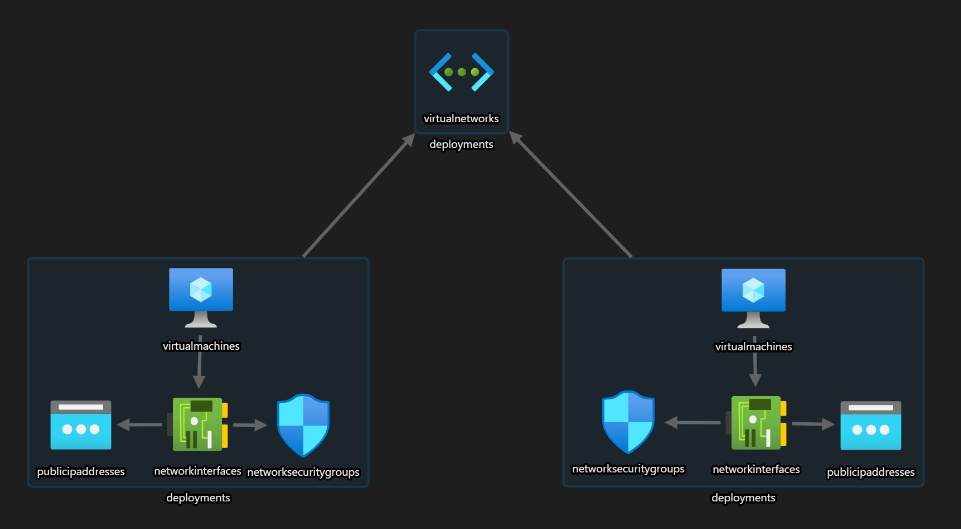
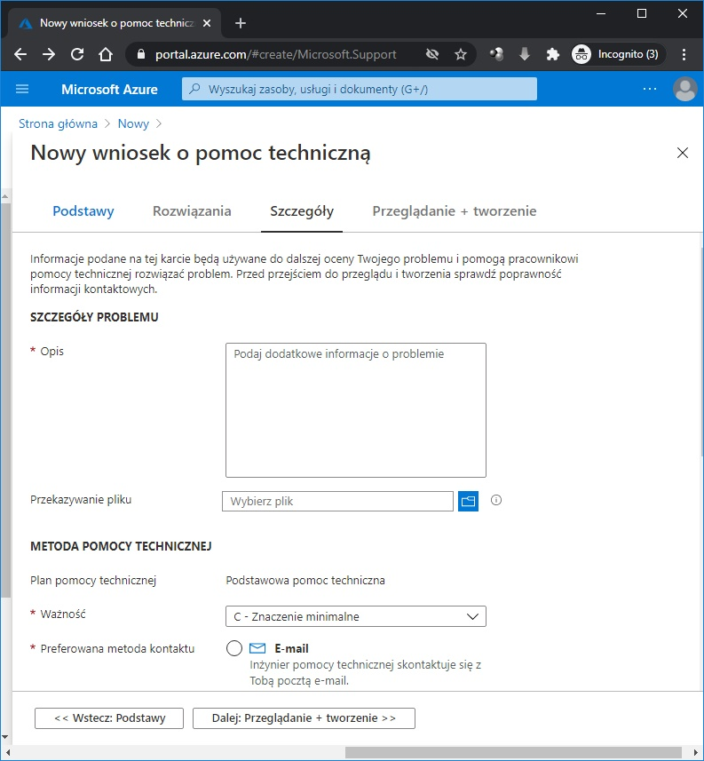

# [Zadanie domowe z tygodnia 2](https://szkolachmury.pl/az-303-microsoft-azure-architect-technologies/tydzien-2-application-architecture-patterns-in-azure/praca-domowa/)

> * #TYDZIEN2.1 „Zbuduj prostą konwencję nazewniczą dla min. takich zasobów jak Grupa Zasobów, VNET, Maszyn Wirtualna, Dysk, Konta składowania danych. Pamiętaj o ograniczeniach w nazywaniu zasobów, które występują w Azure”
> * #TYDZIEN2.2 „ Zbuduj prosty ARM Template (możesz wykorzystać już gotowe wzorce z GitHub), który wykorzystuje koncepcję Linked Templates. Template powinien zbudować środowisko złożone z jednej sieci VNET, podzielonej na dwa subnety. W każdy subnecie powinna powstać najprostsza maszyna wirtualna z systemem Ubuntu 18.04 a na każdym subnecie powinny zostać skonfigurowane NSG.”
> * #TYDZIEN2.3 „Zbuduj najprostrzą właśną rolę RBAC, która pozwala użytkownikowi uruchomić maszynę, zatrzymać ją i zgłosić zgłoszenie do supportu przez Portal Azure”
> * #TYDZIEN2.4 „Spróbuj na koniec zmodyfikować template tak, by nazwa użytkownika i hasło do każdej maszyny z pkt. 2 było pobierane z KeyVault.„

## 1. Zadanie 2.1 

| Resource        | Naming convention                                                | Example                              |
|-----------------|------------------------------------------------------------------|--------------------------------------|
| Resource group  | \<klient\>-\<env\>-rg                                            | cl1-prod-rg                          |
| VNET            | \<klient\>-\<env\>-\<project/app\>-\<region\>-vnet               | cl1-prod-szkchm-ne-vnet              |
| VM              | \<klient\>-\<env\>-\<project/app\>-\<region\>-\<OS\>-vm\<number\>| cl1-prod-szkchm-ne-ubuntu-vm1        |
| Disk            | \<vm-name\>-disk\<number\>                                       | cl1-prod-szkchm-ne-ubuntu-vm1-disk1  |
| Storage account | \<klient\>\<env\><project/app>sa\<uniqueID\>                     | cl1prodszkchmsa0912                  |


## 2. Zadanie 2.2 | Zadanie 2.4

Pliki ARM template:
* folder [3.2](./3.2)
* lub osobne [repozytorium](https://github.com/bpelikan/szkchm-az303-zad2) ze skonfigurowanym CI/CD



### 2.1 Utworzenie Resource Group
```bash
RG_NAME="cl1-prod-rg"
LOCATION="westeurope"
az group create --name $RG_NAME --location $LOCATION
```

### 2.2 Utworzenie Key Vault oraz sekretów
```bash
RG_NAME_VAULT="cl1-prod-kv-rg"
VAULT_NAME="cl1-prod-szkchm-we-kv"
ADMIN_LOGIN="vmadminlogin$RANDOM"
ADMIN_PASS="AdminPassword$RANDOM"
az group create --name $RG_NAME_VAULT --location $LOCATION
az keyvault create --location $LOCATION --name $VAULT_NAME --resource-group $RG_NAME_VAULT
az keyvault update --name $VAULT_NAME --resource-group $RG_NAME_VAULT --enabled-for-template-deployment true

az keyvault secret set --name "vmAdminUsername" --vault-name $VAULT_NAME --value $ADMIN_LOGIN
az keyvault secret set --name "vmAdminPassword" --vault-name $VAULT_NAME --value $ADMIN_PASS
```

### 2.3 Deploy
```bash
git clone https://github.com/bpelikan/szkchm-az303-zad2.git
cd szkchm-az303-zad2
az deployment group validate --resource-group $RG_NAME --template-file azuredeploy.json --parameters azuredeploy.parameters.json 
az deployment group create --resource-group $RG_NAME --template-file azuredeploy.json --parameters azuredeploy.parameters.json 
```

## 3. Zadanie 2.3
### 3.1 Utworzenie customowej roli

* [customRole.json](./3.3/customRole.json)

```bash
cd 3.3
az role definition create --role-definition customRole.json
```

### 3.1 Sprawdzenie
```bash
bartosz@Azure:~/szkchm/az303zad2$ az role definition list --custom-role-only true -o table
Name                 Type                                     Description
-------------------  ---------------------------------------  ---------------------------------------------------------
My custom role name  Microsoft.Authorization/roleDefinitions  Allow user to start VM, stop VM and create support ticket
```
<details>
  <summary><b><i>zalogowanie się na użytkownika z daną rolą</i></b></summary>

* https://portal.azure.com/#create/Microsoft.Support

  

* `az login`
* `az vm deallocate --name testvmstst --resource-group testvm`
* `az vm start --name testvmstst --resource-group testvm`
* `az group show --name testvm`
```bash
bp@DESKTOP MINGW64 ~/Documents/GitHub/SzkolaChmury (az303/zadanie2)
$ az login
Port '8400' is taken with error '[WinError 10013] Została podjęta próba uzyskania dostępu do gniazda w sposób zabroniony przez
przypisane do niego uprawnienia dostępu'. Trying with the next one
You have logged in. Now let us find all the subscriptions to which you have access...
[
  {
    "cloudName": "AzureCloud",
    "homeTenantId": "00000000-0000-0000-0000-000000000000",
    "id": "00000000-0000-0000-0000-000000000000",
    "isDefault": true,
    "managedByTenants": [],
    "name": "sandbox",
    "state": "Enabled",
    "tenantId": "00000000-0000-0000-0000-000000000000",
    "user": {
      "name": "user1@domain.pl",
      "type": "user"
    }
  }
]

bp@DESKTOP MINGW64 ~/Documents/GitHub/SzkolaChmury (az303/zadanie2)
$ az vm deallocate --name testvmstst --resource-group testvm

bp@DESKTOP MINGW64 ~/Documents/GitHub/SzkolaChmury (az303/zadanie2)
$ az vm start --name testvmstst --resource-group testvm

bp@DESKTOP MINGW64 ~/Documents/GitHub/SzkolaChmury (az303/zadanie2)
$ az group show --name testvm
The client 'user1@domain.pl' with object id '00000000-0000-0000-0000-000000000000' does not have authorization to perform action 'Microsoft.Resources/subscriptions/resourcegroups/read' over scope '/subscriptions/00000000-0000-0000-0000-000000000000/resourcegroups/testvm' or the scope is invalid. If access was recently granted, please refresh your credentials.
```

</details>


### 3.1 Usunięcie roli
```bash
az role definition delete --name "My custom role name"
```
