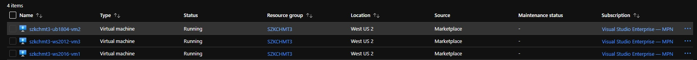
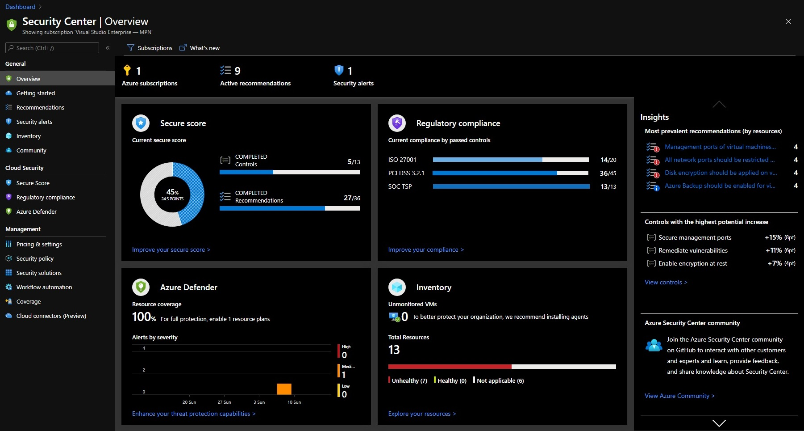
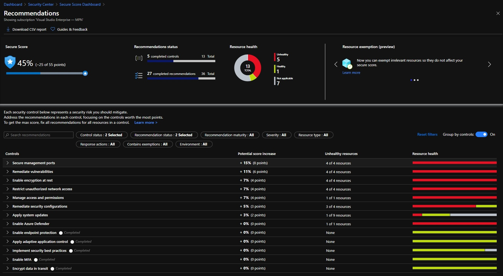

# [Zadanie domowe z tygodnia 3](https://szkolachmury.pl/az-303-microsoft-azure-architect-technologies/tydzien-3-deploying-resources-with-azure-resource-manager/praca-domowa/)

> WAŻNE! Na początku utwórz proste środowisko składające się z systemów Windows oraz Ubuntu. Możesz posłużyć się już znanym Tobie środowiskiem

## 1. Zadanie 4.1 
> #TYDZIEN4.1 „Przeanalizuj proszę Azure Security i zainstaluj Endpoint protection na wcześniej utworzonych Vmkach. Przejrzyj usługę Azure Security Center oraz poszukaj opcję rekomendacji pod względem spełniania regulacji - Regulatory Compliance PCI DSS. W miarę możliwości postaraj się wdrożyć dane rekomendacje i podziel się swoimi wnioskami!”

  
<b><i>Utworzone środowisko</i></b>

### 1.1 Przeanalizowanie Azure Security

Jak widać na ponizszych screenach samo uruchomienie VM w chmurze nie gwarantuje ich bezpieczeństwa, 
konieczne jest podjęcie dalszych działań z naszej strony w celu ich zabezpieczeia.


