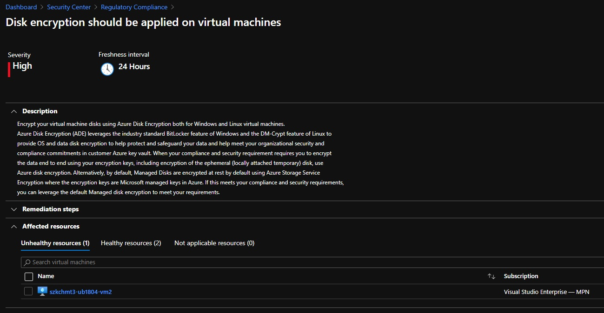

# [Zadanie domowe z tygodnia 3](https://szkolachmury.pl/az-303-microsoft-azure-architect-technologies/tydzien-3-deploying-resources-with-azure-resource-manager/praca-domowa/)

> WAŻNE! Na początku utwórz proste środowisko składające się z systemów Windows oraz Ubuntu. Możesz posłużyć się już znanym Tobie środowiskiem

## 1. Zadanie 4.1
> #TYDZIEN4.1 „Przeanalizuj proszę Azure Security i zainstaluj Endpoint protection na wcześniej utworzonych Vmkach. Przejrzyj usługę Azure Security Center oraz poszukaj opcję rekomendacji pod względem spełniania regulacji - Regulatory Compliance PCI DSS. W miarę możliwości postaraj się wdrożyć dane rekomendacje i podziel się swoimi wnioskami!”

  
<b><i>Utworzone środowisko</i></b>

### 1.1 Przeanalizowanie Azure Security

Jak widać na ponizszych screenach samo uruchomienie VM w chmurze nie gwarantuje ich bezpieczeństwa, 
konieczne jest podjęcie dalszych działań z naszej strony w celu ich zabezpieczeia.

  
<b><i>Azure Security Center</i></b>

### 1.2 Zainstalowanie Endpoint protection

  
<b><i>Instalacja Endpoint protection z poziomu Security Center</i></b>

Jak widać VM z Ubuntu nie została ujęta w rekomendacjach dotyczących Endpoint protection. 
Niestety w moim przypadku ten sposób instalacji dla `vm1` oraz `vm3` się nie powiódł - po zostawieniu VM na noc status instalacji pozostał bez zmian.
Najprawdopodobniej powodem było wyłączenie VM (z racji posiadanej subskrypcji) zaraz po rozpoczęciu instalacji.
Konieczne więc było ręczne zainstalowanie rozszerzenia dla tych VM:

  
<b><i>Instalacja Endpoint protection z poziomu zakładki Extensions dla VM1 oraz VM3</i></b>

Dla testów uruchomiłem `vm4`, na której udało mi się zainstalować Endpoint protection z poziomu Security Center:

  
<b><i>Instalacja Endpoint protection z poziomu Security Center dla VM4</i></b>

### 1.3 Regulatory Compliance PCI DSS

  
<b><i>Lista wymagań do spełnienia</i></b>

Ze względu na to, że punkt 5 z listy został wykonany w poprzednim ćwiczeniu postanowiłem zaszyfrować dyski maszyn wirtualnych:

  
<b><i>Informacja o konieczności włączenia szyfrowania dysków maszyn</i></b>

Szyfrowania dysku dla Ubuntu nie mogłem wykonać - użyta wielkość maszyny `Standard B1ls (1 vcpus, 0.5 GiB memory)` nie jest wspierana przy szyfrowaniu dysku [Supported VMs and operating systems](https://docs.microsoft.com/en-us/azure/virtual-machines/linux/disk-encryption-overview#supported-vms-and-operating-systems).

  
<b><i>Po zaszyfrowaniu</i></b>


