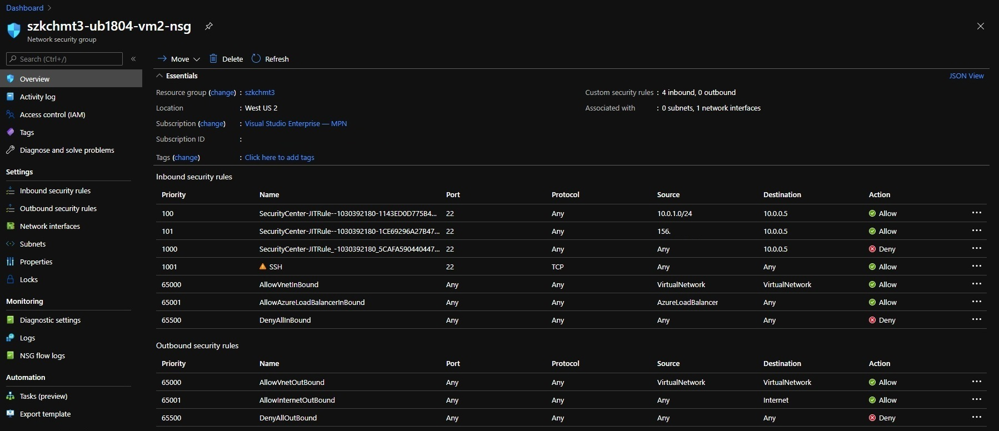

# [Zadanie domowe z tygodnia 3](https://szkolachmury.pl/az-303-microsoft-azure-architect-technologies/tydzien-3-deploying-resources-with-azure-resource-manager/praca-domowa/)

> WAŻNE! Na początku utwórz proste środowisko składające się z systemów Windows oraz Ubuntu. Możesz posłużyć się już znanym Tobie środowiskiem

## 1. Zadanie 3.1
> #TYDZIEN4.1 „Przeanalizuj proszę Azure Security i zainstaluj Endpoint protection na wcześniej utworzonych Vmkach. Przejrzyj usługę Azure Security Center oraz poszukaj opcję rekomendacji pod względem spełniania regulacji - Regulatory Compliance PCI DSS. W miarę możliwości postaraj się wdrożyć dane rekomendacje i podziel się swoimi wnioskami!”

  
<b><i>Utworzone środowisko</i></b>

## 1. Zadanie 4.1
> #TYDZIEN4.1 „Przeanalizuj proszę Azure Security i zainstaluj Endpoint protection na wcześniej utworzonych Vmkach. Przejrzyj usługę Azure Security Center oraz poszukaj opcję rekomendacji pod względem spełniania regulacji - Regulatory Compliance PCI DSS. W miarę możliwości postaraj się wdrożyć dane rekomendacje i podziel się swoimi wnioskami!”

### 1.1 Przeanalizowanie Azure Security

Po analizie Azure Security można wnioskować, że samo uruchomienie VM w chmurze nie gwarantuje ich bezpieczeństwa, 
konieczne jest podjęcie dalszych działań z naszej strony w celu ich zabezpieczeia.

  
<b><i>Azure Security Center</i></b>

### 1.2 Zainstalowanie Endpoint protection

  
<b><i>Instalacja Endpoint protection z poziomu Security Center</i></b>

Jak widać VM z Ubuntu nie została ujęta w rekomendacjach dotyczących Endpoint protection. 
Niestety w moim przypadku ten sposób instalacji dla `vm1` oraz `vm3` się nie powiódł - po zostawieniu VM na noc status instalacji pozostał bez zmian.
Najprawdopodobniej powodem było wyłączenie VM (z racji posiadanej subskrypcji) zaraz po rozpoczęciu instalacji.
Konieczne więc było ręczne zainstalowanie rozszerzenia dla tych VM:

  
<b><i>Instalacja Endpoint protection z poziomu zakładki Extensions dla VM1 oraz VM3</i></b>

Dla testów uruchomiłem `vm4`, na której udało mi się zainstalować Endpoint protection z poziomu Security Center:

  
<b><i>Instalacja Endpoint protection z poziomu Security Center dla VM4</i></b>

### 1.3 Regulatory Compliance PCI DSS

  
<b><i>Lista wymagań do spełnienia</i></b>

Ze względu na to, że punkt 5 z listy został wykonany w poprzednim ćwiczeniu postanowiłem zaszyfrować dyski maszyn wirtualnych:

  
<b><i>Informacja o konieczności włączenia szyfrowania dysków maszyn</i></b>

Dysku dla Ubuntu nie mogłem zaszyfrować - użyta wielkość maszyny `Standard B1ls (1 vcpus, 0.5 GiB memory)` nie jest wspierana przy szyfrowaniu dysku [Supported VMs and operating systems](https://docs.microsoft.com/en-us/azure/virtual-machines/linux/disk-encryption-overview#supported-vms-and-operating-systems).

  
<b><i>Po zaszyfrowaniu</i></b>

Wnioski wynikające z użycia Azure Security to na pewno to, że usługa jest bardzo przydatna i nie należy jej lekceważyć. Daje nam wgląd w środowisko, co należy zrobić aby było bardziej bezpieczne lub było zgodne z regulacjami - tutaj ciekawą opcją jest wygenerowanie raportu z podsumowaniem dla danej regulacji.

## 2. Zadanie 3.2
>#TYDZIEN4.2 „Poprzez Azure Monitor zacznij monitorować dyski, CPU, Memory, a następnie podłącz maszyny do Log Analytics. Zacznij zbierać dane takie jak eventy z logu Apliacation oraz System. Postaraj się utworzyć własne dashboardy, w których pokazywane będą zbierane dane ze zdarzeń oraz danych performansowych (zachęcamy też do popatrzenia na inne dane i tego co da się osiągnąć dzięki Log Analytics w kwestii bezpieczeństwa. Proszę podziel się swoimi wnioskami!)

  
<b><i>Dashboard z metrykami</i></b>

Ciekawą opcją z poziomu Azure Monitor jest wgląd w ruch sieciowy VM. Możemy podejrzeć, które porty są wykorzystywane, przez jakie aplikacje, a nawet do jakich serwerów były wykonywane połączenia.

  
<b><i>Ruch sieciowy VM</i></b>

## 3. Zadanie 3.3
>#TYDZIEN4.3 „Włącz dla maszyn Just-in-time (JIT) i zweryfikuj jakie zmiany nastąpiły na NSG oraz jak możesz zarządzać dostępem do maszyn. Dla utworzonych wcześniej maszyn wdróż usługę Azure Bastion, powyłączaj na VMkach Public IP. Podłącz się za pomocą Azure Basion do VM, opowiedz o plusach i minusach usługi”

Zmiany w `NSG` po włączeniu `JIT`:
1. dla reguł `RDP`/`SSH` zmieniony został ich priorytet 
2. dodana została reguła blokująca dostęp do wybranych portów (nadpisanie reguły z pkt. 1)
3. dla tymczasowego dostępu dodane zostały reguły umożliwiające dostęp (nadpisanie reguły z pkt. 2)

  
<b><i>Zmiany dla RDP</i></b>

  
<b><i>Zmiany dla SSH</i></b>

Zauważyć można, że chcąc korzystać z `Azure Bastion` oraz `JIT`, należy w `JIT` uwzględnić adresację podsieci `AzureBastionSubnet`.

Azure Basion plusy:
* Zwiększa bezpieczeństwo
* Nie musimy się martwić aktualizacjami/patchami Bastiona, jakby to miało miejsce w przypadku jump hosta
* Usługa PaaS
* Połączenie przez SSL
* Wystarczy przeglądarka do połączenia się z maszyną
* Łatwy wgląd w otwarte połączenia/sesje z VM

Azure Basion minusy:
* Usługa dodatkowo płatna
* Brak korzyści z bezpośredniego połączenie się z VM, np. dla RDP obsługa kilku monitorów
