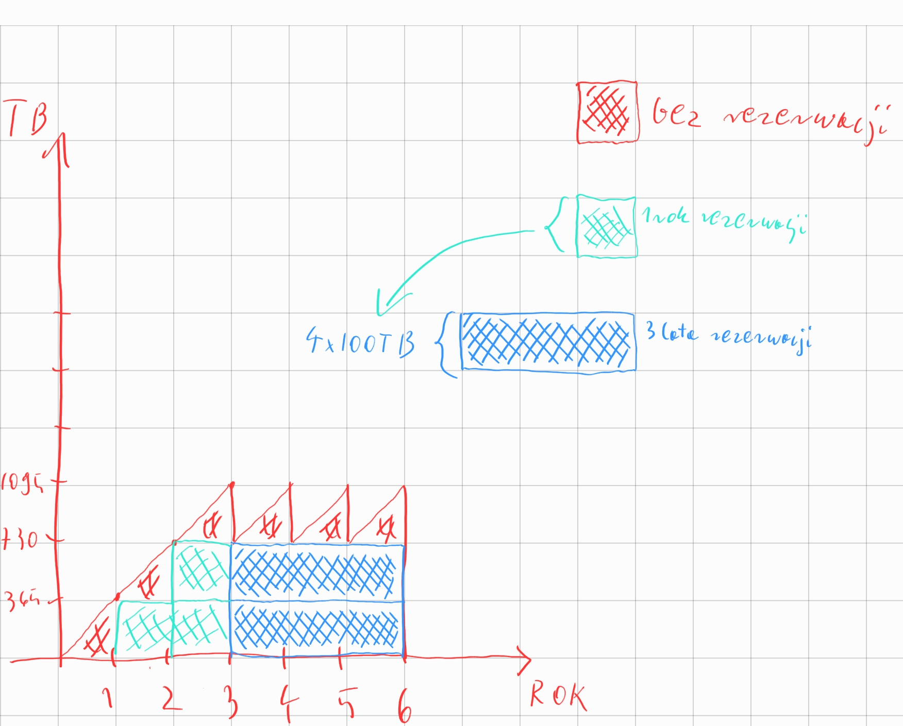
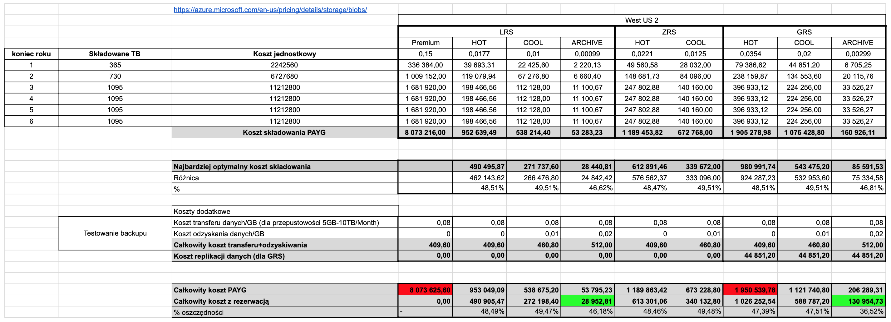

# [Zadanie domowe z tygodnia 4](https://szkolachmury.pl/az-303-microsoft-azure-architect-technologies/tydzien-4-implement-cloud-infrastructure-monitoring/praca-domowa/)

* #TYDZIEŃ4.1 „Dla każdego typu Storage, którego się nauczyłeś w czasie kursu (min. 4 typy) dobierz dwa dobre i jedno złe zastosowanie. Chciałbym byś zweryfikował różne możliwości składowania danych w Azure i opowiedział, kiedy i do czego te możliwości możesz wykorzystać”.
* #TYDZIEŃ4.2 „Wymień jeden dobry i jeden zły przykład wykorzystania StorSimple w swojej organizacji. Napisz, kiedy i w jakich scenariuszach się sprawdzi, a kiedy nie.”
* TYDZIEŃ4.3 „Liczymy Koszty :). Umówmy się. Twój system backupu (nie ma znaczenia jaki) składuje 1TB nowych danych każdego dnia. Wykorzystujesz oczywiście Azure do tej operacji i chcesz dane składować jak najtaniej. Przez dwa lata nie kasujesz zebranych danych. Po dwóch latach na próbę odtwarzasz dane z ostatniego dnia każdego roku. Po 3 roku kasujesz dane, zebrane w roku pierwszym.

    Ile łącznie wygenerujesz kosztów w ramach tej usługi, jeśli rozważymy pełny, 6 letni okres jej działania.
Rozważ różne aspekty i różne możliwości usług i pokaż jako algorytm liczenia przyjąłeś.

## 1. Zadanie 4.1

> Dla każdego typu Storage, którego się nauczyłeś w czasie kursu (min. 4 typy) dobierz dwa dobre i jedno złe zastosowanie. Chciałbym byś zweryfikował różne możliwości składowania danych w Azure i opowiedział, kiedy i do czego te możliwości możesz wykorzystać

* Azure Storage
    * Blobs
        * Plusy: 
            * Przechowywanie plików archiwalnych/backupów np. faktury z dostępem dla klientów poprzez SAS, dokumenty firmowe, regulaminy
            * Przechowywanie logów aplikacyjnych
            * Serwowanie plików/stron statycznych
            * Wykorzystanie lifecycle management dla plików
        * Minusy:
            * Trzymanie plików z dużą ilością zapisu/odczytu np. pliki konfiguracyjne z których bezpośrednio korzystają aplikacje,
            * Backup prywatnych plików (nieoptymalne kosztowo)
    * Files
        * Plusy:
            * Współdzielenie plików pomiędzy VM
            * Zastąpienie lokalnego urządzenia NAS
        * Minusy:
            * Przechowywanie plików statycznych jak np. grafiki na stronę www
            * Niska przepustowość
    * Queues
        * Plusy:
            * Komunikacja asynchroniczna dla serwisów niewymagających określonej kolejności wiadomości, np. wysyłka wiadomości email, żądanie wygenerowania dokumentu
        * Minusy:
            * Brak `publish-subscribe messaging pattern` z wieloma subskrybentami
            * Brak gwarancji kolejności dostarczanych wiadomości
    * Tables
        * Plusy:
            * Tania baza NoSQL - przechowywanie nierelacyjnych danych
            * Storage dla logów, czy też danych/wiadomości z urządzeń IoT
        * Minusy:
            * Brak relacyjności danych
    * Disks
        * Plusy:
            * Wysoka przepustowość IOPS
            * Duży transfer danych (przetwarzanie, obróbka plików)
        * Minusy:
            * Chęć współdzielenia danych pomiędzy VM

## 2. Zadanie 4.2

> Wymień jeden dobry i jeden zły przykład wykorzystania StorSimple w swojej organizacji. Napisz, kiedy i w jakich scenariuszach się sprawdzi, a kiedy nie.

Dobry przykład:
* Uzyskiwanie dostępu do danych w różnych lokalizacjach/biurach (dostęp do często używanych plików z on-prem)
* Backup plików z on-prem na potrzeby disaster recovery, rozwiązania hybrydowe

Zły przykład:
* Storage dla bazy danych
* Wymagany dostęp do całej przestrzeni dyskowej w dowolnym momencie

## 3. Zadanie 4.3

> Liczymy Koszty :). Umówmy się. Twój system backupu (nie ma znaczenia jaki) składuje 1TB nowych danych każdego dnia. Wykorzystujesz oczywiście Azure do tej operacji i chcesz dane składować jak najtaniej. Przez dwa lata nie kasujesz zebranych danych. Po dwóch latach na próbę odtwarzasz dane z ostatniego dnia każdego roku. Po 3 roku kasujesz dane, zebrane w roku pierwszym.
> * Ile łącznie wygenerujesz kosztów w ramach tej usługi, jeśli rozważymy pełny, 6 letni okres jej działania.
> * Rozważ różne aspekty i różne możliwości usług i pokaż jako algorytm liczenia przyjąłeś.

Dane:
* +1TB/dzień
* Dane są składowane przez 2 lata, po 3 roku kasowane są dane z roku pierwszego
* Po 2 latach następuje odtworzenie danych z ostatniego dnia roku
* Składowanie danych trwa 6 lat

Składowanie danych przedstawia poniższy wykres wraz z optymalnym sposobem rezerwacji miejsca:

### 3.1 Obliczenia
- Do obliczeń przyjęte zostały [ceny składowania](https://azure.microsoft.com/en-us/pricing/details/storage/blobs/) danych do 500 TB oraz składowanie w regionie `West US 2`.
- W przypadku GRS dochodzi koszt transferu danych do drugiego regionu w wysokości `0,02/GB`.
- Przy testowaniu backupu musimy uwzględnić koszt odzyskania dancyh oraz samego [transferu wychodzącego](https://azure.microsoft.com/en-us/pricing/details/bandwidth/) z regionu - w tym przypadku wybrana została tańsza opcja [Routing over public Internet (ISP network)](https://docs.microsoft.com/en-us/azure/virtual-network/routing-preference-overview#routing-over-public-internet-isp-network).

Biorąc to pod uwagę, wyliczenia wyglądają następująco [`US Dollar ($)`]:

Wnioski:
* Wykorzystując rezerwację miejsca możemy zaoszczędzić nawet do ~50%
* Rezerwacja całego używanego miejsca nie jest optymalna - ponosimy koszty rezerwacji miejsca, którego nie wykorzystujemy
* Najtańszą opcją okazała się rezerwacja `LRS` w trybie `ARCHIEVE`
* Trzymanie backupów w `LRS` nie jest rozsądne dlatego też, chcąc się zabezpieczyć przed utratą danych, lepiej wybrać `GRS` w trybie `ARCHIEVE` za które zapłacimy 4-krotnie więcej.
* Najdroższe okazały się opcje w PAYG dla `LRS` w trybie `PREMIUM` oraz `GRS` w trybie `HOT`

