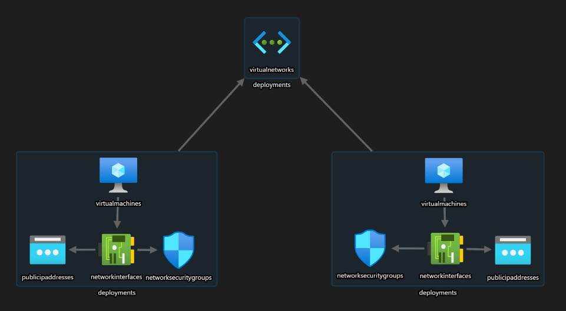

# [Zadanie domowe z tygodnia 2](https://szkolachmury.pl/az-303-microsoft-azure-architect-technologies/tydzien-2-application-architecture-patterns-in-azure/praca-domowa/)

## 1. Zadanie 3.1 

| Resource        | Naming convention                                                | Example                              |
|-----------------|------------------------------------------------------------------|--------------------------------------|
| Resource group  | \<klient\>-\<env\>-rg                                            | cl1-prod-rg                          |
| VNET            | \<klient\>-\<env\>-\<project/app\>-\<region\>-vnet               | cl1-prod-szkchm-ne-vnet              |
| VM              | \<klient\>-\<env\>-\<project/app\>-\<region\>-\<OS\>-vm\<number\>| cl1-prod-szkchm-ne-ubuntu-vm1        |
| Disk            | \<vm-name\>-disk\<number\>                                       | cl1-prod-szkchm-ne-ubuntu-vm1-disk1  |
| Storage account | \<klient\>\<env\><project/app>sa\<uniqueID\>                     | cl1prodszkchmsa0912                  |


## 2. Zadanie 3.2 | Zadanie 3.4

Pliki ARM template:
* folder [3.2](./3.2)
* lub osobne [repozytorium](https://github.com/bpelikan/szkchm-az303-zad2) ze skonfigurowanym CI/CD



### 2.1 Utworzenie Resource Group
```bash
RG_NAME="cl1-prod-rg"
LOCATION="westeurope"
az group create --name $RG_NAME --location $LOCATION
```

### 2.2 Utworzenie Key Vault oraz sekretów
```bash
RG_NAME_VAULT="cl1-prod-kv-rg"
VAULT_NAME="cl1-prod-szkchm-we-kv"
ADMIN_LOGIN="vmadminlogin$RANDOM"
ADMIN_PASS="AdminPassword$RANDOM"
az group create --name $RG_NAME_VAULT --location $LOCATION
az keyvault create --location $LOCATION --name $VAULT_NAME --resource-group $RG_NAME_VAULT
az keyvault update --name $VAULT_NAME --resource-group $RG_NAME_VAULT --enabled-for-template-deployment true

az keyvault secret set --name "vmAdminUsername" --vault-name $VAULT_NAME --value $ADMIN_LOGIN
az keyvault secret set --name "vmAdminPassword" --vault-name $VAULT_NAME --value $ADMIN_PASS
```

### 2.3 Deploy
```bash
git clone https://github.com/bpelikan/szkchm-az303-zad2.git
cd szkchm-az303-zad2
az deployment group validate --resource-group $RG_NAME --template-file azuredeploy.json --parameters azuredeploy.parameters.json 
az deployment group create --resource-group $RG_NAME --template-file azuredeploy.json --parameters azuredeploy.parameters.json 
```

## 3. Zadanie 3.3
### 3.1 Utworzenie customowej roli
```bash
cd 3.3
az role definition create --role-definition customRole.json
```

### 3.1 Sprawdzenie
```bash
bartosz@Azure:~/szkchm/az303zad2$ az role definition list --custom-role-only true -o table
Name                 Type                                     Description
-------------------  ---------------------------------------  ---------------------------------------------------------
My custom role name  Microsoft.Authorization/roleDefinitions  Allow user to start VM, stop VM and create support ticket
```

### 3.1 Usunięcie
```bash
az role definition delete --name "My custom role name"
```
