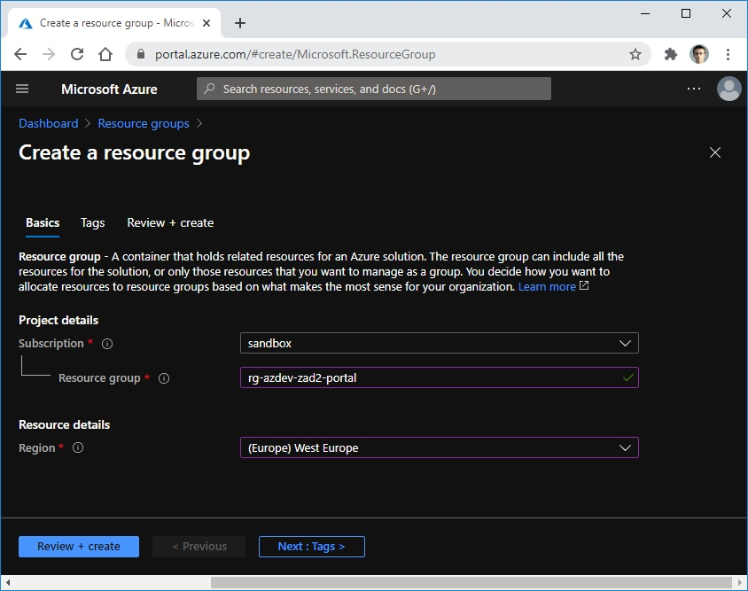
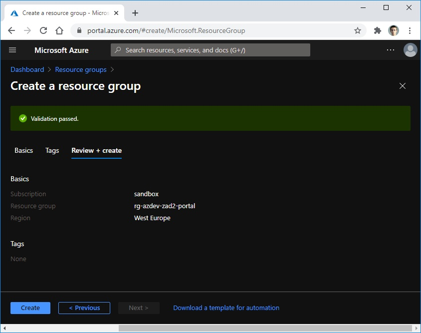
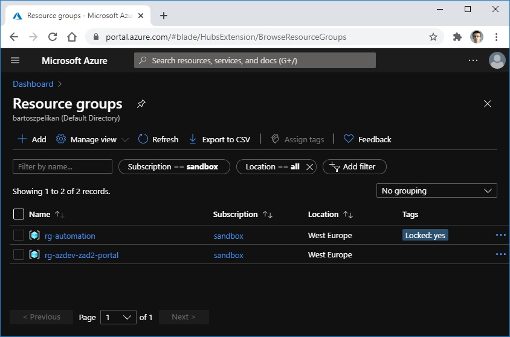

# [Zadanie domowe nr 2](https://szkolachmury.pl/google-cloud-platform-droga-architekta/tydzien-2-podstawy-pracy-z-gcp/zadanie-domowe-nr-2/)

## 1. Utworzenie `Resource Group`

#### 1.1 Azure Portal

