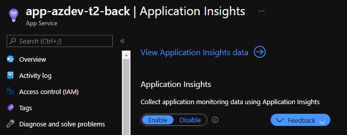
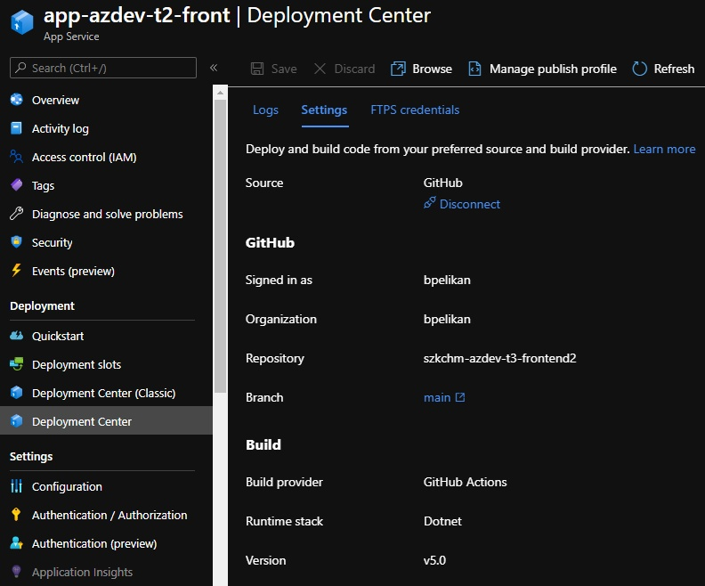
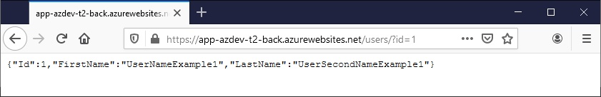
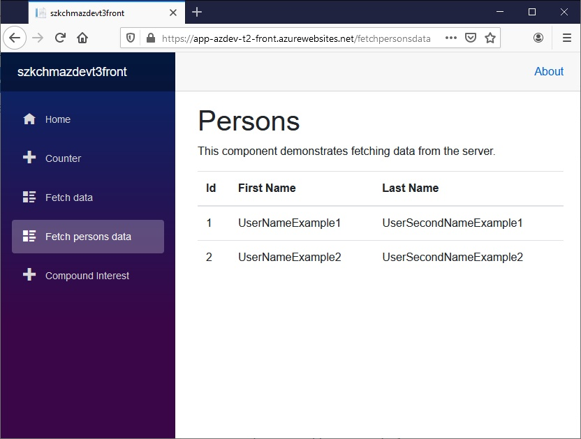
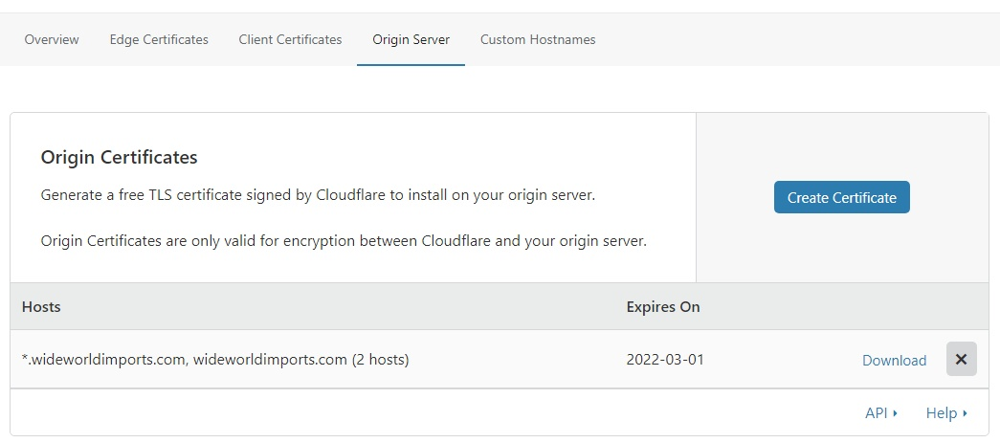
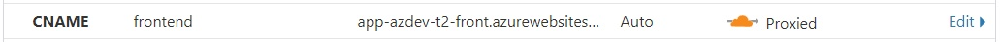
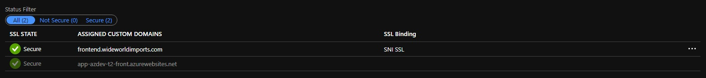

# [Zadanie domowe nr 3](https://szkolachmury.pl/microsoft-azure-software-development/tydzien-2-uzycie-uslug-paas-do-tworzenia-aplikacji-webowych/lekcja-5/)

# Zadanie 1

> * Zbudowanie aplikacji o poniższej architekturze
> * Skonfigurowanie i podpięcie Application Insights
> * Skonfigurowanie custom domain oraz SSL


### 1.1 Utworzenie zasobów


### 1.2 Ustawienia Firewall na bazie SQL


### 1.3 Konfiguracja backend
> Kod źródłowy: [szkchm-azdev-t3-backend](https://github.com/bpelikan/szkchm-azdev-t3-backend/tree/tydzien2)

#### 1.3.1 Deployment


#### 1.3.2 Connection string do bazy


#### 1.3.3 Ustawienie CORS


#### 1.3.4 Podpięcie Application Insights



### 1.4 Konfiguracja frontend
> Kod źródłowy: [szkchm-azdev-t3-frontend2](https://github.com/bpelikan/szkchm-azdev-t3-frontend2/tree/tydzien2)

#### 1.4.1 Deployment



### 1.5 Sprawdzenie działania aplikacji


### 1.6 Skonfigurowanie custom domain oraz SSL

#### 1.6.1 Pobranie certyfikatu


#### 1.6.2 Wygenerowanie certyfikatu PFX
```bash
openssl pkcs12 -inkey ./wideworldimports.com.key -in ./wideworldimports.com.pem -export -out ./wideworldimports.com.pfx
```
#### 1.6.3 Podpięcie domeny oraz zainstalowanie certyfikatu


