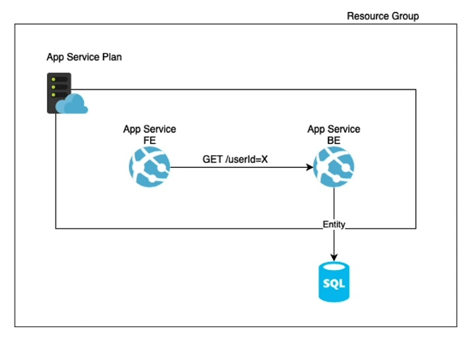
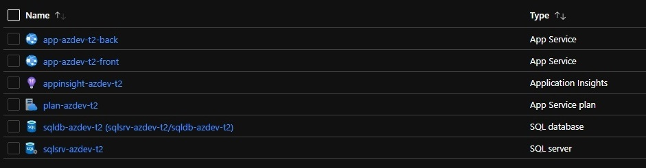
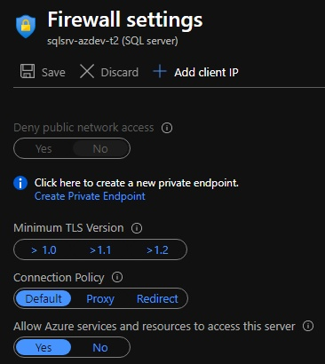
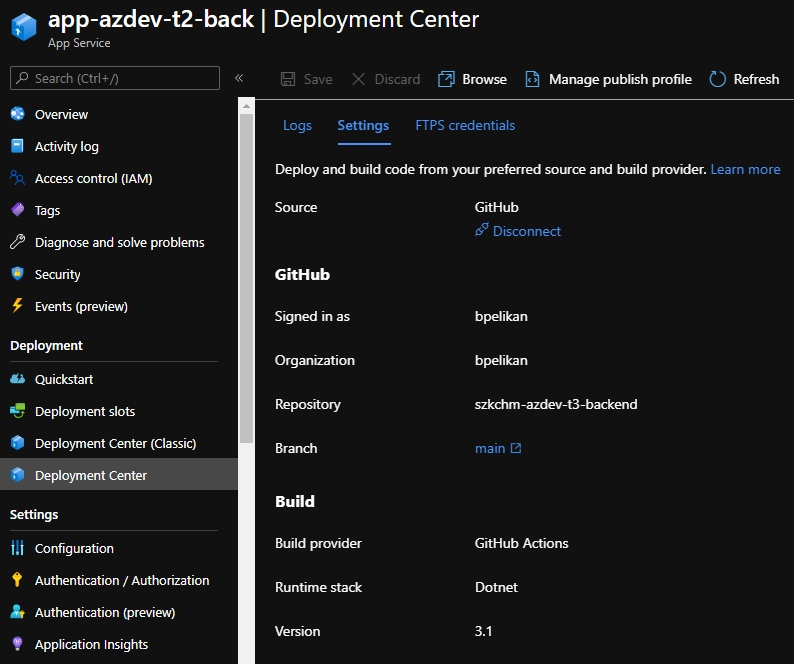
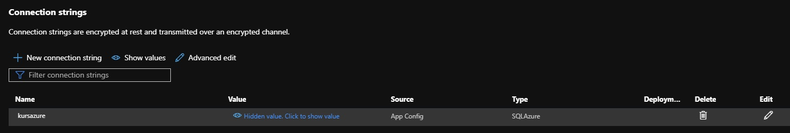
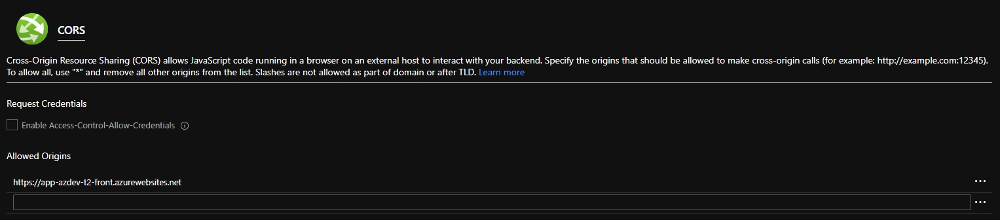

# [Zadanie domowe nr 3](https://szkolachmury.pl/microsoft-azure-software-development/tydzien-2-uzycie-uslug-paas-do-tworzenia-aplikacji-webowych/lekcja-5/)

# Zadanie 1

#### 1.1 Utworzenie zasobów

#### 1.2 Ustawienia Firewall na bazie SQL

#### 1.3 Konfiguracja backend

