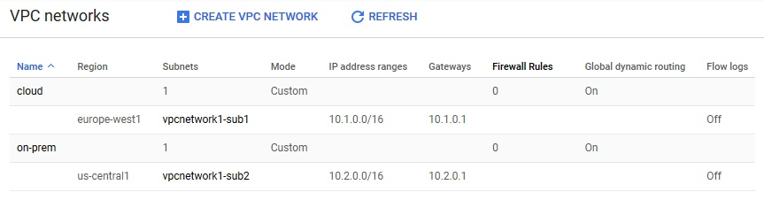
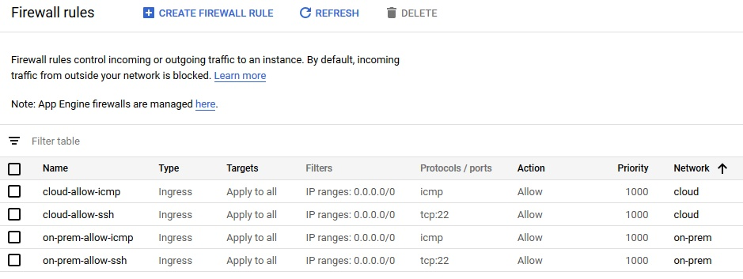

# [Zadanie domowe nr 10](https://szkolachmury.pl/google-cloud-platform-droga-architekta/tydzien-10-cloud-hybrid-connectivity/zadanie-domowe-nr-10/)

## 1. Zadanie 1
Utworzenie projektu przed przystąpieniem do zadania:
```bash
gcloud projects create "zadanie10"
```

### 1.1 Utworzenie sieci VPC w celu symulacji sieci lokalnej oraz produkcyjnej
```bash
vpcNetwork1="cloud"
vpcNetwork2="on-prem"

gcloud compute networks create $vpcNetwork1 --subnet-mode=custom --bgp-routing-mode=global
gcloud compute networks create $vpcNetwork2 --subnet-mode=custom --bgp-routing-mode=global
```

<details>
  <summary><b><i>Sprawdzenie</i></b></summary>

```bash
bartosz@cloudshell:~ (zadanie10)$ gcloud compute networks list
NAME     SUBNET_MODE  BGP_ROUTING_MODE  IPV4_RANGE  GATEWAY_IPV4
cloud    CUSTOM       GLOBAL
on-prem  CUSTOM       GLOBAL
```
</details>

### 1.2 Utworzenie podsieci
Podsieci utworzone zostały w dwóch różnych regionach ze względu na nałożony limit adresów **external IP** per region.
```bash
vpc1subnet1="vpcnetwork1-sub1"
vpc1subnet2="vpcnetwork1-sub2"
vpcRegion1="europe-west1"
vpcRegion2="us-central1"

gcloud compute networks subnets create $vpc1subnet1 --network=$vpcNetwork1 --range=10.1.0.0/16 --region=$vpcRegion1
gcloud compute networks subnets create $vpc1subnet2 --network=$vpcNetwork2 --range=10.2.0.0/16 --region=$vpcRegion2
```

<details>
  <summary><b><i>Sprawdzenie</i></b></summary>

```bash
bartosz@cloudshell:~ (zadanie10)$ gcloud compute networks subnets list
NAME              REGION        NETWORK  RANGE
vpcnetwork1-sub1  europe-west1  cloud    10.1.0.0/16
vpcnetwork1-sub2  us-central1   on-prem  10.2.0.0/16
```


</details>

### 1.3 Dodanie reguł firewall dla ruchu SSH oraz ICMP
```bash
gcloud compute firewall-rules create $vpcNetwork1-allow-icmp --direction=INGRESS --network=$vpcNetwork1 --action=ALLOW --rules=icmp --source-ranges=0.0.0.0/0
gcloud compute firewall-rules create $vpcNetwork1-allow-ssh --direction=INGRESS --network=$vpcNetwork1 --action=ALLOW --rules=tcp:22 --source-ranges=0.0.0.0/0

gcloud compute firewall-rules create $vpcNetwork2-allow-icmp --direction=INGRESS --network=$vpcNetwork2 --action=ALLOW --rules=icmp --source-ranges=0.0.0.0/0
gcloud compute firewall-rules create $vpcNetwork2-allow-ssh --direction=INGRESS --network=$vpcNetwork2 --action=ALLOW --rules=tcp:22 --source-ranges=0.0.0.0/0
```

<details>
  <summary><b><i>Sprawdzenie</i></b></summary>

```bash
bartosz@cloudshell:~ (zadanie10)$ gcloud compute firewall-rules list
NAME                NETWORK  DIRECTION  PRIORITY  ALLOW   DENY  DISABLED
cloud-allow-icmp    cloud    INGRESS    1000      icmp          False
cloud-allow-ssh     cloud    INGRESS    1000      tcp:22        False
on-prem-allow-icmp  on-prem  INGRESS    1000      icmp          False
on-prem-allow-ssh   on-prem  INGRESS    1000      tcp:22        False
```

</details>

gcloud compute networks subnets create $vpc1subnet1 --network=$vpcNetwork1 --region=$vpcRegion --range=10.1.0.0/16
gcloud compute networks subnets create $vpc1subnet2 --network=$vpcNetwork2 --region=$vpcRegion --range=10.2.0.0/16
```

<details>
  <summary><b><i>Sprawdzenie</i></b></summary>

```bash
bartosz@cloudshell:~ (zad10-268721)$ gcloud compute networks subnets list
NAME              REGION                   NETWORK  RANGE
vpcnetwork1-sub1  europe-west1             cloud    10.1.0.0/16
vpcnetwork1-sub2  europe-west1             on-prem  10.2.0.0/16
```
</details>

