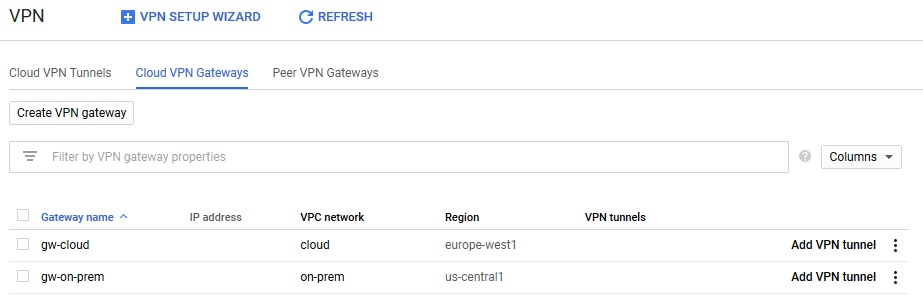
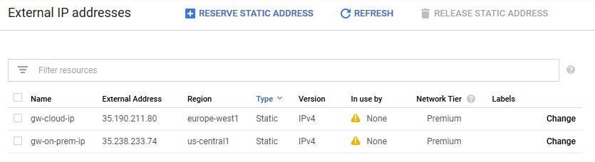
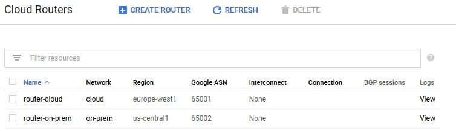

# [Zadanie domowe nr 10](https://szkolachmury.pl/google-cloud-platform-droga-architekta/tydzien-10-cloud-hybrid-connectivity/zadanie-domowe-nr-10/)

## 1. Zadanie 1
Utworzenie projektu przed przystąpieniem do zadania:
```bash
gcloud projects create "zadanie10"
```

### 1.1 Utworzenie sieci VPC w celu symulacji sieci lokalnej oraz produkcyjnej
```bash
vpcNetwork1="cloud"
vpcNetwork2="on-prem"

gcloud compute networks create $vpcNetwork1 --subnet-mode=custom --bgp-routing-mode=global
gcloud compute networks create $vpcNetwork2 --subnet-mode=custom --bgp-routing-mode=global
```

<details>
  <summary><b><i>Sprawdzenie</i></b></summary>

```bash
bartosz@cloudshell:~ (zadanie10)$ gcloud compute networks list
NAME     SUBNET_MODE  BGP_ROUTING_MODE  IPV4_RANGE  GATEWAY_IPV4
cloud    CUSTOM       GLOBAL
on-prem  CUSTOM       GLOBAL
```
</details>

### 1.2 Utworzenie podsieci
Podsieci utworzone zostały w dwóch różnych regionach ze względu na nałożony limit adresów **external IP** per region.
```bash
vpc1subnet1="vpcnetwork1-sub1"
vpc1subnet2="vpcnetwork1-sub2"
vpcRegion1="europe-west1"
vpcRegion2="us-central1"

gcloud compute networks subnets create $vpc1subnet1 --network=$vpcNetwork1 --range=10.1.0.0/16 --region=$vpcRegion1
gcloud compute networks subnets create $vpc1subnet2 --network=$vpcNetwork2 --range=10.2.0.0/16 --region=$vpcRegion2
```

<details>
  <summary><b><i>Sprawdzenie</i></b></summary>

```bash
bartosz@cloudshell:~ (zadanie10)$ gcloud compute networks subnets list
NAME              REGION        NETWORK  RANGE
vpcnetwork1-sub1  europe-west1  cloud    10.1.0.0/16
vpcnetwork1-sub2  us-central1   on-prem  10.2.0.0/16
```


</details>

### 1.3 Dodanie reguł firewall dla ruchu SSH oraz ICMP
```bash
gcloud compute firewall-rules create $vpcNetwork1-allow-icmp --direction=INGRESS --network=$vpcNetwork1 --action=ALLOW --rules=icmp --source-ranges=0.0.0.0/0
gcloud compute firewall-rules create $vpcNetwork1-allow-ssh --direction=INGRESS --network=$vpcNetwork1 --action=ALLOW --rules=tcp:22 --source-ranges=0.0.0.0/0

gcloud compute firewall-rules create $vpcNetwork2-allow-icmp --direction=INGRESS --network=$vpcNetwork2 --action=ALLOW --rules=icmp --source-ranges=0.0.0.0/0
gcloud compute firewall-rules create $vpcNetwork2-allow-ssh --direction=INGRESS --network=$vpcNetwork2 --action=ALLOW --rules=tcp:22 --source-ranges=0.0.0.0/0
```

<details>
  <summary><b><i>Sprawdzenie</i></b></summary>

```bash
bartosz@cloudshell:~ (zadanie10)$ gcloud compute firewall-rules list
NAME                NETWORK  DIRECTION  PRIORITY  ALLOW   DENY  DISABLED
cloud-allow-icmp    cloud    INGRESS    1000      icmp          False
cloud-allow-ssh     cloud    INGRESS    1000      tcp:22        False
on-prem-allow-icmp  on-prem  INGRESS    1000      icmp          False
on-prem-allow-ssh   on-prem  INGRESS    1000      tcp:22        False
```

</details>

### 1.4 Utworzenie target VPN gateway - Classic VPN
```bash
vpngwName1="gw-$vpcNetwork1"
vpngwName2="gw-$vpcNetwork2"

gcloud compute target-vpn-gateways create $vpngwName1 --network $vpcNetwork1 --region $vpcRegion1
gcloud compute target-vpn-gateways create $vpngwName2 --network $vpcNetwork2 --region $vpcRegion2
```

<details>
  <summary><b><i>Sprawdzenie</i></b></summary>

```bash
bartosz@cloudshell:~ (zadanie10)$ gcloud compute target-vpn-gateways list
NAME        NETWORK  REGION
gw-cloud    cloud    europe-west1
gw-on-prem  on-prem  us-central1
```

</details>

### 1.5 Rezerwacja publicznych adresów IP
```bash
gwIpName1="$vpngwName1-ip"
gwIpName2="$vpngwName2-ip"

gcloud compute addresses create $gwIpName1 --region $vpcRegion1
gcloud compute addresses create $gwIpName2 --region $vpcRegion2 

# Zapisanie adresów do zmiennych
gwipAddress1=$(gcloud compute addresses describe $gwIpName1 --region $vpcRegion1 --format='get(address)')
gwipAddress2=$(gcloud compute addresses describe $gwIpName2 --region $vpcRegion2 --format='get(address)')
```

<details>
  <summary><b><i>Sprawdzenie</i></b></summary>

```bash
bartosz@cloudshell:~ (zadanie10)$ gcloud compute addresses list
NAME           ADDRESS/RANGE  TYPE      PURPOSE  NETWORK  REGION        SUBNET  STATUS
gw-cloud-ip    35.190.211.80  EXTERNAL                    europe-west1          RESERVED
gw-on-prem-ip  35.238.233.74  EXTERNAL                    us-central1           RESERVED
```

</details>

### 1.6 Utworzenie reguł dla ruchu IPSec
```bash
frgwName1="fr-$vpngwName1"
frgwName2="fr-$vpngwName2"

# cloud
gcloud compute forwarding-rules create $frgwName1-esp --ip-protocol ESP --address $gwIpName1 --target-vpn-gateway $vpngwName1 --region $vpcRegion1 
gcloud compute forwarding-rules create $frgwName1-udp500 --ip-protocol UDP --ports 500 --address $gwIpName1 --target-vpn-gateway $vpngwName1 --region $vpcRegion1
gcloud compute forwarding-rules create $frgwName1-udp4500 --ip-protocol UDP --ports 4500 --address $gwIpName1 --target-vpn-gateway $vpngwName1 --region $vpcRegion1

# on-prem
gcloud compute forwarding-rules create $frgwName2-esp --ip-protocol ESP --address $gwIpName2 --target-vpn-gateway $vpngwName2 --region $vpcRegion2
gcloud compute forwarding-rules create $frgwName1-udp500 --ip-protocol UDP --ports 500 --address $gwIpName2 --target-vpn-gateway $vpngwName2 --region $vpcRegion2
gcloud compute forwarding-rules create $frgwName1-udp4500 --ip-protocol UDP --ports 4500 --address $gwIpName2 --target-vpn-gateway $vpngwName2 --region $vpcRegion2
```

<details>
  <summary><b><i>Sprawdzenie</i></b></summary>

```bash
bartosz@cloudshell:~ (zadanie10)$ gcloud compute forwarding-rules list
NAME                 REGION        IP_ADDRESS     IP_PROTOCOL  TARGET
fr-gw-cloud-esp      europe-west1  35.190.211.80  ESP          europe-west1/targetVpnGateways/gw-cloud
fr-gw-cloud-udp4500  europe-west1  35.190.211.80  UDP          europe-west1/targetVpnGateways/gw-cloud
fr-gw-cloud-udp500   europe-west1  35.190.211.80  UDP          europe-west1/targetVpnGateways/gw-cloud
fr-gw-cloud-udp4500  us-central1   35.238.233.74  UDP          us-central1/targetVpnGateways/gw-on-prem
fr-gw-cloud-udp500   us-central1   35.238.233.74  UDP          us-central1/targetVpnGateways/gw-on-prem
fr-gw-on-prem-esp    us-central1   35.238.233.74  ESP          us-central1/targetVpnGateways/gw-on-prem
```
</details>

### 1.7 Utworzenie Cloud Router
```bash
routerName1="router-$vpcNetwork1"
routerName2="router-$vpcNetwork2"
asnRouter1=65001
asnRouter2=65002

gcloud compute routers create $routerName1 --asn $asnRouter1 --network $vpcNetwork1 --region $vpcRegion1
gcloud compute routers create $routerName2 --asn $asnRouter2 --network $vpcNetwork2 --region $vpcRegion2
```

<details>
  <summary><b><i>Sprawdzenie</i></b></summary>

```bash
bartosz@cloudshell:~ (zadanie10)$ gcloud compute routers list
NAME            REGION        NETWORK
router-cloud    europe-west1  cloud
router-on-prem  us-central1   on-prem
```

</details>
```

<details>
  <summary><b><i>Sprawdzenie</i></b></summary>

```bash
bartosz@cloudshell:~ (zad10-268721)$ gcloud compute networks subnets list
NAME              REGION                   NETWORK  RANGE
vpcnetwork1-sub1  europe-west1             cloud    10.1.0.0/16
vpcnetwork1-sub2  europe-west1             on-prem  10.2.0.0/16
```
</details>

