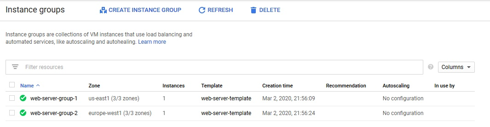
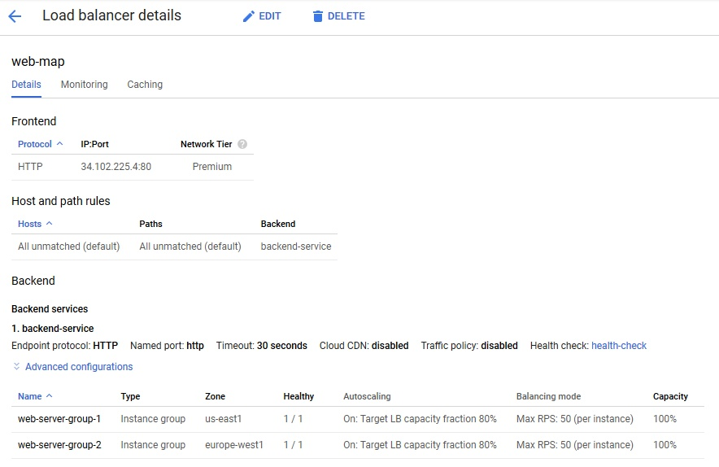
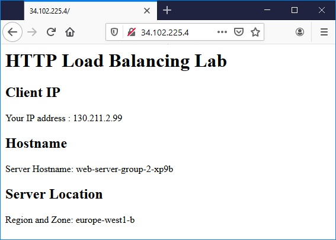
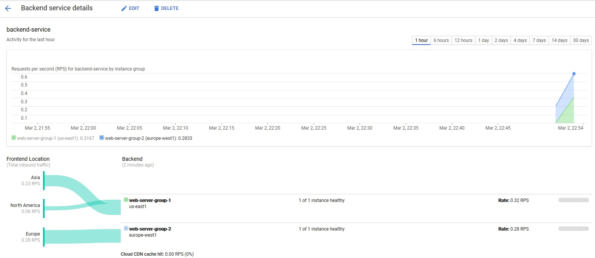
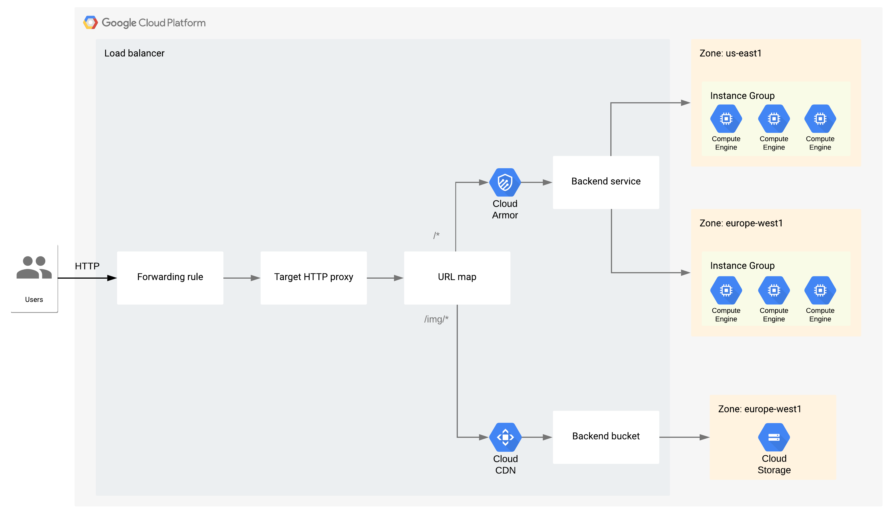

# [Zadanie domowe nr 11](https://szkolachmury.pl/google-cloud-platform-droga-architekta/tydzien-11-load-balancing/zadanie-domowe-nr-11/)

<details>
  <summary><b><i>Spis treści</i></b></summary>

* [1. Utworzenie projektu](#1-utworzenie-projektu)
* [2. Konfiguracja reguł zapory sieciowej HTTP](#2-konfiguracja-reguł-zapory-sieciowej-http)
  * [2.1 Utworzenie reguł firewall](#21-utworzenie-reguł-firewall)
* [3. Tworzenie zarządzanych grup instancji](#3-tworzenie-zarządzanych-grup-instancji)
  * [3.1 Utworzenie Instance Template](#31-utworzenie-instance-template)
  * [3.2 Utworzenie grup instancji](#32-utworzenie-grup-instancji)
  * [3.3 Konfiguracja autoskalowania](#33-konfiguracja-autoskalowania)
* [4. Konfiguracja Load Balancera](#4-konfiguracja-load-balancera)
  * [4.1 Rezerwacja publicznego adresu IP](#41-rezerwacja-publicznego-adresu-ip)
  * [4.2 Utworzenie Health Check](#42-utworzenie-health-check)
  * [4.3 Utworzenie Backend Service](#43-utworzenie-backend-service)
  * [4.4 Dodanie grup instancji do backend service](#44-dodanie-grup-instancji-do-backend-service)
  * [4.5 Dodanie URL Map](#45-dodanie-url-map)
  * [4.6 Dodanie HTTP Proxy](#46-dodanie-http-proxy)
  * [4.7 Utworzenie forwarding-rules](#47-utworzenie-forwarding-rules)
* [5. Test obciążenia](#5-test-obciążenia)
  * [5.1 Utworzenie dwóch instancji VM (us-central1-a, europe-west1-b) i wykonanie testu obciążenia](#51-utworzenie-dwóch-instancji-vm-us-central1-a-europe-west1-b-i-wykonanie-testu-obciążenia)
  * [5.2 Zmniejszenie przepustowości ruchu do backendu](#52-zmniejszenie-przepustowości-ruchu-do-backendu)
  * [5.3 Zmiana parametru testu obciążeniowego](#53-zmiana-parametru-testu-obciążeniowego)
  * [5.4 Zmiana parametru testu obciążeniowego](#54-zmiana-parametru-testu-obciążeniowego)
* [6. Cloud Armor](#6-cloud-armor)
  * [6.1 Utworzenie Google Cloud Armor security policies](#61-utworzenie-google-cloud-armor-security-policies)
  * [6.2 Dodanie reguły do Google Cloud Armor security policies](#62-dodanie-reguły-do-google-cloud-armor-security-policies)
  * [6.3 Przypięcie reguły do Backend Service](#63-przypięcie-reguły-do-backend-service)
* [7. Dodanie Cloud Storage do Load Balancera](#7-dodanie-cloud-storage-do-load-balancera)
  * [7.1 Utworzenie Cloud Storage](#71-utworzenie-cloud-storage)
  * [7.2 Skopiowanie przykładowych plików](#72-skopiowanie-przykładowych-plików)
  * [7.3 Udostępnienie bucketa](#73-udostępnienie-bucketa)
  * [7.4 Utworzenie Backend Bucket](#74-utworzenie-backend-bucket)
  * [7.5 Zdefiniowanie ścieżek w URL Map](#75-zdefiniowanie-ścieżek-w-url-map)
* [8. Schemat końcowej architektury](#8-schemat-końcowej-architektury)
* [9. Usunięcie projektu](#9-usunięcie-projektu)
</details>

---

#### 1. Utworzenie projektu
```bash
projectName="zadanie11"
gcloud projects create $projectName
```

## 2. Konfiguracja reguł zapory sieciowej HTTP

#### 2.1 Utworzenie reguł firewall
Poniższe reguły pozwolą na ruch http z dowolnego źródła oraz ruch health-check z Load Balancera. Dodatkowo reguły wiążemy tagiem `http-server` w celu automatycznego przypisywania do maszyn z tym tagiem.
```bash
vpcName="default"
firewallTag="http-server"
gcloud compute firewall-rules create $vpcName-allow-http --direction=INGRESS --network=$vpcName --action=ALLOW --rules=tcp:80 --priority=1000 --source-ranges=0.0.0.0/0 --target-tags=$firewallTag

gcloud compute firewall-rules create $vpcName-allow-health-check --direction=INGRESS --network=$vpcName --action=ALLOW --rules=tcp --priority=1000 --source-ranges=130.211.0.0/22,35.191.0.0/16 --target-tags=$firewallTag
```

<details>
  <summary><b><i>Sprawdzenie</i></b></summary>


</details>

## 3. Tworzenie zarządzanych grup instancji

#### 3.1 Utworzenie Instance Template
```bash
templateName="web-server-template"

gcloud compute instance-templates create $templateName \
--image-family debian-9 \
--image-project debian-cloud \
--tags=$firewallTag \
--machine-type=f1-micro \
--metadata startup-script-url="https://raw.githubusercontent.com/bpelikan/SzkolaChmury/master/GCP/Architecture/Zadanie11/code/startup.sh"
```

<details>
  <summary><b><i>Sprawdzenie</i></b></summary>


</details>

#### 3.2 Utworzenie grup instancji
```bash
instanceGroupName1="web-server-group-1"
instanceGroupRegion1="us-east1"
instanceGroupName2="web-server-group-2"
instanceGroupRegion2="europe-west1"

gcloud compute instance-groups managed create $instanceGroupName1 \
    --region $instanceGroupRegion1 \
    --template $templateName \
    --size 1

gcloud compute instance-groups managed create $instanceGroupName2 \
    --region $instanceGroupRegion2 \
    --template $templateName \
    --size 1
```

<details>
  <summary><b><i>Sprawdzenie</i></b></summary>


</details>

#### 3.3 Konfiguracja autoskalowania
```bash
gcloud compute instance-groups managed set-autoscaling $instanceGroupName1 \
    --region $instanceGroupRegion1 \
    --min-num-replicas 1 \
    --max-num-replicas 4 \
    --target-load-balancing-utilization "0.8"

gcloud compute instance-groups managed set-autoscaling $instanceGroupName2 \
    --region $instanceGroupRegion2 \
    --min-num-replicas 1 \
    --max-num-replicas 4 \
    --target-load-balancing-utilization "0.8"
```

<details>
  <summary><b><i>Sprawdzenie</i></b></summary>


</details>

<details>
  <summary><b><i>Weryfikacja instancji</i></b></summary>

```bash
bartosz@cloudshell:~ (zadanie11)$ gcloud compute instances list
NAME                     ZONE            MACHINE_TYPE  PREEMPTIBLE  INTERNAL_IP  EXTERNAL_IP     STATUS
web-server-group-2-xp9b  europe-west1-b  f1-micro                   10.132.0.11  35.190.213.185  RUNNING
web-server-group-1-882x  us-east1-b      f1-micro                   10.142.0.15  104.196.170.97  RUNNING
```


</details>

## 4. [Konfiguracja Load Balancera](https://cloud.google.com/load-balancing/docs/https/https-load-balancer-example)

#### 4.1 Rezerwacja publicznego adresu IP
```bash
lbIPName="lb-ip4"

gcloud compute addresses create $lbIPName --global
```

<details>
  <summary><b><i>Sprawdzenie</i></b></summary>


</details>

#### 4.2 Utworzenie Health Check
```bash
healthCheckName="health-check"

gcloud compute health-checks create http $healthCheckName --port 80
```

<details>
  <summary><b><i>Sprawdzenie</i></b></summary>


</details>

#### 4.3 Utworzenie Backend Service
```bash
backendServiceName="backend-service"
gcloud compute backend-services create $backendServiceName \
    --protocol HTTP \
    --health-checks $healthCheckName \
    --global
```

<details>
  <summary><b><i>Sprawdzenie</i></b></summary>


</details>

#### 4.4 Dodanie grup instancji do backend service
```bash
gcloud compute backend-services add-backend $backendServiceName \
    --balancing-mode=RATE \
    --max-rate-per-instance 50 \
    --instance-group=$instanceGroupName1 \
    --instance-group-region=$instanceGroupRegion1 \
    --global

gcloud compute backend-services add-backend $backendServiceName \
    --balancing-mode=RATE \
    --max-rate-per-instance 50 \
    --instance-group=$instanceGroupName2 \
    --instance-group-region=$instanceGroupRegion2 \
    --global
```

<details>
  <summary><b><i>Sprawdzenie</i></b></summary>


</details>

#### 4.5 Dodanie URL Map
```bash
webMap="web-map"
gcloud compute url-maps create $webMap --default-service $backendServiceName
```

<details>
  <summary><b><i>Sprawdzenie</i></b></summary>


</details>

#### 4.6 Dodanie HTTP Proxy
```bash
httpProxy="http-lb-proxy"
gcloud compute target-http-proxies create $httpProxy --url-map $webMap
```

#### 4.7 Utworzenie forwarding-rules
```bash
httpFwRuleName="http-content-rule"
gcloud compute forwarding-rules create $httpFwRuleName \
    --address=$lbIPName\
    --global \
    --target-http-proxy=$httpProxy \
    --ports=80
```

<details>
  <summary><b><i>Sprawdzenie</i></b></summary>



</details>

<details>
  <summary><b><i>Weryfikacja połączenia</i></b></summary>



Wynik wykonania połączenia z różnych regionów:

</details>

## 5. Test obciążenia
#### 5.1 Utworzenie dwóch instancji VM (us-central1-a, europe-west1-b) i wykonanie testu obciążenia
```bash
sudo apt-get -y install siege
siege -c 250 http://34.102.225.4
```

<details>
  <summary><b><i>Wyniki</i></b></summary>


Ruch z jednego regionu - ruch jest równoważony pomiędzy regionami.


Test obciążenia - zauważyć tutaj można, że zadziałało autoskalowanie grupy instancji, jednak z powodu zbyt dużego obciążenia część VM nie przyjmują ruchu.


</details>

#### 5.2 Zmniejszenie przepustowości ruchu do backendu
```bash
gcloud compute backend-services update-backend $backendServiceName \
    --balancing-mode=RATE \
    --max-rate-per-instance 10 \
    --instance-group=$instanceGroupName1 \
    --instance-group-region=$instanceGroupRegion1 \
    --global

gcloud compute backend-services update-backend $backendServiceName \
    --balancing-mode=RATE \
    --max-rate-per-instance 10 \
    --instance-group=$instanceGroupName2 \
    --instance-group-region=$instanceGroupRegion2 \
    --global
```

#### 5.3 Zmiana parametru testu obciążeniowego
```bash
siege -c 60 http://34.102.225.4
```

<details>
  <summary><b><i>Wyniki</i></b></summary>

Widać równoważenie ruchu w przypadku kiedy dany region nie jest w stanie obsłużyć ruchu


</details>

#### 5.4 Zmiana parametru testu obciążeniowego
```bash
siege -c 20 http://34.102.225.4
```

<details>
  <summary><b><i>Wyniki</i></b></summary>


</details>

<details>
  <summary><b><i>Końcowy wykres po wykonaniu testu</i></b></summary>

Widać bardzo dokładnie jak przy większym obciążeniu danego regionu ruch kierowany był do drugiego regionu


</details>

## 6. Cloud Armor
#### 6.1 Utworzenie Google Cloud Armor security policies
```bash
securityPolicyName="vm-decline-policy"
gcloud compute security-policies create $securityPolicyName \
    --description "policy for decline traffic from VM"
```

#### 6.2 Dodanie reguły do Google Cloud Armor security policies
Zablokowanie ruchu z adresów IP `35.187.75.169` oraz `34.66.42.225`
```bash
gcloud compute security-policies rules create 1000 \
    --security-policy $securityPolicyName \
    --description "deny traffic from 35.187.75.169 and 34.66.42.225" \
    --src-ip-ranges=35.187.75.169,34.66.42.225 \
    --action "deny-403"
```

Mała uwaga - chcąc korzystać z parametu `--expression` i wyrażenia `origin.region_code` należy pamiętać, że region ten jest brany z rejestru adresów IP (warto to zweryfikować na jednej ze stron [IP WHOIS Lookup](https://www.whatismyip.com/ip-whois-lookup/))

<details>
  <summary><b><i>Sprawdzenie połączenia przed dodaniem reguły</i></b></summary>


</details>

#### 6.3 Przypięcie reguły do Backend Service
```bash
gcloud compute backend-services update $backendServiceName --security-policy $securityPolicyName --global
```

<details>
  <summary><b><i>Sprawdzenie</i></b></summary>


</details>

<details>
  <summary><b><i>Sprawdzenie połączenia z VM</i></b></summary>

Utworzenie VM


Sprawdzenie połaczenia


</details>

<details>
  <summary><b><i>Symulacja ruchu z VM</i></b></summary>

Wywołanie polecania `siege -c 10 http://34.102.225.4` na powyższych VM i sprawdzenie blokowania ruchu


</details>

## 7. [Dodanie Cloud Storage do Load Balancera](https://cloud.google.com/load-balancing/docs/https/adding-backend-buckets-to-load-balancers)
#### 7.1 Utworzenie Cloud Storage
```bash
bucketName="zad11cloudbucket"
bucketLocation="europe-west1"
gsutil mb -c STANDARD -l $bucketLocation -b on gs://$bucketName
```

#### 7.2 Skopiowanie przykładowych plików
```bash
gsutil cp gs://gcp-external-http-lb-with-bucket/three-cats.jpg gs://$bucketName/img/
gsutil cp gs://gcp-external-http-lb-with-bucket/two-dogs.jpg gs://$bucketName/img/
```

#### 7.3 Udostępnienie bucketa
```bash
gsutil iam ch allUsers:objectViewer gs://$bucketName
```

#### 7.4 Utworzenie Backend Bucket
```bash
backendBucketName="backend-bucket"
gcloud compute backend-buckets create $backendBucketName --gcs-bucket-name=$bucketName --enable-cdn
```

<details>
  <summary><b><i>Sprawdzenie</i></b></summary>

```bash
bartosz@cloudshell:~ (zadanie11)$ gcloud compute backend-buckets list
NAME            GCS_BUCKET_NAME   ENABLE_CDN
backend-bucket  zad11cloudbucket  False
```
</details>

#### 7.5 Zdefiniowanie ścieżek w URL Map
```bash
webServerMap="web-map"
gcloud compute url-maps add-path-matcher $webServerMap \
    --default-service $backendServiceName \
    --path-matcher-name pathmap \
    --backend-bucket-path-rules="/img/*=$backendBucketName" \
    --global
```

<details>
  <summary><b><i>Sprawdzenie</i></b></summary>


Sprawdzenie działania CDN


</details>

## 8. Schemat końcowej architektury

<details>
  <summary><b><i>Pokaż</i></b></summary>


</details>

---

#### 9. Usunięcie projektu
```bash
gcloud projects delete $projectName
```