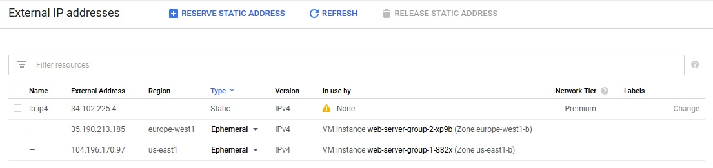

# [Zadanie domowe nr 11](https://szkolachmury.pl/google-cloud-platform-droga-architekta/tydzien-11-load-balancing/zadanie-domowe-nr-11/)

## 1. Zadanie 1

### 1.1 Utworzenie projektu
```bash
gcloud projects create "zadanie11"
```

### 1.2 Utworzenie reguł firewall
Poniższe reguły pozwolą na ruch http z dowolnego źródła oraz ruch health-check z Load Balancera. Dodatkowo reguły wiążemy tagiem `http-server` w celu automatycznego przypisywania do maszym z tym tagiem.
```bash
vpcName="default"
firewallTag="http-server"
gcloud compute firewall-rules create $vpcName-allow-http --direction=INGRESS --network=$vpcName --action=ALLOW --rules=tcp:80 --priority=1000 --source-ranges=0.0.0.0/0 --target-tags=$firewallTag

gcloud compute firewall-rules create $vpcName-allow-health-check --direction=INGRESS --network=$vpcName --action=ALLOW --rules=tcp --priority=1000 --source-ranges=130.211.0.0/22,35.191.0.0/16 --target-tags=$firewallTag
```

<details>
  <summary><b><i>Sprawdzenie</i></b></summary>


</details>

### 1.3 Utworzenie Instance Template
```bash
templateName="web-server-template"

gcloud compute instance-templates create $templateName \
--image-family debian-9 \
--image-project debian-cloud \
--tags=$firewallTag \
--machine-type=f1-micro \
--metadata startup-script-url="https://raw.githubusercontent.com/bpelikan/SzkolaChmury/master/GCP/Architecture/Zadanie11/code/startup.sh"
```

<details>
  <summary><b><i>Sprawdzenie</i></b></summary>


</details>

### 1.4 Utworzenie grup instancji
```bash
instanceGroupName1="web-server-group-1"
instanceGroupRegion1="us-east1"
instanceGroupName2="web-server-group-2"
instanceGroupRegion2="europe-west1"

gcloud compute instance-groups managed create $instanceGroupName1 \
    --region $instanceGroupRegion1 \
    --template $templateName \
    --size 1

gcloud compute instance-groups managed create $instanceGroupName2 \
    --region $instanceGroupRegion2 \
    --template $templateName \
    --size 1
```

<details>
  <summary><b><i>Sprawdzenie</i></b></summary>


</details>

### 1.5 Konfiguracja autoskalowania
```bash
gcloud compute instance-groups managed set-autoscaling $instanceGroupName1 \
    --region $instanceGroupRegion1 \
    --min-num-replicas 1 \
    --max-num-replicas 4 \
    --target-load-balancing-utilization "0.8"

gcloud compute instance-groups managed set-autoscaling $instanceGroupName2 \
    --region $instanceGroupRegion2 \
    --min-num-replicas 1 \
    --max-num-replicas 4 \
    --target-load-balancing-utilization "0.8"
```

<details>
  <summary><b><i>Sprawdzenie</i></b></summary>


</details>

<details>
  <summary><b><i>Weryfikacja instancji</i></b></summary>

```bash
bartosz@cloudshell:~ (zadanie11)$ gcloud compute instances list
NAME                     ZONE            MACHINE_TYPE  PREEMPTIBLE  INTERNAL_IP  EXTERNAL_IP     STATUS
web-server-group-2-xp9b  europe-west1-b  f1-micro                   10.132.0.11  35.190.213.185  RUNNING
web-server-group-1-882x  us-east1-b      f1-micro                   10.142.0.15  104.196.170.97  RUNNING
```


</details>

### 1.6 Rezerwacja publicznego adresu IP
```bash
lbIPName="lb-ip4"
gcloud compute addresses create $lbIPName --global
```

<details>
  <summary><b><i>Sprawdzenie</i></b></summary>


</details>

```


</details>

