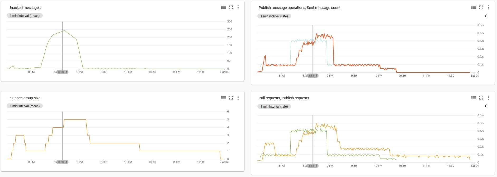
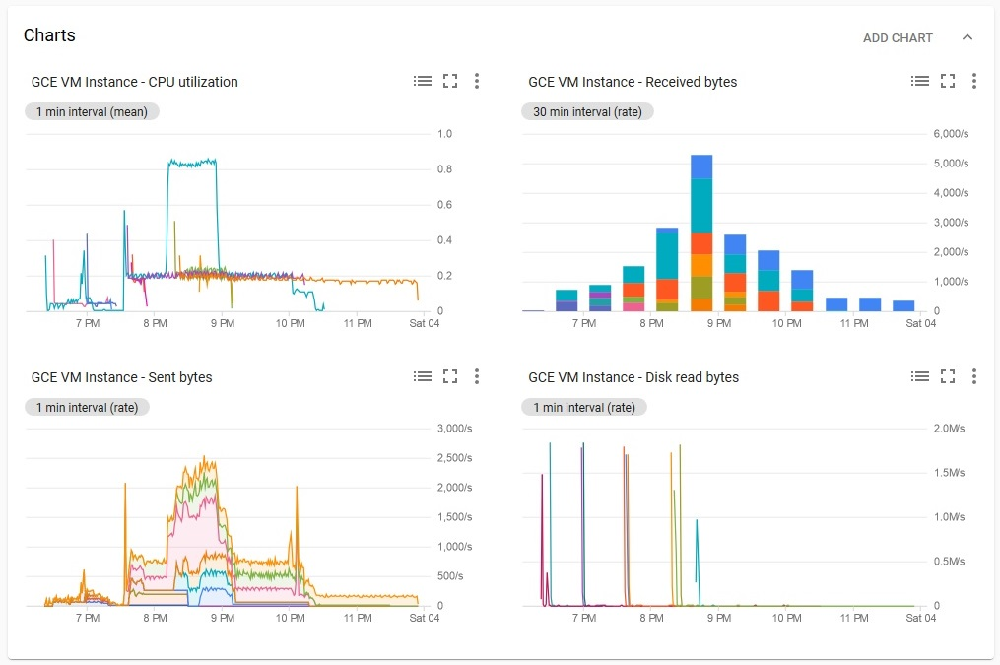
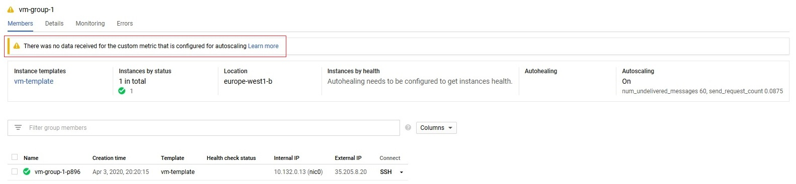
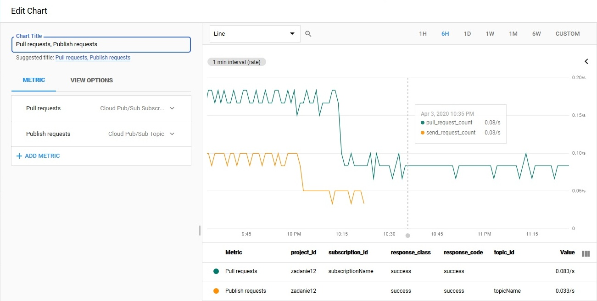

# [Zadanie domowe nr 12](https://szkolachmury.pl/google-cloud-platform-droga-architekta/tydzien-12-monitoring-with-stackdriver/zadanie-domowe-nr-12/)

#### 1. Utworzenie projektu
```bash
projectName="zadanie12"
gcloud projects create $projectName
```

<details>
  <summary><b><i>Utworzenie Cloud Pub/Sub</i></b></summary>

```bash
# Topic
topicName="topicName"
gcloud pubsub topics create $topicName

# Subskrypcja
subscriptionName="subscriptionName"
gcloud pubsub subscriptions create $subscriptionName --topic $topicName --ack-deadline=20
```

#### 
```bash
# Sprawdzenie
bartosz@cloudshell:~ (zadanie12)$ gcloud pubsub topics list
---
name: projects/zadanie12/topics/topicName
bartosz@cloudshell:~ (zadanie12)$ gcloud pubsub subscriptions list
---
ackDeadlineSeconds: 20
expirationPolicy:
  ttl: 2678400s
messageRetentionDuration: 604800s
name: projects/zadanie12/subscriptions/subscriptionName
pushConfig: {}
topic: projects/zadanie12/topics/topicName
```
</details>

#### Utworzenie Instance Template
Instancja VM pobierać będzie 1 wiadomość na 10 sekund.
```bash
templateName="vm-template"

gcloud compute instance-templates create $templateName \
--image-family debian-9 \
--image-project debian-cloud \
--machine-type=f1-micro \
--metadata=startup-script=\#\!/bin/bash$'\n'wget\ https://raw.githubusercontent.com/bpelikan/SzkolaChmury/master/GCP/Architecture/Zadanie12/code/read.sh$'\n'bash\ read.sh\ $subscriptionName\ 1\ 10
```

#### Utworzenie grupy instancji
```bash
instanceGroupName="vm-group-1"
instanceGroupZone="europe-west1-b"

gcloud compute instance-groups managed create $instanceGroupName \
    --zone $instanceGroupZone \
    --template $templateName \
    --size 0
```

#### Konfiguracja autoskalowania
Autoskalowanie na podstawie niestandardowej metryki jaką jest ilości wiadomości do przetworzenia w kolejce Cloud Pub/Sub. 
W związku z tym, że użyta została **per-group metrics** typu **instance assignment** możliwe jest skalowanie grupy instancji do 0 w przypadku braku wiadomości/ruchu w kolejce.
```bash
gcloud beta compute instance-groups managed set-autoscaling $instanceGroupName \
--zone=$instanceGroupZone \
--max-num-replicas=8 \
--min-num-replicas=0 \
--update-stackdriver-metric='pubsub.googleapis.com/subscription/num_undelivered_messages' \
--stackdriver-metric-filter="resource.type = pubsub_subscription AND resource.label.subscription_id = $subscriptionName" \
--stackdriver-metric-single-instance-assignment=60

gcloud beta compute instance-groups managed set-autoscaling $instanceGroupName \
--zone=$instanceGroupZone \
--max-num-replicas=8 \
--min-num-replicas=0 \
--update-stackdriver-metric='pubsub.googleapis.com/topic/send_request_count' \
--stackdriver-metric-filter="resource.type = pubsub_topic AND resource.label.topic_id = $topicName" \
--stackdriver-metric-single-instance-assignment=0.0875
```

<details>
  <summary><b><i>Metryki</i></b></summary>




Wniosek: metryka **pubsub.googleapis.com/topic/send_request_count** nie jest najlepsza w celu skalowania do 0:




</details>
```

