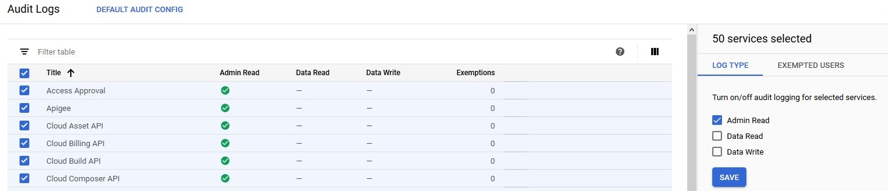

# [Zadanie domowe nr 12](https://szkolachmury.pl/google-cloud-platform-droga-architekta/tydzien-12-monitoring-with-stackdriver/zadanie-domowe-nr-12/)

#### 1. Utworzenie projektu
```bash
projectName="zadanie12"
gcloud projects create $projectName
```

<details>
  <summary><b><i>Utworzenie Cloud Pub/Sub</i></b></summary>

```bash
# Topic
topicName="topicName"
gcloud pubsub topics create $topicName

# Subskrypcja
subscriptionName="subscriptionName"
gcloud pubsub subscriptions create $subscriptionName --topic $topicName --ack-deadline=20
```

#### 
```bash
# Sprawdzenie
bartosz@cloudshell:~ (zadanie12)$ gcloud pubsub topics list
---
name: projects/zadanie12/topics/topicName
bartosz@cloudshell:~ (zadanie12)$ gcloud pubsub subscriptions list
---
ackDeadlineSeconds: 20
expirationPolicy:
  ttl: 2678400s
messageRetentionDuration: 604800s
name: projects/zadanie12/subscriptions/subscriptionName
pushConfig: {}
topic: projects/zadanie12/topics/topicName
```
</details>

#### Utworzenie Instance Template
Instancja VM pobierać będzie 1 wiadomość na 10 sekund.
```bash
templateName="vm-template"

gcloud compute instance-templates create $templateName \
--image-family debian-9 \
--image-project debian-cloud \
--machine-type=f1-micro \
--metadata=startup-script=\#\!/bin/bash$'\n'wget\ https://raw.githubusercontent.com/bpelikan/SzkolaChmury/master/GCP/Architecture/Zadanie12/code/read.sh$'\n'bash\ read.sh\ $subscriptionName\ 1\ 10
```

#### Utworzenie grupy instancji
```bash
instanceGroupName="vm-group-1"
instanceGroupZone="europe-west1-b"

gcloud compute instance-groups managed create $instanceGroupName \
    --zone $instanceGroupZone \
    --template $templateName \
    --size 0
```

#### Konfiguracja autoskalowania
Autoskalowanie na podstawie niestandardowej metryki jaką jest ilości wiadomości do przetworzenia w kolejce Cloud Pub/Sub. 
W związku z tym, że użyta została **per-group metrics** typu **instance assignment** możliwe jest skalowanie grupy instancji do 0 w przypadku braku wiadomości/ruchu w kolejce.
```bash
gcloud beta compute instance-groups managed set-autoscaling $instanceGroupName \
--zone=$instanceGroupZone \
--max-num-replicas=8 \
--min-num-replicas=0 \
--update-stackdriver-metric='pubsub.googleapis.com/subscription/num_undelivered_messages' \
--stackdriver-metric-filter="resource.type = pubsub_subscription AND resource.label.subscription_id = $subscriptionName" \
--stackdriver-metric-single-instance-assignment=60

gcloud beta compute instance-groups managed set-autoscaling $instanceGroupName \
--zone=$instanceGroupZone \
--max-num-replicas=8 \
--min-num-replicas=0 \
--update-stackdriver-metric='pubsub.googleapis.com/topic/send_request_count' \
--stackdriver-metric-filter="resource.type = pubsub_topic AND resource.label.topic_id = $topicName" \
--stackdriver-metric-single-instance-assignment=0.0875
```

<details>
  <summary><b><i>Metryki</i></b></summary>


Wniosek: metryka **pubsub.googleapis.com/topic/send_request_count** nie jest najlepsza w celu skalowania do 0:


</details>

#### Wygenerowanie ruchu
Utworzenie VM z poziomu consoli GCP i rozpoczęcie wysyłania wiadomości do Cloud Pub/Sub.
```bash
topicName="topicName"
wget https://raw.githubusercontent.com/bpelikan/SzkolaChmury/master/GCP/Architecture/Zadanie12/code/send.sh
bash send.sh $topicName 10
```

## Zadanie 2

#### Utworzenie Cloud Storage
```bash
bucketName1="computeadminactivitylogs"
bucketName2="bucketactivitylogs"
bucketLocation="EUROPE-WEST1"
gsutil mb -c STANDARD -l $bucketLocation gs://${bucketName1}/
gsutil mb -c STANDARD -l $bucketLocation gs://${bucketName2}/
```

#### Włączenie logowania
<details>
  <summary><b><i>Audit Logs</i></b></summary>


</details>

#### Eksport logów do bucketa
```bash
sinkName1="exportComputeAdminActivityLogs"
sinkName2="exportBucketActivityLogs"
#gcloud logging sinks create  $sinkName  storage.googleapis.com/${bucketName}  --log-filter="resource.type=gce_instance"
gcloud logging sinks create  $sinkName1  storage.googleapis.com/${bucketName1}  --log-filter="resource.type=\"gce_instance\" AND log_name=\"projects/$projectName/logs/cloudaudit.googleapis.com%2Factivity\""
gcloud logging sinks create  $sinkName2  storage.googleapis.com/${bucketName2}  --log-filter="resource.type=\"gcs_bucket\" AND log_name=\"projects/zadanie12/logs/cloudaudit.googleapis.com%2Factivity\""
```

#### Pobranie nazwy service accounta

<details>
  <summary><b><i>gcloud logging sinks describe</i></b></summary>

```bash
bartosz@cloudshell:~ (zadanie12)$ gcloud logging sinks list
NAME                            DESTINATION                                      FILTER
exportBucketActivityLogs        storage.googleapis.com/bucketactivitylogs        resource.type="gcs_bucket" AND log_name="projects/zadanie12/logs/cloudaudit.googleapis.com%2Factivity"
exportComputeAdminActivityLogs  storage.googleapis.com/computeadminactivitylogs  resource.type="gce_instance" AND log_name="projects/zadanie12/logs/cloudaudit.googleapis.com%2Factivity"

bartosz@cloudshell:~ (zadanie12)$ gcloud logging sinks describe $sinkName1
createTime: '2020-04-04T18:46:53.147258296Z'
destination: storage.googleapis.com/computeadminactivitylogs
filter: resource.type="gce_instance" AND log_name="projects/zadanie12/logs/cloudaudit.googleapis.com%2Factivity"
name: exportComputeAdminActivityLogs
outputVersionFormat: V2
updateTime: '2020-04-04T18:46:53.147258296Z'
writerIdentity: serviceAccount:p913410739349-430717@gcp-sa-logging.iam.gserviceaccount.com

bartosz@cloudshell:~ (zadanie12)$ gcloud logging sinks describe $sinkName2
createTime: '2020-04-04T18:46:56.310208758Z'
destination: storage.googleapis.com/bucketactivitylogs
filter: resource.type="gcs_bucket" AND log_name="projects/zadanie12/logs/cloudaudit.googleapis.com%2Factivity"
name: exportBucketActivityLogs
outputVersionFormat: V2
updateTime: '2020-04-04T18:46:56.310208758Z'
writerIdentity: serviceAccount:p913410739349-108804@gcp-sa-logging.iam.gserviceaccount.com
```

</details>

```bash
serviceAccount1="p913410739349-430717@gcp-sa-logging.iam.gserviceaccount.com"
serviceAccount2="p913410739349-108804@gcp-sa-logging.iam.gserviceaccount.com"
```

#### Nadanie uprawnień do bucketa
```bash
gsutil iam ch serviceAccount:$serviceAccount1:roles/storage.objectCreator gs://${bucketName1}
gsutil iam ch serviceAccount:$serviceAccount2:roles/storage.objectCreator gs://${bucketName2}
```

Wygenerowanie logów poprzez utworzenie/usuwanie VM/Bucketów oraz odczekanie na export logów:
`Log entries are saved to Cloud Storage buckets in hourly batches. It might take from 2 to 3 hours before the first entries begin to appear.`

<details>
  <summary><b><i>Sprawdzenie</i></b></summary>

```bash
bartosz@cloudshell:~ (zadanie12)$ gsutil ls -r gs://${bucketName1}/**
gs://computeadminactivitylogs/cloudaudit.googleapis.com/activity/2020/04/04/18:00:00_18:59:59_S0.json
gs://computeadminactivitylogs/cloudaudit.googleapis.com/activity/2020/04/04/19:00:00_19:59:59_S0.json
gs://computeadminactivitylogs/cloudaudit.googleapis.com/activity/2020/04/04/20:00:00_20:59:59_S0.json

bartosz@cloudshell:~ (zadanie12)$ gsutil ls -r gs://${bucketName2}/**
gs://bucketactivitylogs/cloudaudit.googleapis.com/activity/2020/04/04/18:00:00_18:59:59_S0.json
gs://bucketactivitylogs/cloudaudit.googleapis.com/activity/2020/04/04/18:00:00_18:59:59_S1.json
```
</details>
```

