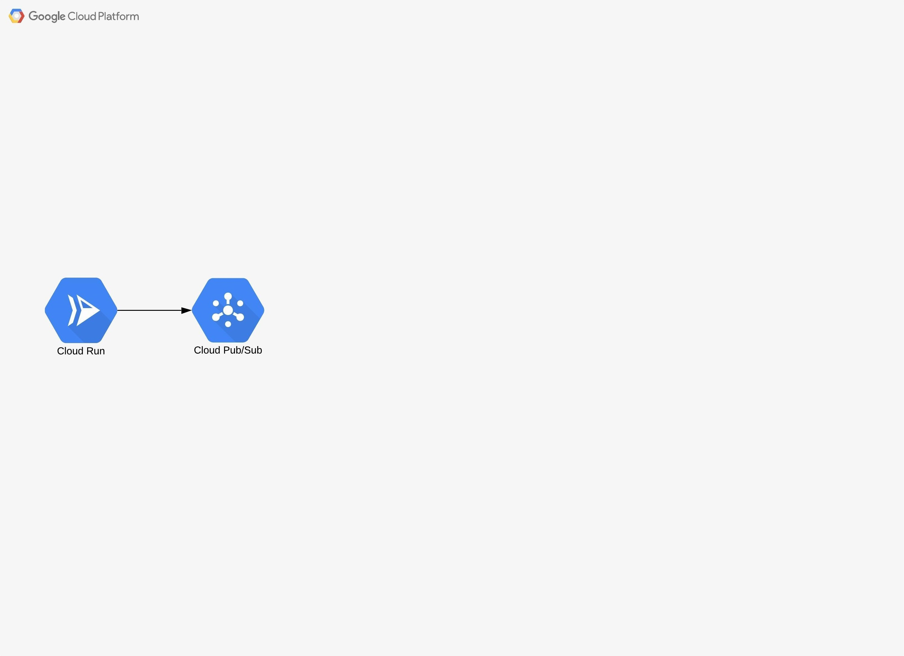

# [Zadanie domowe nr 13](https://szkolachmury.pl/google-cloud-platform-droga-architekta/tydzien-13-serverless-i-big-data/zadanie-domowe-nr-13/)





#### Utworzenie projektu
```bash
projectName="zadanie13"
gcloud projects create $projectName
projectId=$(gcloud config get-value core/project)
```

#### Utworzenie Cloud Pub/Sub
```bash
# Topic
topicName="rawdata"
gcloud pubsub topics create $topicName

# Subskrypcja
subscriptionName="rawdatasub"
gcloud pubsub subscriptions create $subscriptionName --topic $topicName --ack-deadline=20
```


#### Symulacja działania urządzenia IoT
```bash
git clone https://github.com/damiansmazurek/gcp-pubsub-iotdevice.git
cd gcp-pubsub-iotdevice
sed -i "s|\"PROJECT_ID\"|${projectId}|g" Dockerfile
sed -i "s|\"TOPIC_NAME\"|${topicName}|g" Dockerfile

# zbudowanie obrazu za pomocą Cloud Build
gcloud builds submit --tag gcr.io/$projectId/iotdevice

# deploy obrazu do Cloud Run
gcloud run deploy --image gcr.io/$projectId/iotdevice --platform managed --region=us-central1
```

