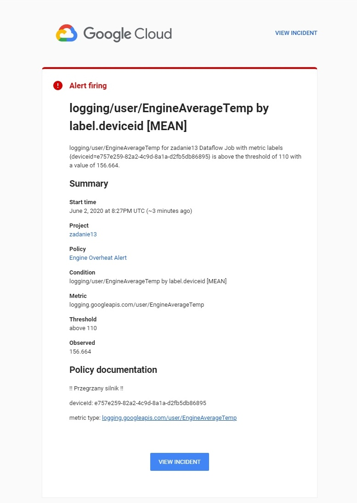
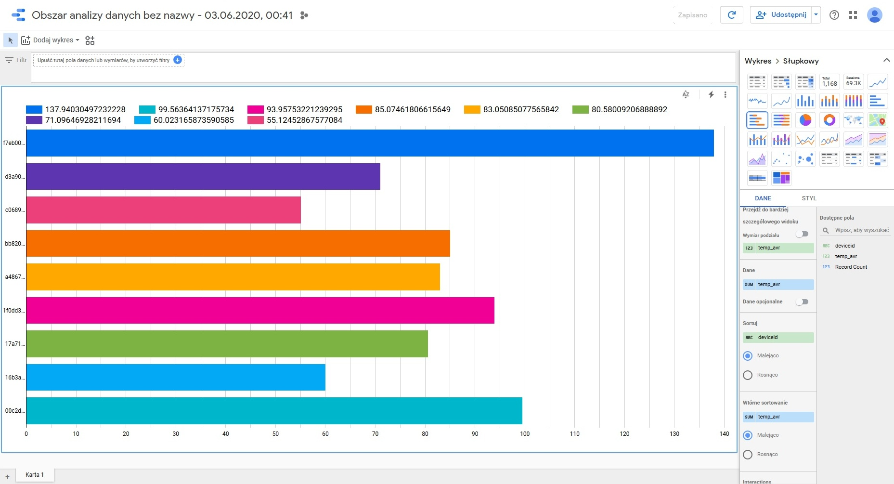

# [Zadanie domowe nr 13](https://szkolachmury.pl/google-cloud-platform-droga-architekta/tydzien-13-serverless-i-big-data/zadanie-domowe-nr-13/)


#### Wymagania klienta
Wymagania:
* Dane archiwalne przechowywane przez 5 lat.
* Dostęp do danych archiwalnych przy pomocy zapytań SQL
* Możliwość szybkiego odczytu i odpytywania danych z ostatnich 10 dni
* Raz na 3 dni wymagane jest stworzenie raportów porównawczych, pokazujących średnią dzienną pracę silnika przez ostatnie 3 miesiące, oraz jego obciążenie.
* Należy powiadomić użytkownika poprzez dedykowane zdarzenie o przegrzaniach silnika (temperatura powyżej 110 stopni celcjusza utrzymująca się ponad 5 min)

Dodatkowo:
* zdarzenia o przegrzaniach powinny być wysyłane do topica pub/sub
* przegranie silnika po stronie chmury
* obciążenie na poziomie 100 000 urządzeń
* rozwiązanie optymalne kosztowo

---

<details>
  <summary><b><i>Architektura</i></b></summary>


</details>

#### Utworzenie projektu
```bash
PROJECT_NAME="zadanie13"
gcloud projects create $PROJECT_NAME
PROJECT_ID=$(gcloud config get-value core/project)
```

#### Utworzenie topica w Cloud Pub/Sub
```bash
TOPIC_NAME="rawdata"
gcloud pubsub topics create $TOPIC_NAME
```

#### Utworzenie Bucketa na dane archiwalne
```bash
BUCKET_NAME=$PROJECT_ID-bucket
BUCKET_NAME_TEMP=$PROJECT_ID-bucket-temp
REGION="us-central1"

gsutil mb -c STANDARD -l $REGION gs://${BUCKET_NAME}/
gsutil mb -c STANDARD -l $REGION gs://${BUCKET_NAME_TEMP}/
```

#### Polityka cyklu życia obiektów w Buckecie
```bash
gsutil lifecycle set bucketPolicy.json gs://$BUCKET_NAME
gsutil lifecycle get gs://$BUCKET_NAME
```

#### Utworzenie BigQuery Dataset
```bash
DATASET_NAME_10="IoTData_10"
DATASET_NAME_90="IoTData_90"
BG_LOCATION="us-east1"

bq mk --dataset --location $BG_LOCATION \
--default_table_expiration 864000 \
$PROJECT_ID:$DATASET_NAME_10

bq mk --dataset --location $BG_LOCATION \
--default_table_expiration 7948800 \
$PROJECT_ID:$DATASET_NAME_90
```

#### Przygotowanie środowiska dla Apache Beam
```bash
sudo pip3 install -U pip
sudo pip3 install --upgrade virtualenv
virtualenv -p python3.7 env
source env/bin/activate

pip install apache-beam[gcp]
pip install strict_rfc3339

# deactivate
```

#### Pobranie plików źródłowych
```bash
git clone https://github.com/bpelikan/SzkolaChmury.git
cd SzkolaChmury/GCP/Architecture/Zadanie13/source
```

#### Uruchomienie lokalnie streamingu danych w celach testowych
```bash
python dataflow/beam.py \
  --project $PROJECT_ID \
  --topic projects/$PROJECT_ID/topics/$TOPIC_NAME \
  --output_bucket gs://$BUCKET_NAME/samples/enginedate \
  --output_bigquery $PROJECT_ID:$DATASET_NAME_10.engine \
  --output_bigquery_avg $PROJECT_ID:$DATASET_NAME_90.engine_avr \
  --runner DirectRunner
```

#### Symulacja działania urządzenia IoT
```bash
sed -i "s|\"PROJECT_ID\"|${PROJECT_ID}|g" emulator/Dockerfile
sed -i "s|\"TOPIC_NAME\"|${TOPIC_NAME}|g" emulator/Dockerfile
sed -i "s|\"PROJECT_ID\"|${PROJECT_ID}|g" emulator_overheat/Dockerfile
sed -i "s|\"TOPIC_NAME\"|${TOPIC_NAME}|g" emulator_overheat/Dockerfile

# zbudowanie obrazu za pomocą Cloud Build i umieszczenie go w Container Registry
gcloud builds submit --tag gcr.io/$PROJECT_ID/iotdevice:emulator emulator
gcloud builds submit --tag gcr.io/$PROJECT_ID/iotdevice:overheat emulator_overheat

# deploy obrazu do Cloud Run
# gcloud run deploy --image gcr.io/$PROJECT_ID/iotdevice:emulator --platform managed --region=us-central1
# gcloud run deploy --image gcr.io/$PROJECT_ID/iotdevice:overheat --platform managed --region=us-central1

# uruchomienie lokalnie
docker run -d gcr.io/$PROJECT_ID/iotdevice:emulator
docker run -d gcr.io/$PROJECT_ID/iotdevice:overheat
docker kill $(docker ps -q)
```

#### Streaming danych w DataFlow
```bash
python dataflow/beam.py \
  --project $PROJECT_ID \
  --region $REGION \
  --topic projects/$PROJECT_ID/topics/$TOPIC_NAME \
  --output_bucket gs://$BUCKET_NAME/samples/enginedata \
  --output_bigquery $PROJECT_ID:$DATASET_NAME_10.engine \
  --output_bigquery_avg $PROJECT_ID:$DATASET_NAME_90.engine_avr \
  --setup_file dataflow/setup.py \
  --runner DataflowRunner \
  --temp_location=gs://$BUCKET_NAME_TEMP/temp
```

#### Customowe metryki bazujące na logach
<details>
  <summary><b><i>Custom metric</i></b></summary>


</details>

#### Topic Pub/Sub dla powiadomień
```bash
TOPIC_NAME_NOTIFICATION="notification_engine_overheat"
gcloud pubsub topics create $TOPIC_NAME
```

#### Utworzenie alertu

<details>
  <summary><b><i>Dodanie nowego kanału powiadomień</i></b></summary>


</details>

<details>
  <summary><b><i>Konfiguracja metryki</i></b></summary>


</details>

<details>
  <summary><b><i>Konfiguracja alertu</i></b></summary>


</details>

<details>
  <summary><b><i>Test wywołania alertu</i></b></summary>



</details>

#### Odpytanie danych archiwalnych
```bash
bq query \
--external_table_definition=engineExtr::timestamp:TIMESTAMP,deviceid:STRING,I:FLOAT,U:FLOAT,Tm:FLOAT@NEWLINE_DELIMITED_JSON=gs://$BUCKET_NAME/samples/engine*.json \
'SELECT
  deviceid, count(*) as count, avg(Tm) as temp_avr
FROM
  engineExtr
GROUP BY deviceid
'
```

<details>
  <summary><b><i>Output</i></b></summary>

```bash
bartosz@cloudshell:~/zad13/SzkolaChmury/GCP/Architecture/Zadanie13/source (zadanie13)$ bq query \
> --external_table_definition=engineExtr::timestamp:TIMESTAMP,deviceid:STRING,I:FLOAT,U:FLOAT,Tm:FLOAT@NEWLINE_DELIMITED_JSON=gs://$BUCKET_NAME/samples/engine*.json \
> 'SELECT
>   deviceid, count(*) as count, avg(Tm) as temp_avr
> FROM
>   engineExtr
> GROUP BY deviceid
> '
/usr/lib/google-cloud-sdk/platform/bq/bq.py:45: DeprecationWarning: the imp module is deprecated in favour of importlib; see the module's documentation for alternative uses
  import imp
Waiting on bqjob_r1cdb239400cbc722_000001727713605a_1 ... (0s) Current status: DONE   
+--------------------------------------+-------+--------------------+
|               deviceid               | count |      temp_avr      |
+--------------------------------------+-------+--------------------+
| a4867da1-a36d-4909-9e9a-737a27bd9674 |  1433 | 103.68246959857069 |
| 72154393-93de-4b86-803b-10ee7c6373aa |    79 |  75.64208747404463 |
| 1d040a82-b38a-41db-8e22-4ce9c6dba31d |   383 |  76.97826203570771 |
| d3a909ee-91b0-4e98-8225-aa0b4c07248a |  1432 | 102.33843136969428 |
| f2ba6ac4-0b00-4f48-b415-6a01edad906d |   409 |   73.9672069948344 |
| 85642f90-7e8a-4f22-9d86-4db93cde9d2f |   958 |  72.50763587183222 |
| 70f4d526-9ad6-4560-bdd3-d801bee0f33a |    71 |  69.43747510314007 |
| 2f8af323-c6f3-4b7b-a0b6-c571da018ab2 |  1261 |   76.1348232779182 |
| 1fa6805e-e0db-4b8f-8222-dde7279a7072 |  1665 |    74.072138875285 |
| 09bd62c5-1dfc-4c79-bf81-69a6e90794c4 |   379 |  75.52881440106688 |
| ddc99568-9b4c-41d3-a891-88556981e39f |  1259 |  75.25954176009124 |
| 79ac69e7-46d2-4274-abac-5b05a93309d4 |   387 |  75.33425536519992 |
| 415408d6-16d4-4768-8807-9a54f5d2790c |   500 |  77.14240450782705 |
| 50968d8e-2cae-4361-b23a-ccbb81f7895c |   936 | 115.04686034851169 |
| e757e259-82a2-4c9d-8a1a-d2fb5db86895 |   503 | 153.09239030756342 |
| b68fd752-a098-4331-ac10-976ccd325339 |   141 | 176.56384764092286 |
| e6693ee9-927f-412e-83d3-4540dc086676 |   957 |  76.23106515821594 |
| c1dbedcd-6bce-4840-ac4c-7b26c2312e46 |   406 |  75.65631246840186 |
| 9537e0e2-b768-451c-97bb-cccf2d626f2e |    74 |   78.2595695579868 |
| 5a822f61-0f35-4aae-b17f-b4edfa686a10 |   963 |  73.83181169445595 |
| cbfaa2df-13b0-4b4a-a30e-85131fed19ae |  1668 |  72.40537860858983 |
| eff88078-0114-4119-83ca-98e515365552 |   145 | 168.74020009140668 |
| f2a8b4a1-52f4-4bdb-a34c-20ed8a89e121 |    79 |  86.35292870983326 |
| 5e5190e4-8729-46b9-8230-4f60c4501a82 |    74 |  80.68776588677392 |
| 1cadbf1c-5f5a-40fc-bf52-2139ebffa0bf |   960 |  72.83901345343646 |
| 12e4ad15-ed21-430b-9237-123187a050cf |   558 | 136.82353504374075 |
| 2e9bf394-fe56-425e-9210-5b3bf65954d4 |   526 | 152.35495856364903 |
+--------------------------------------+-------+--------------------+
```
</details>

#### Raport
<details>
  <summary><b><i>Generowanie co 3 dni zapytania dla raportu</i></b></summary>


</details>

<details>
  <summary><b><i>Eksport danych do Data Studio</i></b></summary>


</details>

  --input gs://dataflow-samples/shakespeare/kinglear.txt \
  --output gs://$BUCKET_NAME/wordcount/outputs \
  --runner DataflowRunner
```
```
```
