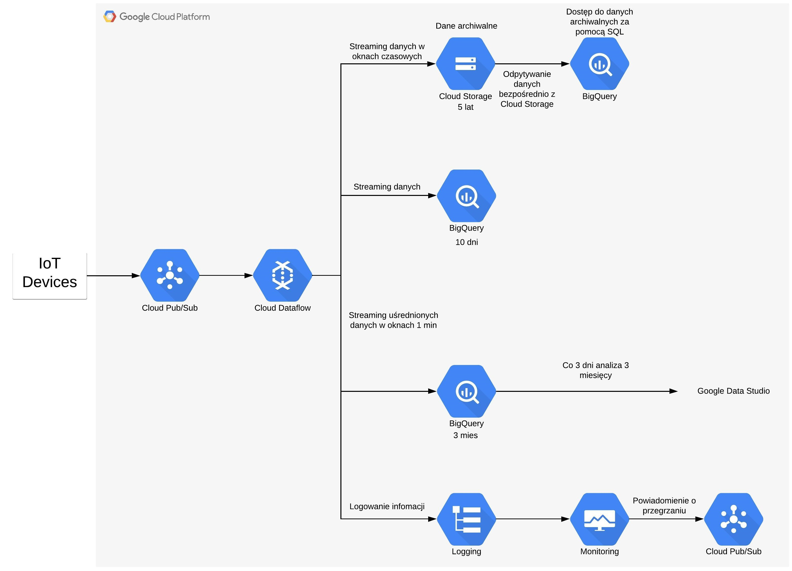

# [Zadanie domowe nr 13](https://szkolachmury.pl/google-cloud-platform-droga-architekta/tydzien-13-serverless-i-big-data/zadanie-domowe-nr-13/)





#### Utworzenie projektu
```bash
projectName="zadanie13"
gcloud projects create $projectName
projectId=$(gcloud config get-value core/project)
```

#### Utworzenie topica w Cloud Pub/Sub
```bash
# Topic
topicName="rawdata"
gcloud pubsub topics create $topicName
```


#### Symulacja działania urządzenia IoT
```bash
git clone https://github.com/damiansmazurek/gcp-pubsub-iotdevice.git
sed -i "s|\"PROJECT_ID\"|${projectId}|g" gcp-pubsub-iotdevice/Dockerfile
sed -i "s|\"TOPIC_NAME\"|${topicName}|g" gcp-pubsub-iotdevice/Dockerfile

# zbudowanie obrazu za pomocą Cloud Build i umieszczenie go w Container Registry
gcloud builds submit --tag gcr.io/$projectId/iotdevice gcp-pubsub-iotdevice

# deploy obrazu do Cloud Run
gcloud run deploy --image gcr.io/$projectId/iotdevice --platform managed --region=us-central1
```

#### Utworzenie Storage Bucket
```bash
bucketName=$projectId-bucket
region="us-central1"

gsutil mb -c STANDARD -l $region gs://${bucketName}/
```

#### Przygotowanie środowiska dla Apache Beam
```bash
# python3 --version
# pip3 --version
sudo pip3 install -U pip
sudo pip3 install --upgrade virtualenv
virtualenv -p python3.7 env
source env/bin/activate

pip install apache-beam[gcp]
```
```
```
