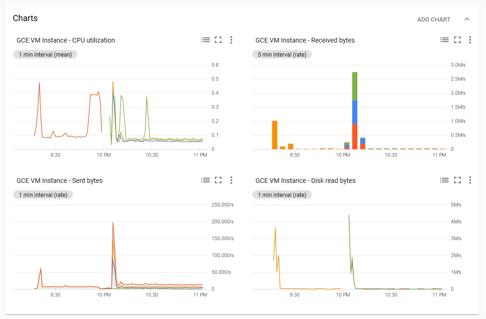

# [Zadanie domowe nr 14](https://szkolachmury.pl/google-cloud-platform-droga-architekta/tydzien-14-kontenery-w-gcp/zadanie-domowe-nr-14/)

## 1. Przygotowanie środowiska

#### 1.1 Utworzenie projektu
```bash
PROJECT_NAME="zadanie14"
gcloud projects create $PROJECT_NAME
```

#### 1.2 Utworzenie klastra Google Kubernetes Engine
```bash
CLUSTER_NANE="cluster-zad14"
CLUSTER_ZONE="us-central1-c"

# utworzenie klastra
gcloud container clusters create $CLUSTER_NANE --num-nodes 3 --zone $CLUSTER_ZONE --machine-type "n1-standard-1"

# pobranie credentiali
gcloud container clusters get-credentials $CLUSTER_NANE --zone $CLUSTER_ZONE --project $PROJECT_NAME
```

#### 1.3 Deployment
```bash
wget https://raw.githubusercontent.com/bpelikan/SzkolaChmury/master/GCP/Architecture/Zadanie14/code/deployment.yaml
kubectl apply -f deployment.yaml
```

<details>
  <summary><b><i>kubectl describe deployment web</i></b></summary>

```bash
bartosz@cloudshell:~/zad14 (zadanie14)$ kubectl describe deployment web
Name:                   web
Namespace:              default
CreationTimestamp:      Wed, 10 Jun 2020 22:06:07 +0200
Labels:                 <none>
Annotations:            deployment.kubernetes.io/revision: 1
Selector:               app=nginx
Replicas:               1 desired | 1 updated | 1 total | 0 available | 1 unavailable
StrategyType:           RollingUpdate
MinReadySeconds:        0
RollingUpdateStrategy:  25% max unavailable, 25% max surge
Pod Template:
  Labels:  app=nginx
  Containers:
   nginx:
    Image:      nginx:latest
    Port:       80/TCP
    Host Port:  0/TCP
    Limits:
      cpu:     300m
      memory:  500Mi
    Requests:
      cpu:        100m
      memory:     250Mi
    Environment:  <none>
    Mounts:       <none>
  Volumes:        <none>
Conditions:
  Type           Status  Reason
  ----           ------  ------
  Available      False   MinimumReplicasUnavailable
  Progressing    True    ReplicaSetUpdated
OldReplicaSets:  <none>
NewReplicaSet:   web-c7759f966 (1/1 replicas created)
Events:
  Type    Reason             Age   From                   Message
  ----    ------             ----  ----                   -------
  Normal  ScalingReplicaSet  5s    deployment-controller  Scaled up replica set web-c7759f966 to 1
```
</details>

## 2. Zadanie 1

#### 2.1 Horizontal Pod Autoscaler
```bash
wget https://raw.githubusercontent.com/bpelikan/SzkolaChmury/master/GCP/Architecture/Zadanie14/code/web-hpa.yaml
kubectl apply -f web-hpa.yaml
```

<details>
  <summary><b><i>kubectl get hpa</i></b></summary>

```bash
bartosz@cloudshell:~/zad14 (zadanie14)$ kubectl get hpa
NAME   REFERENCE        TARGETS         MINPODS   MAXPODS   REPLICAS   AGE
web    Deployment/web   <unknown>/80%   1         10        0          4s
```
</details>

<details>
  <summary><b><i>kubectl describe hpa web</i></b></summary>

```bash
bartosz@cloudshell:~/zad14 (zadanie14)$ kubectl describe hpa web
Name:                     web
Namespace:                default
Labels:                   <none>
Annotations:              autoscaling.alpha.kubernetes.io/conditions:
                            [{"type":"AbleToScale","status":"True","lastTransitionTime":"2020-06-10T20:08:06Z","reason":"ScaleDownStabilized","message":"recent recomm...
                          autoscaling.alpha.kubernetes.io/current-metrics:
                            [{"type":"Resource","resource":{"name":"cpu","currentAverageUtilization":0,"currentAverageValue":"0"}}]
CreationTimestamp:        Wed, 10 Jun 2020 22:08:01 +0200
Reference:                Deployment/web
Target CPU utilization:   80%
Current CPU utilization:  0%
Min replicas:             1
Max replicas:             10
Deployment pods:          1 current / 1 desired
Events:                   <none>
```
</details>

#### 2.2 Podłączenie się do kontenera

<details>
  <summary><b><i>kubectl get pod</i></b></summary>

```bash
bartosz@cloudshell:~/zad14 (zadanie14)$ kubectl get pod
NAME                  READY   STATUS    RESTARTS   AGE
web-c7759f966-jd54k   1/1     Running   0          2m29s
```
</details>

```bash
kubectl exec -it web-c7759f966-jd54k /bin/bash
```

#### 2.3 Symulacja obciążenia
```
apt-get update
apt-get install stress
stress -c 5
```

<details>
  <summary><b><i>Przed symulacją</i></b></summary>

```bash
bartosz@cloudshell:~ (zadanie14)$ kubectl get hpa
NAME   REFERENCE        TARGETS   MINPODS   MAXPODS   REPLICAS   AGE
web    Deployment/web   0%/80%    1         10        1          64s

bartosz@cloudshell:~ (zadanie14)$ kubectl get pod
NAME                  READY   STATUS    RESTARTS   AGE
web-c7759f966-jd54k   1/1     Running   0          3m9s
```
</details>

<details>
  <summary><b><i>W trakcie symulacji</i></b></summary>

```bash
bartosz@cloudshell:~ (zadanie14)$ kubectl get hpa -w
NAME   REFERENCE        TARGETS   MINPODS   MAXPODS   REPLICAS   AGE
web    Deployment/web   0%/80%    1         10        1          89s
web    Deployment/web   119%/80%   1         10        2          2m33s
web    Deployment/web   301%/80%   1         10        2          2m43s
web    Deployment/web   301%/80%   1         10        4          2m56s
web    Deployment/web   150%/80%   1         10        4          3m10s
web    Deployment/web   75%/80%   1         10        4          3m42s
```
</details>

<details>
  <summary><b><i>Po zakończeniu symulacji</i></b></summary>

```bash
bartosz@cloudshell:~ (zadanie14)$ kubectl get hpa -w
NAME   REFERENCE        TARGETS   MINPODS   MAXPODS   REPLICAS   AGE
web    Deployment/web   75%/80%   1         10        4          4m36s
web    Deployment/web   0%/80%    1         10        4          5m12s
web    Deployment/web   0%/80%    1         10        4          10m
web    Deployment/web   0%/80%    1         10        1          10m
web    Deployment/web   0%/80%    1         10        1          16m
```
</details>

<details>
  <summary><b><i>Metryki</i></b></summary>


</details>

#### 2.4 Usunięcie HPA
```
kubectl delete -f web-hpa.yaml
```

## 3. Zadanie 2

> Wymień jeden przykład, w którym mógłbyś utworzyć HPA, aby zapewnić działanie swojego środowiska. Opis powinien zawierać:
> 1) Jakiego typu aplikacja (frontend, backend)
> 2) Za co odpowiada, jakie operacje wykonuje
> 3) Z jakich metryk byś skorzystał ?
> 4) Pamiętaj, ze CPU i RAM to nie jedyne metryki.

1) Backend - obróbka plików wideo
2) Konwertowanie do różnych rozdzielczości plików wysyłanych do bucketa 
3) Ilość plików wideo pozostałych do obróbki, czyli na podstawie ilości wiadomości w kolejce Pub/Sub - dodanie pliku do bucketa generowałoby wiadomość w kolejce Pub/Sub

## 4. Zadanie dodatkowe

<details>
  <summary><b><i>kubectl describe hpa web</i></b></summary>

```bash
bartosz@cloudshell:~/zad14 (zadanie14)$ kubectl describe hpa web
Name:                     web
Namespace:                default
Labels:                   <none>
Annotations:              autoscaling.alpha.kubernetes.io/conditions:
                            [{"type":"AbleToScale","status":"True","lastTransitionTime":"2020-06-10T20:25:35Z","reason":"ReadyForNewScale","message":"recommended size...
                          autoscaling.alpha.kubernetes.io/current-metrics:
                            [{"type":"Resource","resource":{"name":"cpu","currentAverageUtilization":0,"currentAverageValue":"0"}}]
CreationTimestamp:        Wed, 10 Jun 2020 22:25:20 +0200
Reference:                Deployment/web
Target CPU utilization:   80%
Current CPU utilization:  0%
Min replicas:             1
Max replicas:             10
Deployment pods:          1 current / 1 desired
Events:
  Type    Reason             Age    From                       Message
  ----    ------             ----   ----                       -------
  Normal  SuccessfulRescale  8m14s  horizontal-pod-autoscaler  New size: 4; reason: cpu resource utilization (percentage of request) above target
  Normal  SuccessfulRescale  114s   horizontal-pod-autoscaler  New size: 3; reason: All metrics below target
  Normal  SuccessfulRescale  84s    horizontal-pod-autoscaler  New size: 1; reason: All metrics below target
```
</details>

## 5. Wyczyszczenie środowiska
```bash
gcloud projects delete $projectName
```

## Pliki

* [deployment.yaml](./code/deployment.yaml)
* [web-hpa.yaml](./code/web-hpa.yaml)