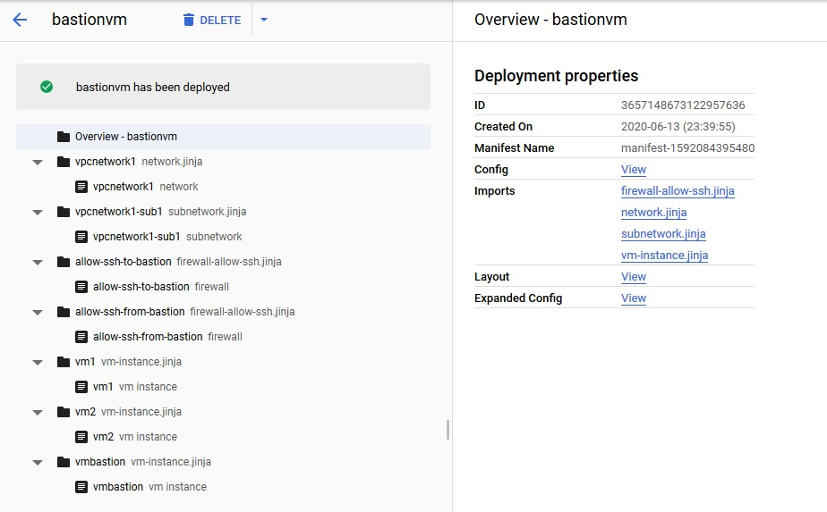
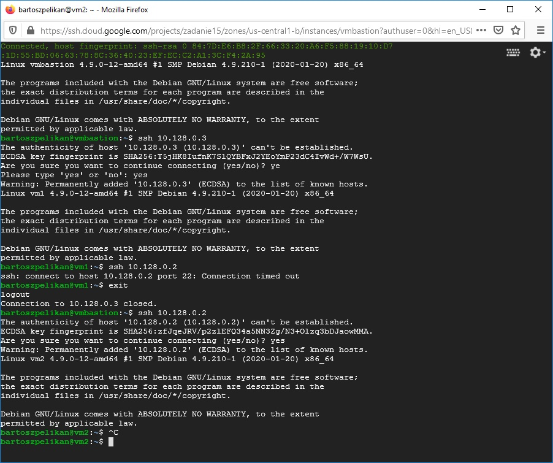

# [Zadanie domowe nr 15](https://szkolachmury.pl/google-cloud-platform-droga-architekta/tydzien-15-backup-i-recovery/zadanie-domowe-nr-15/)

### 1. Utworzenie projektu
```bash
PROJECT_NAME="zadanie15"
gcloud projects create $PROJECT_NAME
```

### 2. Deployment manager files
<details>
  <summary><b><i>network.jinja</i></b></summary>

```jinja
resources:
- name: {{ env["name"] }}
  type: compute.v1.network
  properties:
    autoCreateSubnetworks: false
```
</details>

<details>
  <summary><b><i>subnetwork.jinja</i></b></summary>

```jinja
resources:
- name: {{ env["name"] }}
  type: compute.v1.subnetwork
  properties:
    ipCidrRange: {{ properties["ipCidrRange"] }}
    network: {{ properties["network"] }}
    region: {{ properties["region"] }}
```
</details>

<details>
  <summary><b><i>firewall-allow-ssh.jinja</i></b></summary>

```jinja
resources:
- name: {{ env["name"] }}
  type: compute.v1.firewall
  properties:
    network: {{ properties["network"] }}
    sourceRanges: {{ properties["sourceRanges"] }}
    targetTags: {{ properties["targetTags"] }}
    sourceTags: {{ properties["sourceTags"] }}
    allowed:
    - IPProtocol: TCP
      ports: [22]
```
</details>

<details>
  <summary><b><i>firewall-deny.jinja</i></b></summary>

```jinja
resources:
- name: {{ env["name"] }}
  type: compute.v1.firewall
  properties:
    network: {{ properties["network"] }}
    sourceRanges: {{ properties["sourceRanges"] }}
    priority:  {{ properties["priority"] }}  1000 
    denied:
    - IPProtocol: {{ properties["IPProtocol"] }}
      ports: {{ properties["Port"] }}
```
</details>

<details>
  <summary><b><i>vm-instances.jinja</i></b></summary>

```jinja
resources:
- name: {{ env["name"] }}
  type: compute.v1.instance
  properties:
    machineType: zones/{{ properties["zone"] }}/machineTypes/{{ properties["machineType"] }}
    zone: {{ properties["zone"] }}
    tags: 
      items: [ 
                {{ i }},
               # ,
               
             ]
      #{{ properties["tags"] }}
    networkInterfaces:
     - network: {{ properties["network"] }}
       subnetwork: {{ properties["subnetwork"] }}
       accessConfigs:
       - name: External NAT
         type: ONE_TO_ONE_NAT
    disks:
     - deviceName: {{ env["name"] }}
       type: PERSISTENT
       boot: true
       autoDelete: true
       initializeParams:
         sourceImage: https://www.googleapis.com/compute/v1/projects/debian-cloud/global/images/family/debian-9
```
</details>

<details>
  <summary><b><i>config.yaml</i></b></summary>

```yaml
imports:
- path: network.jinja
- path: subnetwork.jinja
- path: vm-instance.jinja
- path: firewall-allow-ssh.jinja

resources:
- name: vpcnetwork1
  type: network.jinja

- name: vpcnetwork1-sub1
  type: subnetwork.jinja
  properties:
    ipCidrRange: 10.128.0.0/20
    network: $(ref.vpcnetwork1.selfLink)
    region: us-central1

- name: allow-ssh-to-bastion
  type: firewall-allow-ssh.jinja
  properties:
    network: $(ref.vpcnetwork1.selfLink)
    sourceRanges: ["0.0.0.0/0"]
    targetTags: [bastion]

- name: allow-ssh-from-bastion
  type: firewall-allow-ssh.jinja
  properties:
    network: $(ref.vpcnetwork1.selfLink)
    sourceTags: [bastion]

- name: vm1
  type: vm-instance.jinja
  properties:
    zone: us-central1-b
    machineType: f1-micro
    network: $(ref.vpcnetwork1.selfLink)
    subnetwork: $(ref.vpcnetwork1-sub1.selfLink)

- name: vm2
  type: vm-instance.jinja
  properties:
    zone: us-central1-b
    machineType: f1-micro
    network: $(ref.vpcnetwork1.selfLink)
    subnetwork: $(ref.vpcnetwork1-sub1.selfLink)

- name: vmbastion
  type: vm-instance.jinja
  properties:
    zone: us-central1-b
    tags: [bastion, test2]
    machineType: f1-micro
    network: $(ref.vpcnetwork1.selfLink)
    subnetwork: $(ref.vpcnetwork1-sub1.selfLink)

```
</details>

### 3. Pobranie plików
```bash
wget https://raw.githubusercontent.com/bpelikan/SzkolaChmury/master/GCP/Architecture/Zadanie15/code/download-files.sh
sh download-files.sh
```

### 4. Utworzenie Deploymentu
```bash
DEPLOYMENT_NAME="bastionvm"
gcloud deployment-manager deployments create $DEPLOYMENT_NAME --config=config.yaml
```

<details>
  <summary><b><i>Weryfikacja poprawnego wykonania deploymentu</i></b></summary>

```bash
bartosz@cloudshell:~/zad15/complete (zadanie15)$ gcloud deployment-manager deployments list
NAME       LAST_OPERATION_TYPE  STATUS  DESCRIPTION  MANIFEST                ERRORS
bastionvm  insert               DONE                 manifest-1592084395480  []

bartosz@cloudshell:~/zad15/complete (zadanie15)$ gcloud deployment-manager deployments describe bastionvm
---
fingerprint: e8sY9_I4i8s9h5pPjXw0Pw==
id: '3657148673122957636'
insertTime: '2020-06-13T14:39:55.448-07:00'
manifest: manifest-1592084395480
name: bastionvm
operation:
  endTime: '2020-06-13T14:41:21.775-07:00'
  name: operation-1592084395377-5a7fe08d6c429-b4164911-faae62ad
  operationType: insert
  progress: 100
  startTime: '2020-06-13T14:39:55.616-07:00'
  status: DONE
  user: <...>@gmail.com
NAME                    TYPE                   STATE      INTENT
allow-ssh-from-bastion  compute.v1.firewall    COMPLETED
allow-ssh-to-bastion    compute.v1.firewall    COMPLETED
vm1                     compute.v1.instance    COMPLETED
vm2                     compute.v1.instance    COMPLETED
vmbastion               compute.v1.instance    COMPLETED
vpcnetwork1             compute.v1.network     COMPLETED
vpcnetwork1-sub1        compute.v1.subnetwork  COMPLETED
```



</details>

<details>
  <summary><b><i>Weryfikacja połączenia ssh</i></b></summary>

```bash
bartosz@cloudshell:~/zad15/complete (zadanie15)$ gcloud compute instances list
NAME       ZONE           MACHINE_TYPE  PREEMPTIBLE  INTERNAL_IP  EXTERNAL_IP   STATUS
vm1        us-central1-b  f1-micro                   10.128.0.3   34.69.12.220  RUNNING
vm2        us-central1-b  f1-micro                   10.128.0.2   34.72.178.58  RUNNING
vmbastion  us-central1-b  f1-micro                   10.128.0.4   34.68.78.33   RUNNING
```


</details>

### 5. Usunięcie Deploymentu
```
gcloud deployment-manager deployments delete $DEPLOYMENT_NAME
```

### 6. Usunięcie projektu
```bash
gcloud projects delete $PROJECT_NAME
```