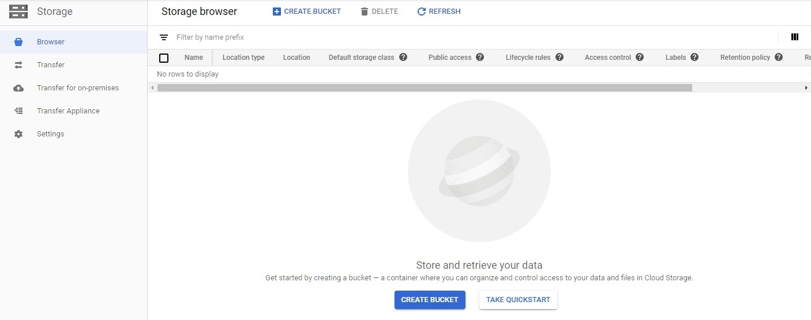
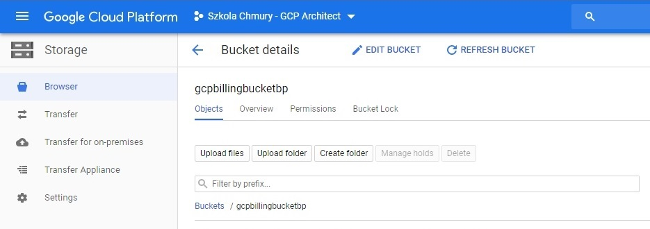
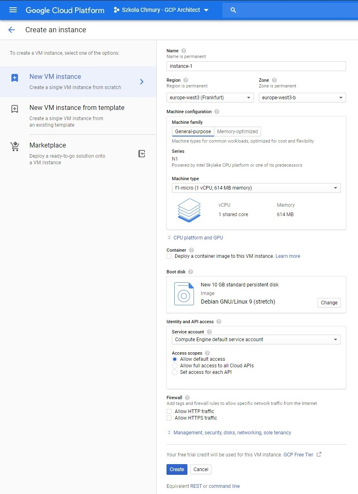

# Zadanie domowe nr 2

# Billing

## 1. Eksport danych rozliczeniowych do BigQuery

#### 1.1 Utworzenie Datasetu w BigQuery

  
<b><i>Pokaż</i></b>

#### 1.2 Eksport bilingu do BigQuery

  
<b><i>Pokaż</i></b>

## 2. Eksport danych rozliczeniowych do pliku

#### 2.1 Utworzenie Bucketa w Cloud Storage

  
<b><i>Pokaż</i></b>

#### 2.1 Eksport danych do pliku CSV

  
<b><i>Pokaż</i></b>

# Compute Engine

## 3.1 Utworzenie oraz uruchamianie instancji

  
<b><i>Pokaż</i></b>


