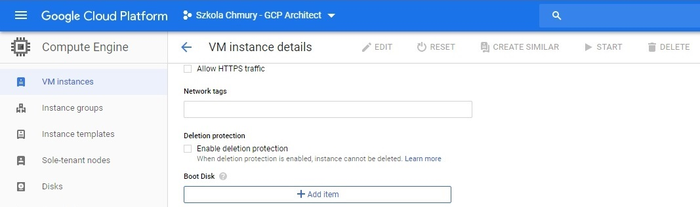
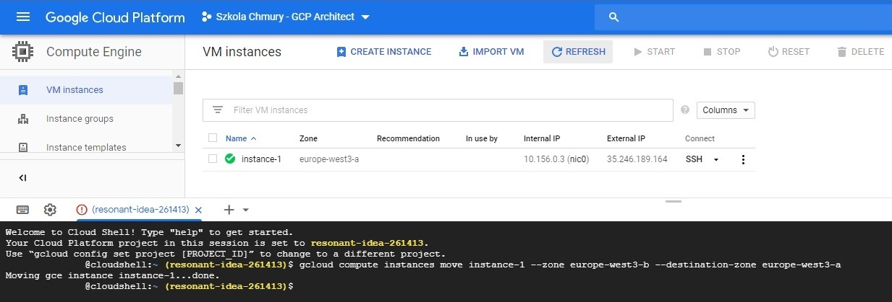

# Zadanie domowe nr 2

# Billing

## 1. Eksport danych rozliczeniowych do BigQuery

#### 1.1 Utworzenie Datasetu w BigQuery

<details>
  <summary><b><i>Pokaż</i></b></summary>


</details>

#### 1.2 Eksport bilingu do BigQuery

<details>
  <summary><b><i>Pokaż</i></b></summary>


</details>

## 2. Eksport danych rozliczeniowych do pliku

#### 2.1 Utworzenie Bucketa w Cloud Storage

<details>
  <summary><b><i>Pokaż</i></b></summary>


</details>

#### 2.1 Eksport danych do pliku CSV

<details>
  <summary><b><i>Pokaż</i></b></summary>


</details>


# Compute Engine

## 3.1 Utworzenie oraz uruchamianie instancji

<details>
  <summary><b><i>Pokaż</i></b></summary>


</details>

## 3.2 Odłączenie dysku startowego

<details>
  <summary><b><i>Pokaż</i></b></summary>




</details>

## 3.3 Ponowne podłączenie dysku startowego

<details>
  <summary><b><i>Pokaż</i></b></summary>


</details>

## 3.4 Snapshot dysku

<details>
  <summary><b><i>Pokaż</i></b></summary>


</details>

## 3.5 Przenoszenie instancji pomiędzy strefami

```
gcloud compute instances move instance-1 --zone europe-west3-b --destination-zone europe-west3-a
```

<details>
  <summary><b><i>Pokaż</i></b></summary>



</details>