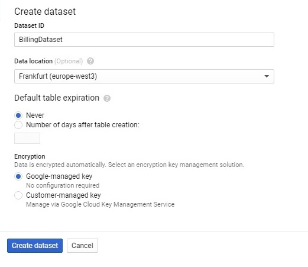
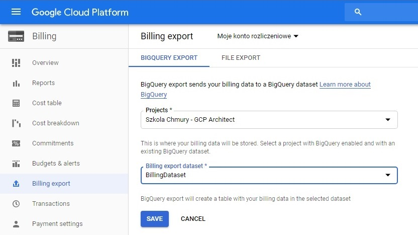
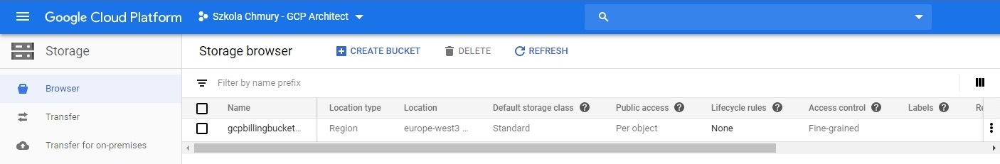
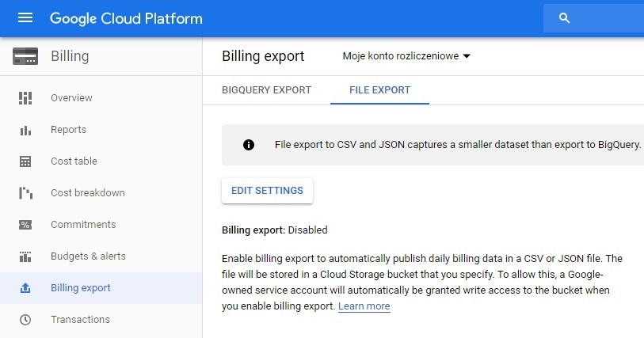
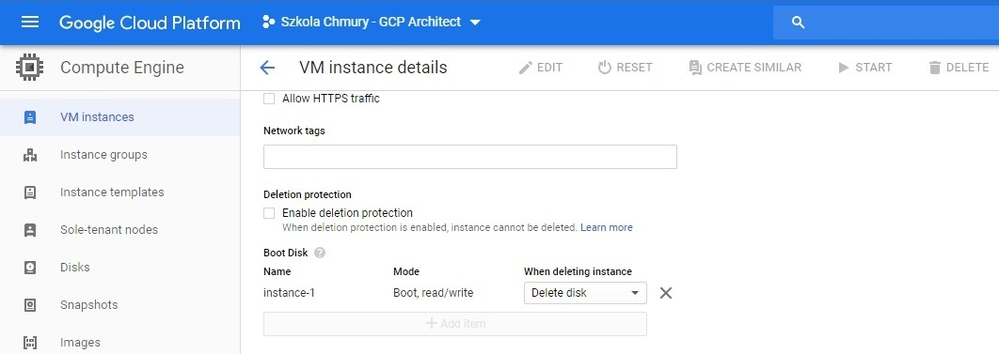
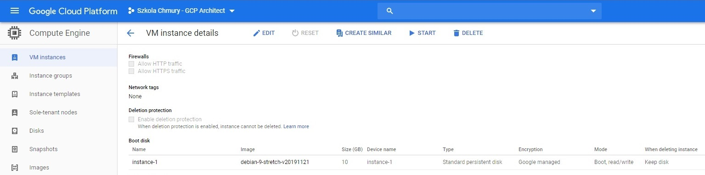
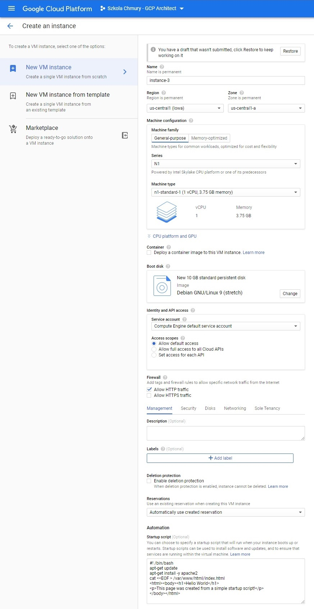
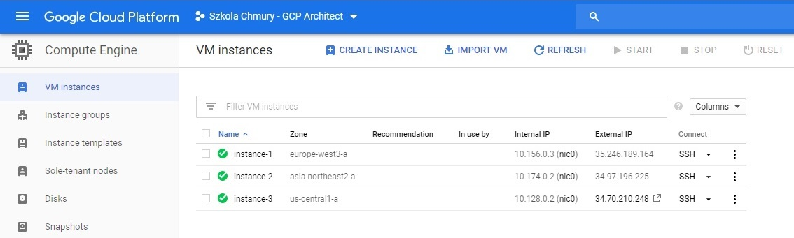

# Zadanie domowe nr 2

# Billing

## 1. Eksport danych rozliczeniowych do BigQuery

#### 1.1 Utworzenie Datasetu w BigQuery

<details>
  <summary><b><i>Pokaż</i></b></summary>



</details>

#### 1.2 Eksport bilingu do BigQuery

<details>
  <summary><b><i>Pokaż</i></b></summary>




</details>

## 2. Eksport danych rozliczeniowych do pliku

#### 2.1 Utworzenie Bucketa w Cloud Storage

<details>
  <summary><b><i>Pokaż</i></b></summary>




</details>

#### 2.1 Eksport danych do pliku CSV

<details>
  <summary><b><i>Pokaż</i></b></summary>




</details>


# Compute Engine

## 3.1 Utworzenie oraz uruchamianie instancji

<details>
  <summary><b><i>Pokaż</i></b></summary>


</details>

## 3.2 Odłączenie dysku startowego

<details>
  <summary><b><i>Pokaż</i></b></summary>




</details>

## 3.3 Ponowne podłączenie dysku startowego

<details>
  <summary><b><i>Pokaż</i></b></summary>



</details>

## 3.4 Snapshot dysku

<details>
  <summary><b><i>Pokaż</i></b></summary>


</details>

## 3.5 Przenoszenie instancji pomiędzy strefami

```
gcloud compute instances move instance-1 --zone europe-west3-b --destination-zone europe-west3-a
```

<details>
  <summary><b><i>Pokaż</i></b></summary>


</details>

## 3.6 Przenoszenie instancji pomiędzy regionami

#### 3.6.1 Stworzenie dysku ze snapshota
Wyświetlenie wszystkich dysków
```
bartosz@cloudshell:~ (resonant-idea-261413)$ gcloud compute disks list
NAME        LOCATION        LOCATION_SCOPE  SIZE_GB  TYPE         STATUS
instance-1  europe-west3-a  zone            10       pd-standard  READY
```

Wyświetlenie snapshotów
```
bartosz@cloudshell:~ (resonant-idea-261413)$ gcloud compute snapshots list
NAME        DISK_SIZE_GB  SRC_DISK                         STATUS
snapshot-1  10            europe-west3-b/disks/instance-1  READY
```

Sprawdzenie listy dostępnych zone:
```
bartoszpelikan@cloudshell:~ (resonant-idea-261413)$ gcloud compute zones list
NAME                       REGION                   STATUS  NEXT_MAINTENANCE  TURNDOWN_DATE
asia-northeast2-a          asia-northeast2          UP
```

Utworzenie nowego dysku ze snapshota
```
bartosz@cloudshell:~ (resonant-idea-261413)$ gcloud compute disks create instance-2 --source-snapshot snapshot-1 --zone asia-northeast2-a
Created [https://www.googleapis.com/compute/v1/projects/resonant-idea-261413/zones/asia-northeast2-a/disks/instance-2].
NAME        ZONE               SIZE_GB  TYPE         STATUS
instance-2  asia-northeast2-a  10       pd-standard  READY
```

#### 3.6.2 Utworzenie nowej instancji
Utworzenie nowej instancji VM:
```
bartosz@cloudshell:~ (resonant-idea-261413)$ gcloud compute instances create instance-2 --machine-type f1-micro --disk name=instance-2,boot=yes,mode=rw --zone asia-northeast2-a
Created [https://www.googleapis.com/compute/v1/projects/resonant-idea-261413/zones/asia-northeast2-a/instances/instance-2].
NAME        ZONE               MACHINE_TYPE  PREEMPTIBLE  INTERNAL_IP  EXTERNAL_IP    STATUS
instance-2  asia-northeast2-a  f1-micro                   10.174.0.2   34.97.196.225  RUNNING
```

<details>
  <summary><b><i>Sprawdzenie</i></b></summary>


</details>


## 4. Uruchomienie skryptów startowych

<details>
  <summary><b><i>Utworzenie nowej instancji VM</i></b></summary>



</details>

<details>
  <summary><b><i>Sprawdzenie</i></b></summary>


</details>