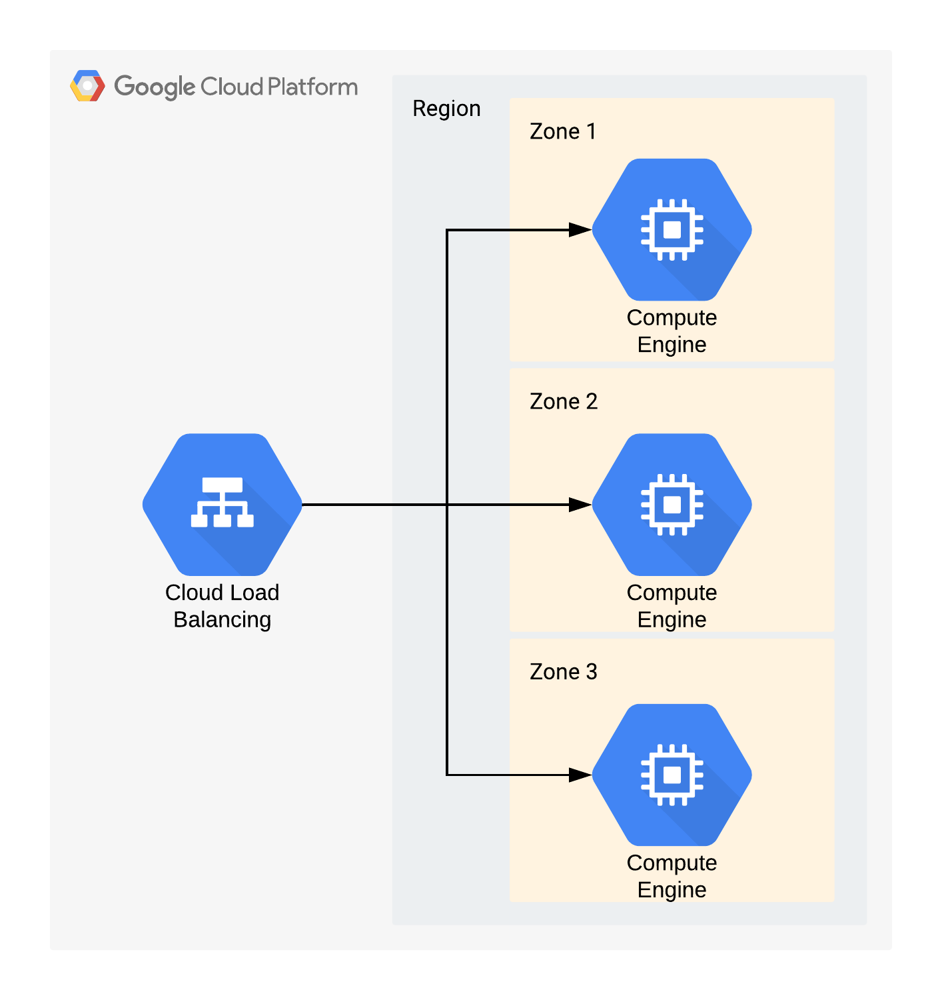

# [Zadanie domowe nr 3](https://szkolachmury.pl/google-cloud-platform-droga-architekta/tydzien-3-compute-engine/zadanie-domowe/)

1. Wybierz odpowiednią strategię migracji w oparciu o dostarczony opis.
2. W punktach napisz jak podszedłbyś do tej migracji, które kroki zrealizowałbyś w pierwszej kolejności
3. Firma wymaga, abyś przygotował demo końcowej architektury i zaprezentował je podczas umówionego spotkania w siedzibie firmy.

----

## 1. Wybierz odpowiednią strategię migracji w oparciu o dostarczony opis.

> Lift and shift

## 2. W punktach napisz jak podszedłbyś do tej migracji, które kroki zrealizowałbyś w pierwszej kolejności

1. Utworzenie obrazu maszyny
2. Umieszczenie obrazu w GCP
3. Dobranie odpowiedniej wielkości maszyny i utworzenie jej z dostarczonego obrazu
4. Uruchomienie środowiska, testowanie, monitorowanie zachowania środowiska oraz aplikacji

Uwagi do rozwiązania:
* Aby zapewnić **hight availability** oraz **skalowalność** (jak wynika z opisu zadania) należałoby wykorzystać **Managed instance group**, gdzie mamy możliwość utworzenia maszyn w środowisku **Multiple zones** zapewniającym HA oraz autoskalowalność. Jednak na ten moment nie możemy tego zapewnić ze względu na *'brak wiedzy'*. ([Google Compute Engine boosts high availability controls](https://cloud.google.com/blog/products/gcp/google-compute-engine-boosts-high-availability-controls))
* W powyższym rozwiązaniu (Managed instance group + Multiple zones) mając całe rozwiązanie w jednej maszynie (aplikacja + baza) dochodzą problemy z wydajnością oraz konsystencją danych pomiędzy maszynami.
* Dodatkowo przenosząc rozwiązanie do chmury należałoby rozważyć sprawy licencyjne, czy obenie używane pozwalają nam na migrację do chmury oraz oczywiście aspekty prawne.

## 3. Firma wymaga, abyś przygotował demo końcowej architektury i zaprezentował je podczas umówionego spotkania w siedzibie firmy.

<details>
  <summary><b><i>Diagram</i></b></summary>


</details>

#### Utworzenie VM z dostarczonego obrazu
```bash
# Utworzenie zmiennych
bucketName="images-bp"
bucketLocation="europe-west3"
imageName="mountkirk-games-image"
vmName="mountkirk-games-vm"
vmType="f1-micro"
vmZone="europe-west1-b"

# Utworzenie bucketa dla obrazu
gsutil mb -c STANDARD -l $bucketLocation gs://${bucketName}/

# Skopiowanie obrazu do własnego bucketa
gsutil cp gs://mountkirk-games-image/mountkirk-games.vmdk gs://${bucketName}/mountkirk-games.vmdk

# Import obrazu do własnego repozytorium
gcloud compute images import $imageName --os=debian-9 --source-file=gs://${bucketName}/mountkirk-games.vmdk

# Utworzenie VM na podstawie obrazu
gcloud compute instances create $vmName --machine-type=$vmType --zone=$vmZone --image=$imageName --tags=http-server
```

#### Usunięcie zasobów
```bash
# VM
gcloud compute instances delete $vmName --zone $vmZone
# Image
gcloud compute images delete $imageName
# Bucket
gsutil rm -r gs://${bucketName}/
```


```
