# [Zadanie domowe nr 4](https://szkolachmury.pl/google-cloud-platform-droga-architekta/tydzien-4-cloud-identity-and-access-management/zadanie-domowe-nr-4/)

* [Zadanie 1](#1-zadanie-1)
* [Zadanie 2](#2-zadanie-2)

---

## 1. Zadanie 1

> Klient poprosił cię o przygotowanie maszyny dla swoich pracowników, którzy będą mogli pobierać faktury z przygotowanego repozytorium (w naszym przypadku jest to pojemnik Cloud Storage)

#### 1.1 Przygotowanie `Cloud Storage`
```bash
# Zmienne
bucketName="zad4bpstorage"
bucketLocation="europe-west3"

# Utworzenie bucketa
gsutil mb -c STANDARD -l $bucketLocation gs://${bucketName}/

# Utworzenie plików
echo "Plik 1 - przykładowy tekst 1" > test1.txt
echo "Plik 2 - przykładowy tekst 2" > test2.txt

# Wysłanie plików
gsutil cp test*.txt gs://${bucketName}/
```

#### 1.2 Utworzenie `Service Account`
> Utworzenie konta serwisowego z dostępnem Read-only do wcześniej utworzonego bucketa

<details>
  <summary><b><i>Pokaż</i></b></summary>

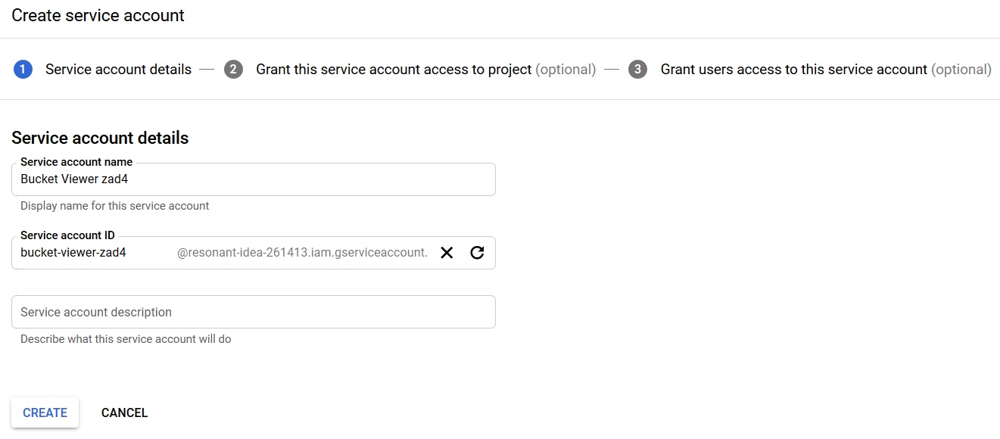
Dodanie roli **Storage Object Viewer**

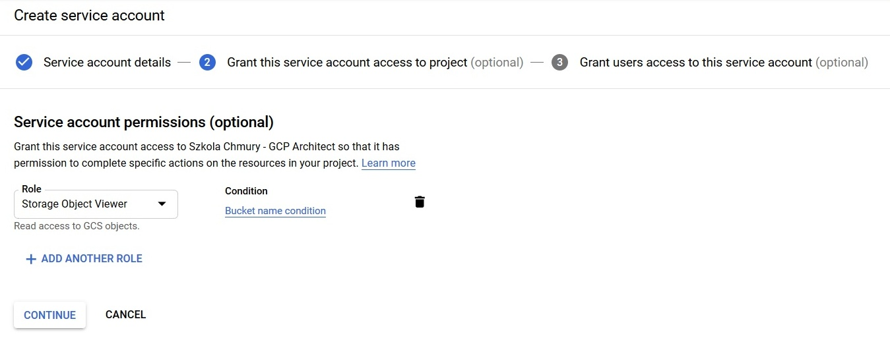
Oraz warunku dostępu tylko do danego bucketa:
* Name is `projects/_/buckets/zad4bpstorage`
* or Name Starts with `projects/_/buckets/zad4bpstorage/objects/`

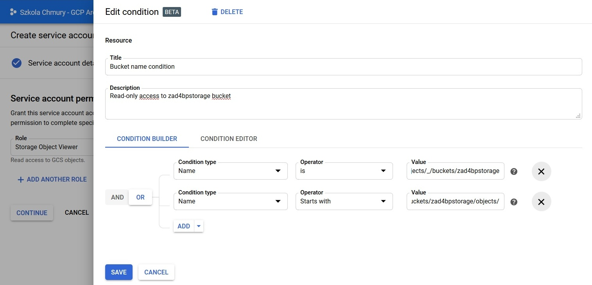

</details>

#### 1.3 Utworzenie VM
```bash
# Zmienne
vmName="zad4bpvm"
vmType="f1-micro"
vmZone="europe-west3-b"
serviceAccountEmail="" # gcloud iam service-accounts list

# Utworzenie VM
gcloud compute instances create $vmName --zone=$vmZone --machine-type=$vmType --image-project=debian-cloud --image=debian-9-stretch-v20191210 --service-account=$serviceAccountEmail
```

#### 1.4 Sprawdzenie uprawnień
> Połączenie się z VM i sprawdzenie czy ma dostęp Read-only do bucketa

<details>
  <summary><b><i>Pokaż</i></b></summary>

```bash
bartosz@zad4bpvm:~$ gsutil ls gs://zad4bpstorage
gs://zad4bpstorage/test1.txt
gs://zad4bpstorage/test2.txt
bartosz@zad4bpvm:~$ gsutil cat gs://zad4bpstorage/test1.txt
Plik 1 - przykładowy tekst 1
bartosz@zad4bpvm:~$ echo "test1" > testvm.txt
bartosz@zad4bpvm:~$ ls
testvm.txt
bartosz@zad4bpvm:~$ gsutil cp testvm.txt gs://zad4bpstorage
Copying file://testvm.txt [Content-Type=text/plain]...
AccessDeniedException: 403 Insufficient Permission                              
bartosz@zad4bpvm:~$ gsutil rm gs://zad4bpstorage/test1.txt
Removing gs://zad4bpstorage/test1.txt...
AccessDeniedException: 403 Insufficient Permission
bartosz@zad4bpvm:~$ gsutil ls gs://
AccessDeniedException: 403 bucket-viewer-zad4@resonant-idea-261413.iam.gserviceaccount.com does not have storage.buckets.list access to project 162512192576.
```
</details>

#### 1.5 Usunięcie zasobów
```bash
gcloud compute instances delete $vmName --zone=$vmZone 
gcloud iam service-accounts delete $serviceAccountEmail
gsutil -m rm -r gs://${bucketName}/
rm test*.txt
```

## 2. Zadanie 2

> Dany klient przetrzymuje bardzo ważne dokumenty. Zarząd zdecydował, że wprowadzą szyfrowanie krytycznych dokumentów, które będą mogły zostać odszyfrowane po stronie pracownika, który z danego dokumentu chce skorzystać.

#### 2.1 Utworzenie bucketa dla plików
```bash
bucketName="secretstoragebp"
bucketLocation="europe-west3"

# Utworzenie bucketa
gsutil mb -c STANDARD -l $bucketLocation gs://${bucketName}/
```

#### 2.2 Uruchomieie usługi KMS
```bash
gcloud services enable cloudkms.googleapis.com
```

#### 2.3 [Utworzenie klucza asymetrycznego](https://cloud.google.com/kms/docs/creating-asymmetric-keys)
```bash
keyringsName="vmkeyrings"
keyName="vmKeyAsync"
keyPurpose="asymmetric-encryption"
defaultAlgorithm="rsa-decrypt-oaep-3072-sha256"

# Utworzenie Keyrings
gcloud kms keyrings create $keyringsName --location global

# Utworzenie klucza
gcloud kms keys create $keyName --location global --keyring $keyringsName --purpose $keyPurpose --default-algorithm $defaultAlgorithm 
```

#### 2.4 PoC w Cloud Shell
<details>
  <summary><b><i>PoC w Cloud Shell</i></b></summary>

#### 2.4.1 Utworzenie przykładowego pliku
```bash
echo "Plik 1 - przykładowy tekst 1 ąźćżółęż" > test1.txt
```

#### 2.4.2 [Pobranie klucza publicznego](https://cloud.google.com/kms/docs/retrieve-public-key#kms-howto-retrieve-public-key-cli)
```bash
keyVersion="1"

# Pobranie klucza publicznego
gcloud kms keys versions get-public-key $keyVersion --location global --keyring $keyringsName --key $keyName --output-file public-key.pub
```

#### 2.4.3 [Zaszyfrowanie pliku](https://cloud.google.com/kms/docs/encrypt-decrypt-rsa#encrypt_data)
```bash
openssl pkeyutl -in $HOME/zadanie4/test1.txt -encrypt -pubin -inkey $HOME/zadanie4/public-key.pub -pkeyopt rsa_padding_mode:oaep -pkeyopt rsa_oaep_md:sha256 -pkeyopt rsa_mgf1_md:sha256 > $HOME/zadanie4/secret/test1.enc
```

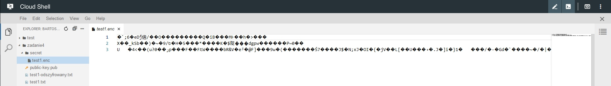

#### 2.4.4 [Odszyfrowanie pliku](https://cloud.google.com/kms/docs/encrypt-decrypt-rsa#decrypt_data)
```bash
gcloud kms asymmetric-decrypt --location global --keyring $keyringsName --key $keyName --version $keyVersion --ciphertext-file $HOME/zadanie4/secret/test1.enc --plaintext-file $HOME/zadanie4/test1-odszyfrowany.txt
```

#### 2.4.5 Porównanie pliku po odszyfrowaniu
```bash
bartosz@cloudshell:~/zadanie4 (resonant-idea-261413)$ cat test1.txt
Plik 1 - przykładowy tekst 1 ąźćżółęż
bartosz@cloudshell:~/zadanie4 (resonant-idea-261413)$ cat test1-odszyfrowany.txt
Plik 1 - przykładowy tekst 1 ąźćżółęż
```
</details>


#### 2.5 Utworzenie kont serwisowych

#### 2.5.1 Konto serwisowe do szyfrowania dokumentów
<details>
  <summary><b><i>Pokaż</i></b></summary>

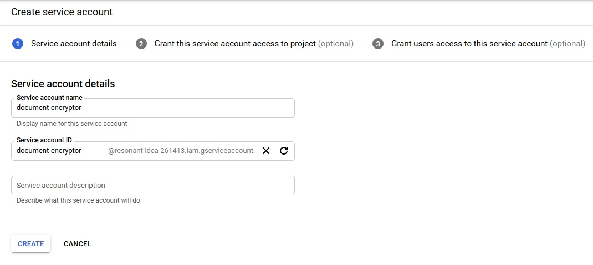
Dodanie ról:
* **Storage Object Creator** oraz
* **Cloud KMS CryptoKey Public Key Viewer**

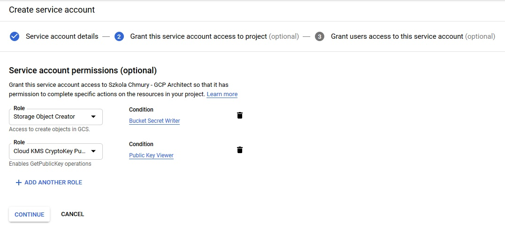

Oraz warunków:
* zapisu tylko do danego bucketa:
  * Name Starts with `projects/_/buckets/secretstoragebp/objects/`

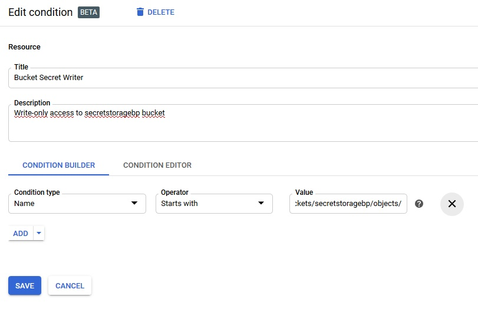

* oraz pobieranie kluczy publicznych z danego keyringa:
  * Name Starts with `projects/resonant-idea-261413/locations/global/keyRings/vmkeyrings/cryptoKeys/`

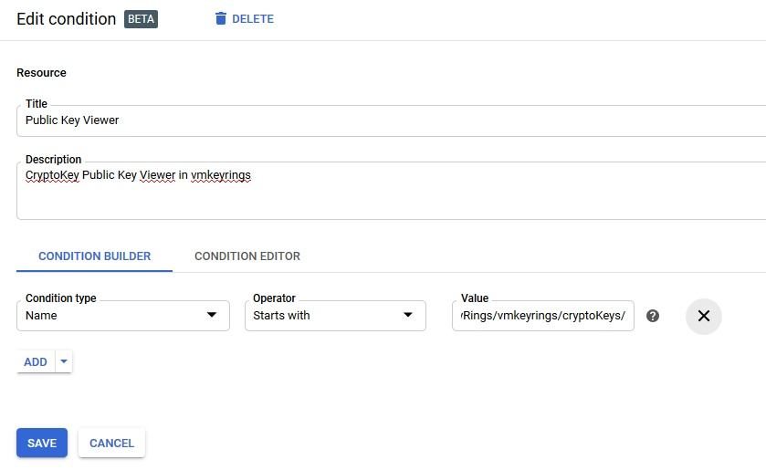
</details>

#### 2.5.2 Konto serwisowe do odszyfrowania dokumentów
<details>
  <summary><b><i>Pokaż</i></b></summary>

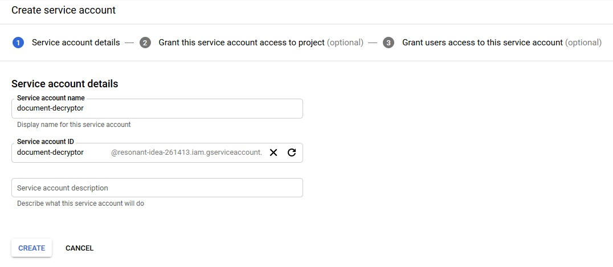
Dodanie ról:
* **Storage Object Viewer** oraz
* **Cloud KMS CryptoKey Decrypter**

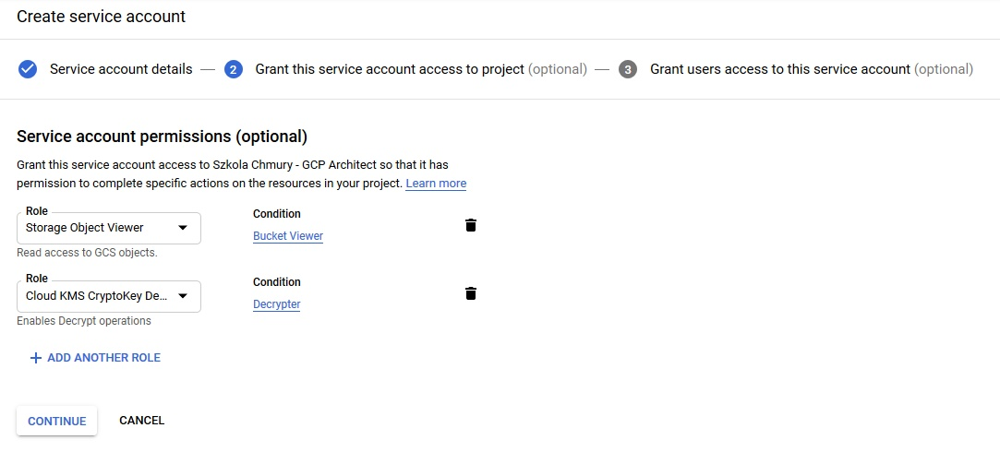

Oraz warunków:
* odczytu danych tylko z danego bucketa:
  * Name is `projects/_/buckets/secretstoragebp`
  * or Name Starts with `projects/_/buckets/secretstoragebp/objects/`

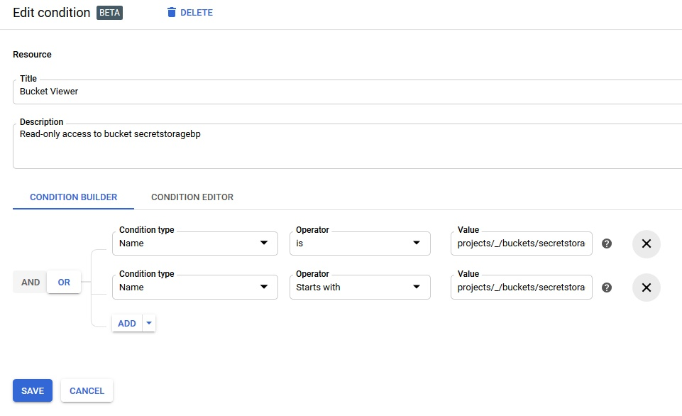

* oraz deszyfrowania danych za pomocą kluczy z danego keyringa:
  * Name Starts with `projects/resonant-idea-261413/locations/global/keyRings/vmkeyrings/cryptoKeys/`

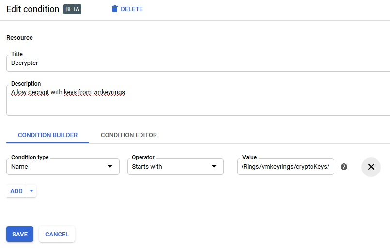
</details>

#### 2.6 Utworzenie VM
```bash
vmNameEncrypt="zad4encr"
vmNameDecrypt="zad4decr"
vmType="f1-micro"
vmZone="europe-west3-b"
serviceAccountEmailEncrypt="document-encryptor@resonant-idea-261413.iam.gserviceaccount.com" # gcloud iam service-accounts list
serviceAccountEmailDecrypt="document-decryptor@resonant-idea-261413.iam.gserviceaccount.com"

# Encryptor VM
gcloud compute instances create $vmNameEncrypt --zone=$vmZone --machine-type=$vmType --image-project=debian-cloud --image=debian-9-stretch-v20191210 --service-account=$serviceAccountEmailEncrypt --scopes=https://www.googleapis.com/auth/cloud-platform

# Decryptor VM
gcloud compute instances create $vmNameDecrypt --zone=$vmZone --machine-type=$vmType --image-project=debian-cloud --image=debian-9-stretch-v20191210 --service-account=$serviceAccountEmailDecrypt --scopes=https://www.googleapis.com/auth/cloud-platform
```

#### 2.7 Zaszyfrowanie plików 
```bash
bucketName="secretstoragebp"
keyringsName="vmkeyrings"
keyName="vmKeyAsync"
keyVersion="1"

# Utworzenie przykładowych plików
echo "Plik 1 - przykładowy tekst 1 ąźćżółęż" > test1.txt
echo "Plik 2 - przykładowy tekst 2 ąźćżółęż" > test2.txt

# Pobranie klucza publicznego
gcloud kms keys versions get-public-key $keyVersion --location global --keyring $keyringsName --key $keyName --output-file public-key.pub

# Zaszyfrowanie plików
mkdir secret
openssl pkeyutl -in $HOME/test1.txt -encrypt -pubin -inkey $HOME/public-key.pub -pkeyopt rsa_padding_mode:oaep -pkeyopt rsa_oaep_md:sha256 -pkeyopt rsa_mgf1_md:sha256 > $HOME/secret/test1.enc
openssl pkeyutl -in $HOME/test2.txt -encrypt -pubin -inkey $HOME/public-key.pub -pkeyopt rsa_padding_mode:oaep -pkeyopt rsa_oaep_md:sha256 -pkeyopt rsa_mgf1_md:sha256 > $HOME/secret/test2.enc

# Wysłanie plików do Cloud Storage
gsutil cp $HOME/secret/test1.enc gs://$bucketName/
gsutil cp $HOME/secret/test2.enc gs://$bucketName/

# Próby wykonania niedozwolonych operacji
gsutil ls gs://$bucketName
gsutil rm gs://$bucketName/test1.enc
gsutil cat gs://$bucketName/test1.enc # powodzenie - jak można zauważyć może odczytywać pliki które utworzył
gsutil cat gs://$bucketName/t.txt

gcloud kms asymmetric-decrypt --location global --keyring $keyringsName --key $keyName --version $keyVersion --ciphertext-file $HOME/secret/test1.enc --plaintext-file $HOME/test1-odszyfrowany.txt
```

<details>
  <summary><b><i>Console output</i></b></summary>

```bash
bartosz@zad4encr:~$ bucketName="secretstoragebp"
bartosz@zad4encr:~$ keyringsName="vmkeyrings"
bartosz@zad4encr:~$ keyName="vmKeyAsync"
bartosz@zad4encr:~$ keyVersion="1"
# Utworzenie przykładowych plików
bartosz@zad4encr:~$ echo "Plik 1 - przykładowy tekst 1 ąźćżółęż" > test1.txt
bartosz@zad4encr:~$ echo "Plik 2 - przykładowy tekst 2 ąźćżółęż" > test2.txt
# Pobranie klucza publicznego
bartosz@zad4encr:~$ gcloud kms keys versions get-public-key $keyVersion --location global --keyring $keyringsName --key $keyName --output-file public-key.pub
bartosz@zad4encr:~$ ls
public-key.pub  test1.txt  test2.txt
bartosz@zad4encr:~$ mkdir secret
bartosz@zad4encr:~$ ls
public-key.pub  secret  test1.txt  test2.txt
# Zaszyfrowanie plików
bartosz@zad4encr:~$ openssl pkeyutl -in $HOME/test1.txt -encrypt -pubin -inkey $HOME/public-key.pub -pkeyopt rsa_padding_mode:oaep -pkeyopt rsa_oaep_md:sha256 -pkeyopt rsa_mgf1_md:sha256 > $HOME/secret/test1.enc
bartosz@zad4encr:~$ openssl pkeyutl -in $HOME/test2.txt -encrypt -pubin -inkey $HOME/public-key.pub -pkeyopt rsa_padding_mode:oaep -pkeyopt rsa_oaep_md:sha256 -pkeyopt rsa_mgf1_md:sha256 > $HOME/secret/test2.enc
# Wysłanie plików do Cloud Storage
bartosz@zad4encr:~$ gsutil cp $HOME/secret/test1.enc gs://$bucketName/
Copying file:///home/bartosz/secret/test1.enc [Content-Type=application/octet-stream]...
/ [1 files][  384.0 B/  384.0 B]                                                
Operation completed over 1 objects/384.0 B.                                      
bartosz@zad4encr:~$ gsutil cp $HOME/secret/test2.enc gs://$bucketName/
Copying file:///home/bartosz/secret/test2.enc [Content-Type=application/octet-stream]...
/ [1 files][  384.0 B/  384.0 B]                                                
Operation completed over 1 objects/384.0 B.                                      
# Próby wykonania niedozwolonych operacji
bartosz@zad4encr:~$ gsutil ls gs://$bucketName
AccessDeniedException: 403 document-encryptor@resonant-idea-261413.iam.gserviceaccount.com does not have storage.objects.list access to secretstoragebp.
bartosz@zad4encr:~$ gsutil rm gs://$bucketName/test1.enc
Removing gs://secretstoragebp/test1.enc...
AccessDeniedException: 403 document-encryptor@resonant-idea-261413.iam.gserviceaccount.com does not have storage.objects.delete access to secretstoragebp/test1.enc.
bartosz@zad4encr:~$ gsutil cat gs://$bucketName/test1.enc
��� �%2+?s]�n���N�� # {...} powodzenie
bartosz@zad4encr:~$ gsutil cat gs://$bucketName/t.txt
AccessDeniedException: 403 document-encryptor@resonant-idea-261413.iam.gserviceaccount.com does not have storage.objects.list access to secretstoragebp.
bartosz@zad4encr:~$ gcloud kms asymmetric-decrypt --location global --keyring $keyringsName --key $keyName --version $keyVersion --ciphertext-file $HOME/secret/test1.enc --plaintext-file $HOME/test1-odszyfrowany.txt
ERROR: (gcloud.kms.asymmetric-decrypt) PERMISSION_DENIED: Permission 'cloudkms.cryptoKeyVersions.useToDecrypt' denied on resource 'projects/resonant-idea-261413/locations/global/keyRings/vmkeyrings/cryptoKeys/vmKeyAsync/cryptoKeyVersions/1' (or it may not exist).
```
</details>

#### 2.8 Odszyfrowanie plików 
```bash
bucketName="secretstoragebp"
keyringsName="vmkeyrings"
keyName="vmKeyAsync"
keyVersion="1"

# Pobranie plików
gsutil cp gs://$bucketName/* .

# Odszyfrowanie plików
gcloud kms asymmetric-decrypt --location global --keyring $keyringsName --key $keyName --version $keyVersion --ciphertext-file $HOME/test1.enc --plaintext-file $HOME/test1-odszyfrowany.txt
gcloud kms asymmetric-decrypt --location global --keyring $keyringsName --key $keyName --version $keyVersion --ciphertext-file $HOME/test2.enc --plaintext-file $HOME/test2-odszyfrowany.txt

# Wyświetlenie zawartości odszyfrowanych plików
cat test1-odszyfrowany.txt
cat test2-odszyfrowany.txt

# Próby wykonania niedozwolonych operacji
gsutil rm gs://$bucketName/test1.enc
gcloud kms keys versions get-public-key $keyVersion --location global --keyring $keyringsName --key $keyName --output-file public-key.pub
gsutil cp $HOME/test1-odszyfrowany.txt gs://$bucketName/
```

<details>
  <summary><b><i>Console output</i></b></summary>

```bash
bartosz@zad4decr:~$ bucketName="secretstoragebp"
bartosz@zad4decr:~$ keyringsName="vmkeyrings"
bartosz@zad4decr:~$ keyName="vmKeyAsync"
bartosz@zad4decr:~$ keyVersion="1"
bartosz@zad4decr:~$ ls
# Pobranie plików
bartosz@zad4decr:~$ gsutil cp gs://$bucketName/* .
Copying gs://secretstoragebp/t.txt...
Copying gs://secretstoragebp/test1.enc...                                       
Copying gs://secretstoragebp/test2.enc...                                       
/ [3 files][  774.0 B/  774.0 B]                                                
Operation completed over 3 objects/774.0 B.                                      
bartosz@zad4decr:~$ cat test1.enc
��� �%2+?s]�n���N�� # {...}
# Odszyfrowanie plików
bartosz@zad4decr:~$ gcloud kms asymmetric-decrypt --location global --keyring $keyringsName --key $keyName --version $keyVersion --ciphertext-file $HOME/test1.enc --plaintext-file $HOME/test1-odszyfrowany.txt
bartosz@zad4decr:~$ gcloud kms asymmetric-decrypt --location global --keyring $keyringsName --key $keyName --version $keyVersion --ciphertext-file $HOME/test2.enc --plaintext-file $HOME/test2-odszyfrowany.txt
bartosz@zad4decr:~$ ls
test1.enc  test1-odszyfrowany.txt  test2.enc  test2-odszyfrowany.txt  t.txt
# Wyświetlenie zawartości odszyfrowanych plików - zawartość prawidłowa
bartosz@zad4decr:~$ cat test1-odszyfrowany.txt
Plik 1 - przykładowy tekst 1 ąźćżółęż
bartosz@zad4decr:~$ cat test2-odszyfrowany.txt
Plik 2 - przykładowy tekst 2 ąźćżółęż
# Próby wykonania niedozwolonych operacji
bartosz@zad4decr:~$ gsutil rm gs://$bucketName/test1.enc
Removing gs://secretstoragebp/test1.enc...
AccessDeniedException: 403 document-decryptor@resonant-idea-261413.iam.gserviceaccount.com does not have storage
.objects.delete access to secretstoragebp/test1.enc.
bartosz@zad4decr:~$ gcloud kms keys versions get-public-key $keyVersion --location global --keyring $keyringsName --key $keyName --output-file public-key.pub
ERROR: (gcloud.kms.keys.versions.get-public-key) PERMISSION_DENIED: Permission 'cloudkms.cryptoKeyVersions.viewPublicKey' denied on resource 'projects/resonant-idea-261413/locations/global/keyRings/vmkeyrings/cryptoKeys/vmKeyAsync/cryptoKeyVersions/1' (or it may not exist).
bartosz@zad4decr:~$ gsutil cp $HOME/test1-odszyfrowany.txt gs://$bucketName/
Copying file:///home/bartosz/test1-odszyfrowany.txt [Content-Type=text/plain]...
AccessDeniedException: 403 document-decryptor@resonant-idea-261413.iam.gserviceaccount.com does not have storage
.objects.create access to secretstoragebp/test1-odszyfrowany.txt.
```
</details>

