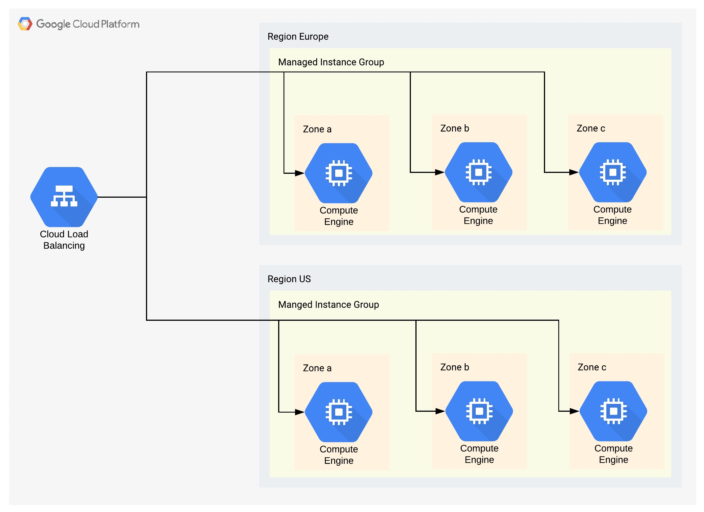
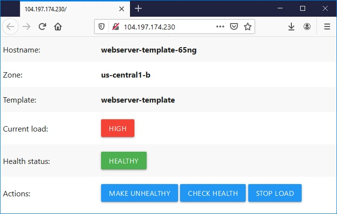
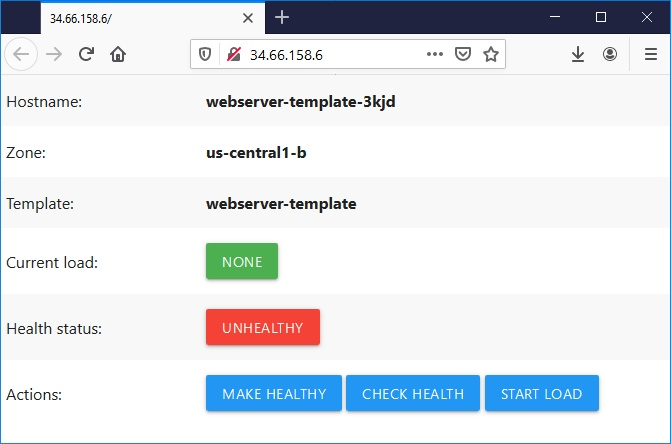
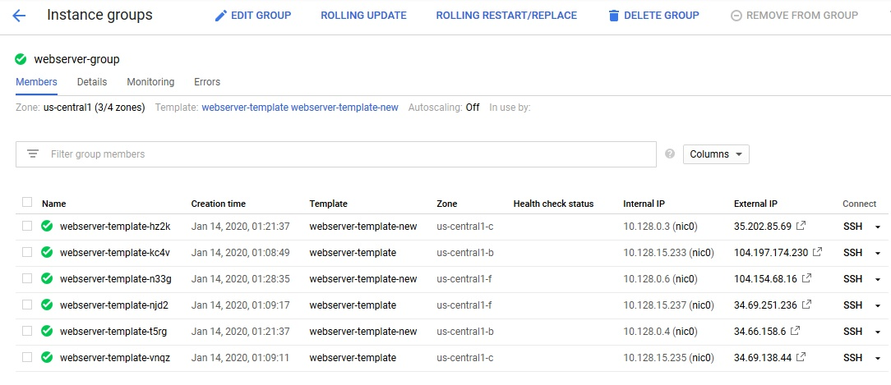
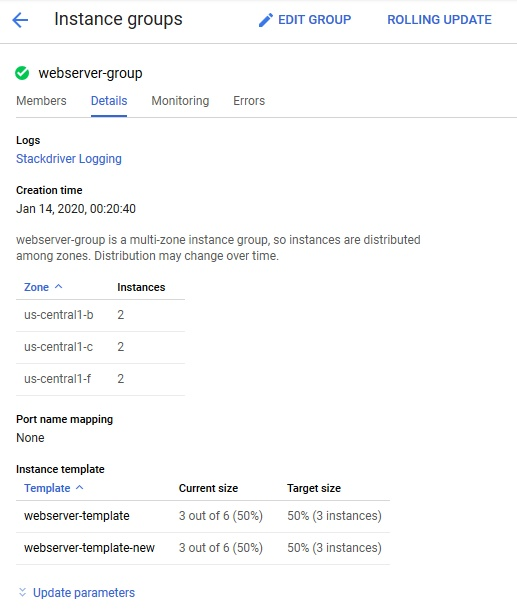
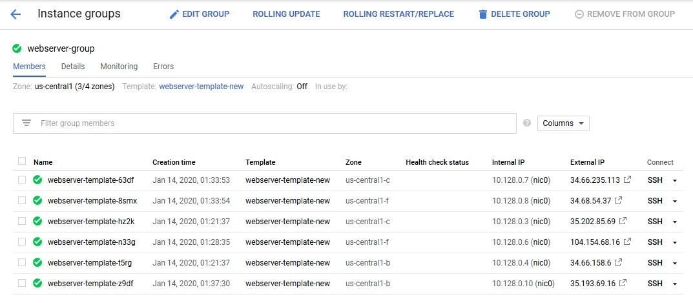
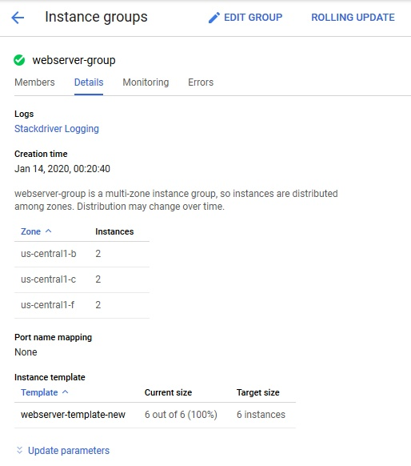

# [Zadanie domowe nr 5](https://szkolachmury.pl/google-cloud-platform-droga-architekta/tydzien-5-instance-groups-i-autoskalowanie/zadanie-domowe-nr-5/)

1. Na ten moment firma nie może zrezygnować z maszyn wirtualnych, dlatego nowa architektura musi korzystać z wirtualnych maszyn postawionych z niestandardowego obrazu, dostarczonego bezpośrednio przez firmę.
2. Rozwiązanie musi dynamicznie skalować się w górę lub w dół w zależności od aktywności w grze - bez większej ingerencji specjalistów
3. Gracze korzystający z funkcjonalności firmy pochodzą z całego świata, a w szczególności z Stanów Zjednoczonych oraz Europy. Poprzez odpowiednie umiejscowienie rozwiązania MountKirk chce zredukować opóźnienie jakie występuje dla osób łączących się z US.
4. Rozwiązanie musi zapobiegać jakiejkolwiek przerwie w dostarczaniu funkcjonalności na wypadek awarii np. regionu Google Cloud.
5. Rozwiązanie musi umożliwość łatwe i bezpiecznie wdrażanie nowych wersji oprogramowania do instancji bez konieczności wpływania na całe środowisko.

# 1 Rozwiązanie
## 1.1 Opis
Użycie [Managed Instance Groups](https://cloud.google.com/compute/docs/instance-groups/) pozwoli spełnić powyższe założenia:
* Zapewnienie **High availability**:
  * **Keeping instances running** - w przypadku niezamierzonego wyłączenia/usunięcia maszyny, VM zostanie automatycznie odtworzona na nowo
  * [**Autohealing**](https://cloud.google.com/compute/docs/instance-groups/#autohealing) - w przypadku błędnego kodu odpowiedzi z aplikacji, maszyna zostanie usunięta i odtworzona na nowo
  * [**Regional (multiple zone) coverage**](https://cloud.google.com/compute/docs/instance-groups/#types_of_managed_instance_groups) - umieszczenie maszyn w różnych strefach pozwala na zabezpieczenie się przed awarią jednego z nich oraz rozłożeniem ruchu pomiędzy strefy. Natomiast umieszczenie maszyn w różnych regionach pomaga zmniejszyć opóźnienie w przypadku posiadania użytkowników z różnych części świata. W wyborze regionów pomóc może zbieranie metryk z informacją o lokalizacji użytkownika, ich ilości w danym regionie oraz występujących opóźnieniach.
  * [**Load balancing**](https://cloud.google.com/compute/docs/instance-groups/#load_balancing) - równomierne rozłożenie ruchu pomiędzy maszynami w danej strefie oraz pomiędzy samymi strefami. Wybór regionu do którego użytkownik zostanie przekierowany na podstawie najkrótszego opóźnienia. W przypadku awarii regionu/strefy tymczasowe przekierowanie ruchu do działającego regionu/strefy (zapewnienie **HA**).
* [**Scalability**](https://cloud.google.com/compute/docs/instance-groups/#autoscaling) - **MIG** automatycznie zeskaluje środowisko w zależności od obciążenia oraz naszej [polityki skalowania](https://cloud.google.com/compute/docs/autoscaler/#policies).
* [**Automated updates**](https://cloud.google.com/compute/docs/instance-groups/#automatic_updating) - umożliwia wykonanie **Rolling updates** oraz **Canary updates**, czyli wykonanie aktualizacji w dość bezpieczny sposób z możliwością łatwego przywrócenia poprzedniej wersji.

## 1.2 Diagram

<details>
  <summary><b><i>Diagram</i></b></summary>


</details>

## 1.3 Update

1. Wybranie strefy na której testowana będzie nowa wersja aplikacji
2. Przekierowanie 10% ruchu w wybranej strefie do nowej wersji, wraz z czasem zwiększanie tej wartości do 100% ([Canary update](https://cloud.google.com/compute/docs/instance-groups/rolling-out-updates-to-managed-instance-groups#starting_a_canary_update)). W międzyczasie zbierane będą informacje czy nie występują błędy, spowolnienie aplikacji, oraz zadowolenie użytkowników (porzez zbieranie zgłoszeń, czy też monitorowanie portali społecznościowych)
3. Jeśli po określonym czasie w strefie nie zostaną odnotowane żadne nieprawidłowości, wykonanie rolling update za pozostałych strefach.
4. Jeśli wystąpią nieprawidłowości, zbyt wiele błędów lub za dużo niezadowolonych użytkowników nastapi cofnięcie wersji do poprzedniej.

# 2. Demo

## 1.1 Utworzenie `Health check`
```bash
healthCheckName="autohealer-check"
# Utworznie
gcloud compute health-checks create http $healthCheckName \
    --check-interval 10 \
    --timeout 5 \
    --healthy-threshold 3 \
    --unhealthy-threshold 3 \
    --request-path "/health"

# Sprawdzenie
gcloud compute health-checks list
```

## 1.2 Utworzenie template dla MIG
```bash
templateName="webserver-template"
templateName2="webserver-template-new"

# wersja 1
gcloud compute instance-templates create $templateName \
    --machine-type f1-micro \
    --tags http-server \
    --metadata startup-script='
  sudo apt-get update && sudo apt-get install git gunicorn3 python3-pip -y
  git clone https://github.com/GoogleCloudPlatform/python-docs-samples.git
  cd python-docs-samples/compute/managed-instances/demo
  sudo pip3 install -r requirements.txt
  sudo gunicorn3 --bind 0.0.0.0:80 app:app --daemon'

# Wersja 2
gcloud compute instance-templates create $templateName2 \
--image-family debian-9 \
--image-project debian-cloud \
--tags=http-server \
--machine-type=f1-micro \
--metadata=startup-script=\#\!/bin/bash$'\n'sudo\ apt-get\ update\ $'\n'sudo\ apt-get\ install\ -y\ nginx\ $'\n'sudo\ service\ nginx\ start\ $'\n'sudo\ sed\ -i\ --\ \"s/Welcome\ to\ nginx/Version:2\ -\ Welcome\ to\ \$HOSTNAME/g\"\ /var/www/html/index.nginx-debian.html
```

## 1.3 Utworzenie `Managed instance group` z włączonym autohealingiem
```bash
migName="webserver-group"
migRegion="us-central1"
gcloud compute instance-groups managed create $migName \
    --region $migRegion \
    --template $templateName \
    --base-instance-name $templateName \
    --size 3 \
    --health-check autohealer-check \
    --initial-delay 90 \
```

## 1.4 Konfiguracja autoskalowania
```bash
gcloud compute instance-groups managed set-autoscaling $migName \
    --region $migRegion \
    --min-num-replicas 3 \
    --max-num-replicas 8 \
    --target-cpu-utilization "0.5"
```

<details>
  <summary><b><i>Status</i></b></summary>

```bash
bartosz@cloudshell:~ (resonant-idea-261413)$ gcloud compute instance-groups managed list-instances $migName --region $migRegion
NAME                     ZONE           STATUS   ACTION  INSTANCE_TEMPLATE   VERSION_NAME  LAST_ERROR
webserver-template-65ng  us-central1-b  RUNNING  NONE    webserver-template
webserver-template-t1pt  us-central1-c  RUNNING  NONE    webserver-template
webserver-template-hhv3  us-central1-f  RUNNING  NONE    webserver-template
```
</details>

## 1.5 Test autoskalowania

<details>
  <summary><b><i>Obciążenie środowiska</i></b></summary>


</details>


<details>
  <summary><b><i>Wynik</i></b></summary>

```bash
bartosz@cloudshell:~ (resonant-idea-261413)$ gcloud compute instance-groups managed list-instances $migName --region $migRegion
NAME                     ZONE           STATUS   ACTION  INSTANCE_TEMPLATE   VERSION_NAME  LAST_ERROR
webserver-template-3kjd  us-central1-b  RUNNING  NONE    webserver-template
webserver-template-65ng  us-central1-b  RUNNING  NONE    webserver-template
webserver-template-b3zq  us-central1-b  RUNNING  NONE    webserver-template
webserver-template-t1pt  us-central1-c  RUNNING  NONE    webserver-template
webserver-template-wd9t  us-central1-c  RUNNING  NONE    webserver-template
webserver-template-hhv3  us-central1-f  RUNNING  NONE    webserver-template
webserver-template-qfrf  us-central1-f  RUNNING  NONE    webserver-template
webserver-template-szmw  us-central1-f  RUNNING  NONE    webserver-template
```
</details>


## 1.6 Test autohealing

<details>
  <summary><b><i>Status przed</i></b></summary>

```bash
bartosz@cloudshell:~ (resonant-idea-261413)$ gcloud compute instance-groups managed list-instances $migName --region $migRegion
NAME                     ZONE           STATUS   ACTION  INSTANCE_TEMPLATE   VERSION_NAME  LAST_ERROR
webserver-template-3kjd  us-central1-b  RUNNING  NONE    webserver-template
webserver-template-t1pt  us-central1-c  RUNNING  NONE    webserver-template
webserver-template-hhv3  us-central1-f  RUNNING  NONE    webserver-template
```
</details>

<details>
  <summary><b><i>Symulacja niedostępności</i></b></summary>


</details>

<details>
  <summary><b><i>Status po</i></b></summary>

```bash
bartosz@cloudshell:~ (resonant-idea-261413)$ gcloud compute instance-groups managed list-instances $migName --region $migRegion
NAME                     ZONE           STATUS    ACTION      INSTANCE_TEMPLATE   VERSION_NAME  LAST_ERROR
webserver-template-3kjd  us-central1-b  STOPPING  RECREATING  webserver-template
webserver-template-t1pt  us-central1-c  RUNNING   NONE        webserver-template
webserver-template-hhv3  us-central1-f  RUNNING   NONE        webserver-template
```
</details>

## 1.7 Demo wykonania update
```bash
# Wyłączenie autohealing - demostracyjna 2 wersja nie posiada ścieżki /health
gcloud compute instance-groups managed update $migName --region $migRegion --clear-autohealing

# Wyłączenie autoskalowania
gcloud compute instance-groups managed stop-autoscaling $migName --region $migRegion

# Zwiększenie liczby instancji
gcloud compute instance-groups managed resize $migName --region $migRegion --size 6
```

### 1.7.1 Canary update
```bash
gcloud compute instance-groups managed rolling-action start-update $migName --version template=$templateName --canary-version template=$templateName2,target-size=50% --region $migRegion
```

<details>
  <summary><b><i>Wynik</i></b></summary>



</details>

### 1.7.2 Rolling update
```bash
gcloud compute instance-groups managed rolling-action start-update $migName --version template=$templateName2 --region $migRegion
```

<details>
  <summary><b><i>Wynik</i></b></summary>



</details>

