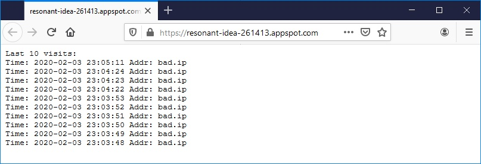

# [Zadanie domowe nr 8](https://szkolachmury.pl/google-cloud-platform-droga-architekta/tydzien-8-app-engine/zadanie-domowe-nr-8/)

### 1. Uruchamiasz aplikację w Google App Engine, która obsługuje ruch produkcyjny. Chcesz wdrożyć ryzykowną, ale konieczną zmianę w aplikacji. Może ona zniszczyć Twoją usługę, jeśli nie będzie prawidłowo zakodowana. Podczas tworzenia aplikacji zdajesz sobie sprawę, że możesz ją prawidłowo przetestować tylko z rzeczywistym ruchem użytkowników.
```bash
# Pobranie przykładowych kodów źródłowych
git clone https://github.com/GoogleCloudPlatform/python-docs-samples

# Wdrożenie aplikacji Hello World
cd ./python-docs-samples/appengine/standard/hello_world
gcloud app deploy

# Pobranie adresu aplikacji i sprawdzenie działania
gcloud app browse
gcloud app services list

# Dokonanie zmian w pliku main.py i wdrożenie nowej wersji aplikacji
gcloud app deploy --no-promote

# Pobranie listy wersji
gcloud app versions list

# Wysłanie do nowej wersji aplikacji 30% użytkowników
gcloud app services set-traffic default --splits 20200203t221803=0.7,20200203t223122=0.3 --split-by=random
# Przekierowanie całego ruchu do nowej wersji aplikacji
gcloud app services set-traffic default --splits 20200203t223122=1

# Sprawdzenie
gcloud app versions list
```

### 2. Zarząd pewnej firmy zdecydował się na przeniesienie swojej aplikacji do środowiska w Google Cloud. Zdecydowali się umieścić swoją aplikacje na środowisku w App Engine. Środowisko wymaga integracji z bazą danych MySQL z których aplikacja pobiera dane.

#### 2.1 Utworzenie Cloud SQL
```bash
sqlInstanceName="zadanie8sqlinst"
secretRootPassword="tajnehaslo1234"
gcloud sql instances create $sqlInstanceName --root-password $secretRootPassword --activation-policy=ALWAYS --tier=db-n1-standard-1 --region=europe-west1
```

#### 2.2 Utworzenie proxy
> https://cloud.google.com/sql/docs/mysql/connect-admin-proxy

#### 2.3 Utworznie bazy
```bash
mysql -h 127.0.0.1 -u root -p -e "CREATE DATABASE mydbname;"
```

#### 2.4 Wdrożenie aplikacji
```bash
# Pobranie kodu aplikacji
git clone https://github.com/GoogleCloudPlatform/php-docs-samples
cd php-docs-samples/appengine/flexible/cloudsql-mysql

# Aktualizacja danych w pliku app.yaml

# Wdrożenie aplikacji
gcloud app deploy
gcloud app browse
```

<details>
  <summary><b><i>Sprawdzenie</i></b></summary>


</details>

### 3. Pytanie
> Posiadasz aplikację App Engine Standard Environment, która używa SQL w chmurze dla backendu bazy danych. W godzinach szczytu użytkowania, liczba zapytań do Cloud SQL skutkuje spadkiem wydajności. W jaki sposób można najlepiej pomóc w ograniczeniu wąskich gardeł wydajnościowych dla typowych zapytań?
> 1. Przełączyć środowisko na App Engine Flexible Environment
> 2. Ustawić Memcache App Engine na dedicated service level i zwiększyć pojemność pamięci podręcznej, aby sprostać szczytowemu obciążeniu zapytań.
> 3. Zwiększyć pamięć swojej bazy danych SQL w chmurze
> 4. Ustawić App Engine's Memcache na poziom shared Service level.

W tym przypadku problemem są typowe zapytania, a więc zapytania które się powtarzają i często wykonanie ich daje takie same wyniki - w takiej sytuacji najlepszym wyborem jest wykorzystanie cachowania zapytań - odrzucamy odpowiedzi 1 oraz 3. 
Pasujące więc odpowiedzi to 2 i 4. 

Wybór pomiędzy nimi zależy od naszych wymagań:

2. **Dedicated memcache** - płatna opcja (per GB/h) zapewniająca daną pojemność przydzieloną tylko do naszej aplikacji - do użycia w przypadku krytycznej aplikacji, gdzie chcemy mieć pewność, że cache będzie działał prawidłowo
4. **Shared memcache** - darmowa usługa współdzielona pomiędzy aplikacjami, nie zapewnia pojemności oraz wydajności - do aplikacji mniej krytycznych, gdzie dopuszczamy możliwość, że cache nie zostanie nam przydzielony
