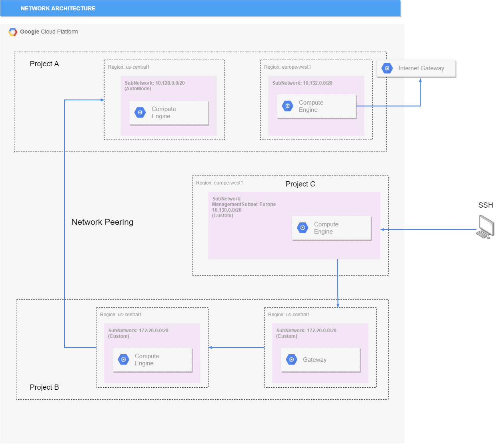

# [Zadanie domowe nr 9](https://szkolachmury.pl/google-cloud-platform-droga-architekta/tydzien-9-understanding-vpc-networks/praca-domowa-nr-9/)

## 1. W tym zadaniu stworzymy dwa przykładowe projekty, a następnie w każdym projekcie utworzymy odpowiednie środowiska sieciowe. Następnie, kiedy będziemy mieć już odpowiednie komponenty w każdym z projektów wykonamy parowanie wzajemne naszych sieci

### 1.1 Utworzenie projektów
```bash
projectId1="zadanie9bp-1"
projectId2="zadanie9bp-2"

gcloud projects create $projectId1
gcloud projects create $projectId2
```

<details>
  <summary><b><i>Sprawdzenie</i></b></summary>

```bash
bartosz@cloudshell:~$ gcloud projects list
PROJECT_ID            NAME                           PROJECT_NUMBER
resonant-idea-261413  Szkola Chmury - GCP Architect  162512192576
zadanie9bp-1          zadanie9bp-1                   492134302499
zadanie9bp-2          zadanie9bp-2                   121362761339
```
</details>

### 1.2 Utworzenie sieci VPC w każdym z projektów
```bash
vpcNetwork1="vpcnetwork1"
vpcNetwork2="vpcnetwork2"

gcloud compute networks create $vpcNetwork1 --subnet-mode=custom --project=$projectId1
gcloud compute networks create $vpcNetwork2 --subnet-mode=custom --project=$projectId2
```

<details>
  <summary><b><i>Sprawdzenie</i></b></summary>

```bash
bartosz@cloudshell:~$ gcloud compute networks list --project=$projectId1
NAME         SUBNET_MODE  BGP_ROUTING_MODE  IPV4_RANGE  GATEWAY_IPV4
default      AUTO         REGIONAL
vpcnetwork1  CUSTOM       REGIONAL
bartosz@cloudshell:~$ gcloud compute networks list --project=$projectId2
NAME         SUBNET_MODE  BGP_ROUTING_MODE  IPV4_RANGE  GATEWAY_IPV4
default      AUTO         REGIONAL
vpcnetwork2  CUSTOM       REGIONAL
```
</details>

### 1.3 Utworzenie podsieci
```bash
vpc1subnet1="vpcnetwork1-sub1"
vpc2subnet2="vpcnetwork2-sub2"

gcloud compute networks subnets create $vpc1subnet1 --network=$vpcNetwork1 --region=europe-west1 --range=10.1.0.0/16 --project=$projectId1
gcloud compute networks subnets create $vpc2subnet2 --network=$vpcNetwork2 --region=europe-west2 --range=10.2.0.0/16 --project=$projectId2
```

<details>
  <summary><b><i>Sprawdzenie</i></b></summary>

```bash
bartosz@cloudshell:~$ gcloud compute networks subnets list --project=$projectId1
NAME              REGION                   NETWORK      RANGE
default           us-west2                 default      10.168.0.0/20
default           asia-northeast1          default      10.146.0.0/20
default           asia-northeast2          default      10.174.0.0/20
default           us-west1                 default      10.138.0.0/20
default           southamerica-east1       default      10.158.0.0/20
default           europe-west6             default      10.172.0.0/20
default           europe-west4             default      10.164.0.0/20
default           asia-east1               default      10.140.0.0/20
default           europe-north1            default      10.166.0.0/20
default           asia-southeast1          default      10.148.0.0/20
default           us-east4                 default      10.150.0.0/20
default           europe-west1             default      10.132.0.0/20
vpcnetwork1-sub1  europe-west1             vpcnetwork1  10.1.0.0/16
default           europe-west2             default      10.154.0.0/20
default           europe-west3             default      10.156.0.0/20
default           australia-southeast1     default      10.152.0.0/20
default           asia-south1              default      10.160.0.0/20
default           asia-northeast3          default      10.178.0.0/20
default           us-east1                 default      10.142.0.0/20
default           us-central1              default      10.128.0.0/20
default           asia-east2               default      10.170.0.0/20
default           northamerica-northeast1  default      10.162.0.0/20
bartosz@cloudshell:~$ gcloud compute networks subnets list --project=$projectId2
NAME              REGION                   NETWORK      RANGE
default           us-west2                 default      10.168.0.0/20
default           asia-northeast1          default      10.146.0.0/20
default           asia-northeast2          default      10.174.0.0/20
default           us-west1                 default      10.138.0.0/20
default           southamerica-east1       default      10.158.0.0/20
default           europe-west6             default      10.172.0.0/20
default           europe-west4             default      10.164.0.0/20
default           asia-east1               default      10.140.0.0/20
default           europe-north1            default      10.166.0.0/20
default           asia-southeast1          default      10.148.0.0/20
default           us-east4                 default      10.150.0.0/20
default           europe-west1             default      10.132.0.0/20
default           europe-west2             default      10.154.0.0/20
vpcnetwork2-sub2  europe-west2             vpcnetwork2  10.2.0.0/16
default           europe-west3             default      10.156.0.0/20
default           australia-southeast1     default      10.152.0.0/20
default           asia-south1              default      10.160.0.0/20
default           asia-northeast3          default      10.178.0.0/20
default           us-east1                 default      10.142.0.0/20
default           us-central1              default      10.128.0.0/20
default           asia-east2               default      10.170.0.0/20
default           northamerica-northeast1  default      10.162.0.0/20
```
</details>

### 1.4 Utworzenie reguł Firewall
```bash
gcloud compute firewall-rules create $vpcNetwork1-allow-icmp --direction=INGRESS --priority=65534 --network=$vpcNetwork1 --action=ALLOW --rules=icmp --source-ranges=0.0.0.0/0 --project=$projectId1
gcloud compute firewall-rules create $vpcNetwork2-allow-icmp --direction=INGRESS --priority=65534 --network=$vpcNetwork2 --action=ALLOW --rules=icmp --source-ranges=0.0.0.0/0 --project=$projectId2
gcloud compute firewall-rules create $vpcNetwork2-allow-ssh --direction=INGRESS --priority=65534 --network=$vpcNetwork1 --action=ALLOW --rules=tcp:22 --source-ranges=0.0.0.0/0 --project=$projectId1
```

<details>
  <summary><b><i>Sprawdzenie</i></b></summary>

```bash
bartosz@cloudshell:~$ gcloud compute firewall-rules list --project=$projectId1
NAME                    NETWORK      DIRECTION  PRIORITY  ALLOW                         DENY  DISABLED
default-allow-icmp      default      INGRESS    65534     icmp                                False
default-allow-internal  default      INGRESS    65534     tcp:0-65535,udp:0-65535,icmp        False
default-allow-rdp       default      INGRESS    65534     tcp:3389                            False
default-allow-ssh       default      INGRESS    65534     tcp:22                              False
vpcnetwork1-allow-icmp  vpcnetwork1  INGRESS    65534     icmp                                False
vpcnetwork2-allow-ssh   vpcnetwork1  INGRESS    65534     tcp:22                              False

To show all fields of the firewall, please show in JSON format: --format=json
To show all fields in table format, please see the examples in --help.

bartosz@cloudshell:~$ gcloud compute firewall-rules list --project=$projectId2
NAME                    NETWORK      DIRECTION  PRIORITY  ALLOW                         DENY  DISABLED
default-allow-icmp      default      INGRESS    65534     icmp                                False
default-allow-internal  default      INGRESS    65534     tcp:0-65535,udp:0-65535,icmp        False
default-allow-rdp       default      INGRESS    65534     tcp:3389                            False
default-allow-ssh       default      INGRESS    65534     tcp:22                              False
vpcnetwork2-allow-icmp  vpcnetwork2  INGRESS    65534     icmp                                False

To show all fields of the firewall, please show in JSON format: --format=json
To show all fields in table format, please see the examples in --help.
```
</details>

### 1.5 Utworzenie VM
```bash
vmName1="zad9vm1"
vmZone1="europe-west1-b"
vmName2="zad9vm2"
vmZone2="europe-west2-b"
vmType="f1-micro"

gcloud compute instances create $vmName1 --zone=$vmZone1 --machine-type=$vmType --network-interface=network=$vpcNetwork1,subnet=$vpc1subnet1 --image-project=debian-cloud --image=debian-9-stretch-v20191210 --project=$projectId1
gcloud compute instances create $vmName2 --zone=$vmZone2 --machine-type=$vmType --network-interface=network=$vpcNetwork2,subnet=$vpc2subnet2 --image-project=debian-cloud --image=debian-9-stretch-v20191210 --project=$projectId2
```

<details>
  <summary><b><i>Sprawdzenie</i></b></summary>

```bash
bartosz@cloudshell:~$ gcloud compute instances list --project=$projectId1
NAME     ZONE            MACHINE_TYPE  PREEMPTIBLE  INTERNAL_IP  EXTERNAL_IP    STATUS
zad9vm1  europe-west1-b  f1-micro                   10.1.0.2     35.240.22.166  RUNNING
bartosz@cloudshell:~$ gcloud compute instances list --project=$projectId2
NAME     ZONE            MACHINE_TYPE  PREEMPTIBLE  INTERNAL_IP  EXTERNAL_IP   STATUS
zad9vm2  europe-west2-b  f1-micro                   10.2.0.2     34.89.72.188  RUNNING
```
</details>

### 1.6 Utworzenie VPC network peering
```bash
peeringvpc1tovpc2="vpc1-vpc2"
peeringvpc2tovpc1="vpc2-vpc1"

gcloud compute networks peerings create $peeringvpc1tovpc2 --network=$vpcNetwork1 --peer-network=$vpcNetwork2 --auto-create-routes --peer-project=$projectId2 --project=$projectId1
gcloud compute networks peerings create $peeringvpc2tovpc1 --network=$vpcNetwork2 --peer-network=$vpcNetwork1 --auto-create-routes --peer-project=$projectId1 --project=$projectId2
```

<details>
  <summary><b><i>Sprawdzenie</i></b></summary>

```bash
bartosz@cloudshell:~$ gcloud compute networks peerings list --project=$projectId1
NAME       NETWORK      PEER_PROJECT  PEER_NETWORK  AUTO_CREATE_ROUTES  STATE   STATE_DETAILS
vpc1-vpc2  vpcnetwork1  zadanie9bp-2  vpcnetwork2   True                ACTIVE  [2020-02-10T14:50:46.142-08:00]: Connected.
bartosz@cloudshell:~$ gcloud compute networks peerings list --project=$projectId2
NAME       NETWORK      PEER_PROJECT  PEER_NETWORK  AUTO_CREATE_ROUTES  STATE   STATE_DETAILS
vpc2-vpc1  vpcnetwork2  zadanie9bp-1  vpcnetwork1   True                ACTIVE  [2020-02-10T14:50:46.142-08:00]: Connected.
```
</details>

### 1.7 Sprawdzenie połączenia
Podłączenie się do VM w podsieci 1 i wykonanie próby połączenia się do VM w podsieci 2 (zad9vm1 -> zad9vm2 | 10.1.0.2 -> 10.2.0.2)

<details>
  <summary><b><i>Console output</i></b></summary>

```bash
Connected, host fingerprint: ssh-rsa 0 {...}
Linux zad9vm1 4.9.0-11-amd64 #1 SMP Debian 4.9.189-3+deb9u2 (2019-11-11) x86_64
The programs included with the Debian GNU/Linux system are free software;
the exact distribution terms for each program are described in the
individual files in /usr/share/doc/*/copyright.
Debian GNU/Linux comes with ABSOLUTELY NO WARRANTY, to the extent
permitted by applicable law.

bartosz@zad9vm1:~$ ping -c 3 10.2.0.2
PING 10.2.0.2 (10.2.0.2) 56(84) bytes of data.
64 bytes from 10.2.0.2: icmp_seq=1 ttl=64 time=7.98 ms
64 bytes from 10.2.0.2: icmp_seq=2 ttl=64 time=6.85 ms
64 bytes from 10.2.0.2: icmp_seq=3 ttl=64 time=6.85 ms

--- 10.2.0.2 ping statistics ---
3 packets transmitted, 3 received, 0% packet loss, time 2002ms
rtt min/avg/max/mdev = 6.851/7.228/7.982/0.541 ms
```
</details>

### 1.8 Pytanie

> Jak zbudujesz połączenie pomiędzy sieciami tak, aby umożliwić dotarcie z Projektu B do świata zewnętrznego wychodząc przez urządzenie wirtualne w Projekcie A?

1. Zablokować ruch wychodzący do sieci publicznej z projektu B
2. Włączyć peering do projektu A (co jest już zrobione)
3. W tablicach routingu jako bramę domyślną ustawić urządzenie wirtualne w projekcie A lub połączyć się przez SSH do maszyny w projekcie A

### 1.9 Usunięcie projektów
```bash
gcloud projects delete $projectId1
gcloud projects delete $projectId2
```

## 2. Realizacja schematu architektury

<details>
  <summary><b><i>Schemat architektury</i></b></summary>




</details>

### 2.1 Utworzenie projektów
```bash
projectA="zadanie9proja"
projectB="zadanie9projb"
projectC="zadanie9projc"

gcloud projects create $projectA
gcloud projects create $projectB
gcloud projects create $projectC
```

<details>
  <summary><b><i>Sprawdzenie</i></b></summary>

```bash
bartosz@cloudshell:~$ gcloud projects list
PROJECT_ID            NAME                           PROJECT_NUMBER
resonant-idea-261413  Szkola Chmury - GCP Architect  162512192576
zadanie9proja         zadanie9proja                  14187841242
zadanie9projb         zadanie9projb                  1031943103857
zadanie9projc         zadanie9projc                  295955672230
```
</details>

### 2.2 Utworzenie sieci VPC w każdym z projektów
```bash
vpcNetworkA="vpcnetworka"
vpcNetworkB="vpcnetworkb"
vpcNetworkC="vpcnetworkc"

gcloud compute networks create $vpcNetworkA --subnet-mode=custom --project=$projectA
gcloud compute networks create $vpcNetworkB --subnet-mode=custom --project=$projectB
gcloud compute networks create $vpcNetworkC --subnet-mode=custom --project=$projectC
```

<details>
  <summary><b><i>Sprawdzenie</i></b></summary>

```bash
bartosz@cloudshell:~$ gcloud compute networks list --project=$projectA
NAME         SUBNET_MODE  BGP_ROUTING_MODE  IPV4_RANGE  GATEWAY_IPV4
default      AUTO         REGIONAL
vpcnetworka  CUSTOM       REGIONAL
bartosz@cloudshell:~$ gcloud compute networks list --project=$projectB
NAME         SUBNET_MODE  BGP_ROUTING_MODE  IPV4_RANGE  GATEWAY_IPV4
default      AUTO         REGIONAL
vpcnetworkb  CUSTOM       REGIONAL
bartosz@cloudshell:~$ gcloud compute networks list --project=$projectC
NAME         SUBNET_MODE  BGP_ROUTING_MODE  IPV4_RANGE  GATEWAY_IPV4
default      AUTO         REGIONAL
vpcnetworkc  CUSTOM       REGIONAL
```
</details>

