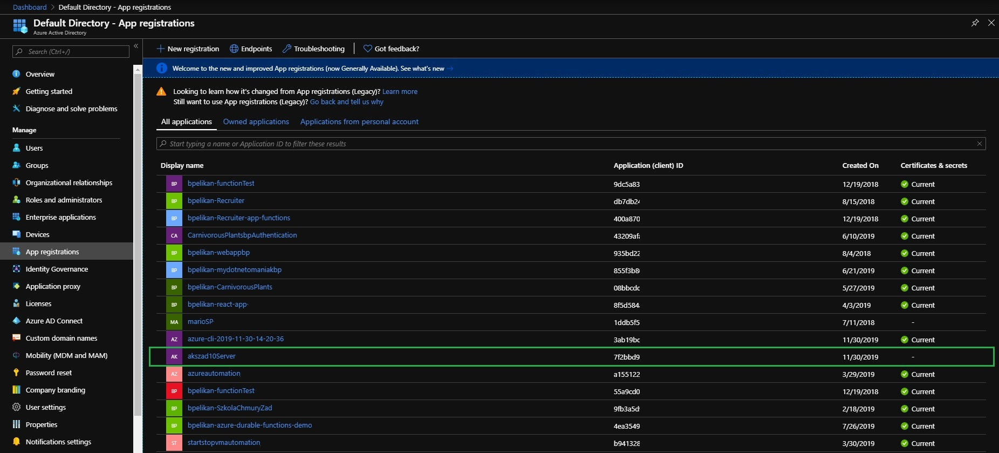
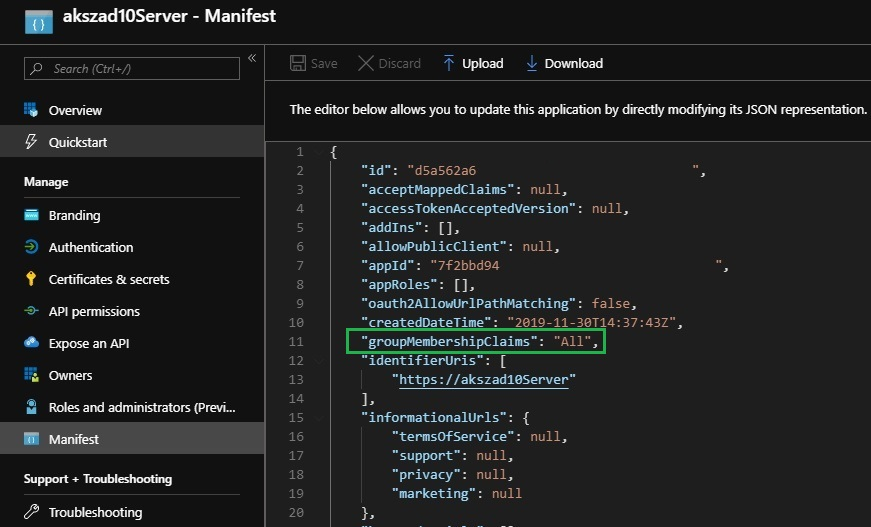
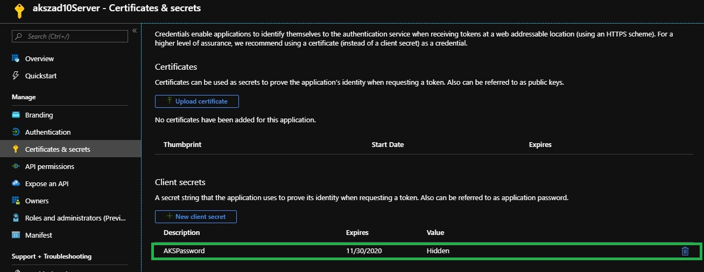
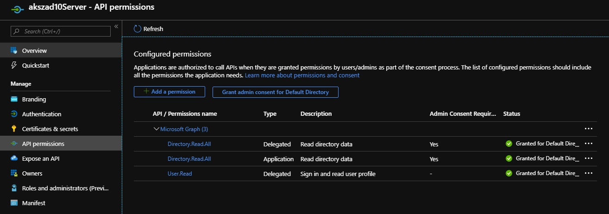
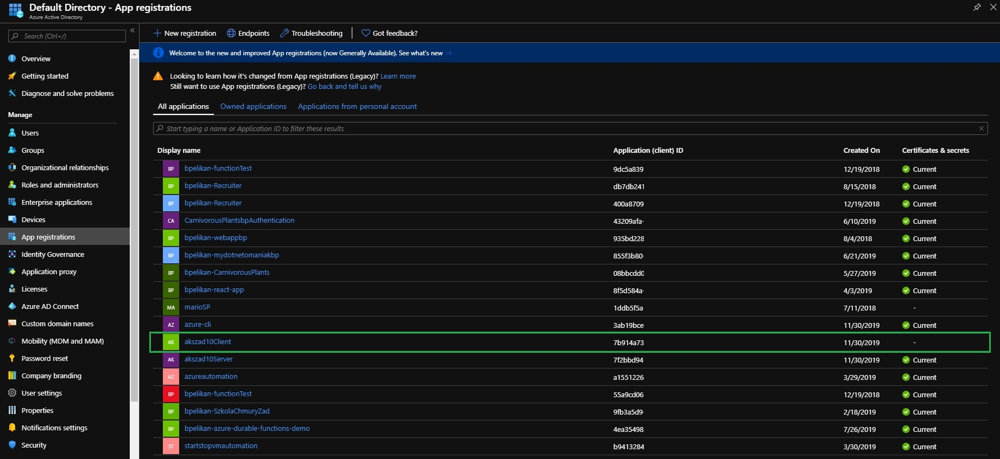
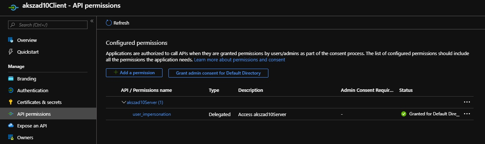

# Praca Domowa nr 10

* [Przygotowanie środowiska](#1-przygotowanie-środowiska)
* [Zadanie](#1-zadanie)
* [Pliki](#pliki)

## 1. Przygotowanie środowiska

<details>
  <summary><b><i>Przygotowanie środowiska</i></b></summary>

#### 1.0 Przygotowanie folderu oraz zmiennych
```bash
mkdir code
cd code

location="westeurope"
resourceGroup="szkchm-zadanie10"
aksName="akszad10"
```

### 1.1 Azure AD application dla serwera

#### 1.1.1 Utworzenie Azure AD application dla serwera
```bash
az ad app create --display-name "${aksName}Server" --identifier-uris "https://${aksName}Server" -o json > serverapp.json
serverApplicationId=$(jq -r ".appId" serverapp.json)
```
<details>
  <summary><b><i>Portal</i></b></summary>


</details>

#### 1.1.2 Aktualizacja application group memebership claims
```bash
az ad app update --id $serverApplicationId --set groupMembershipClaims=All
```
<details>
  <summary><b><i>Portal</i></b></summary>


</details>

#### 1.1.3 Utworzenie Service Principal
```bash
az ad sp create --id $serverApplicationId
```

#### 1.1.4 Pobranie sekretu z utworzonego Service Principal
```bash
az ad sp credential reset --name $serverApplicationId --credential-description "AKSPassword" -o json > serverSPsecret.json
serverApplicationSecret=$(jq -r ".password" serverSPsecret.json)
```
<details>
  <summary><b><i>Portal</i></b></summary>


</details>

#### 1.1.5 Dodanie uprawnień
```bash
az ad app permission add --id $serverApplicationId --api 00000003-0000-0000-c000-000000000000 --api-permissions e1fe6dd8-ba31-4d61-89e7-88639da4683d=Scope 06da0dbc-49e2-44d2-8312-53f166ab848a=Scope 7ab1d382-f21e-4acd-a863-ba3e13f7da61=Role
```

#### 1.1.6 Przyznanie uprawnień
```bash
az ad app permission grant --id $serverApplicationId --api 00000003-0000-0000-c000-000000000000
az ad app permission admin-consent --id  $serverApplicationId
```
<details>
  <summary><b><i>Portal</i></b></summary>


</details>

### 1.2 Azure AD application dla klienta

#### 1.2.1 Utworzenie Azure AD application dla klienta
```bash
az ad app create --display-name "${aksName}Client" --native-app --reply-urls "https://${aksName}Client" -o json > clientapp.json
clientApplicationId=$(jq -r ".appId" clientapp.json)
```

<details>
  <summary><b><i>Portal</i></b></summary>


</details>

#### 1.2.2 Utworzenie Service Principal
```bash
az ad sp create --id $clientApplicationId
```

#### 1.2.3 Pobranie oAuth2 ID z Azure AD application serwera
```bash
az ad app show --id $serverApplicationId -o json > clientSP.json
oAuthPermissionId=$(jq -r ".oauth2Permissions[0].id" clientSP.json)
```

#### 1.2.4 Dodanie uprawnień dla klienta
Dodanie uprawnień dla klienta do komunikacji z serwerem z wykorzystaniem `oAuth2 communication flow`.
```bash
az ad app permission add --id $clientApplicationId --api $serverApplicationId --api-permissions $oAuthPermissionId=Scope
```

#### 1.2.5 Przyznanie uprawnień dla klienta
Przyznanie uprawnień dla klienta do komunikacji z serwerem.
```bash
az ad app permission grant --id $clientApplicationId --api $serverApplicationId
```
<details>
  <summary><b><i>Portal</i></b></summary>


</details>

### 1.3 Utworzenie AKS

#### 1.3.1 Utworznie Resource Group
```bash
az group create --location $location --name $resourceGroup
```
#### 1.3.2 Pobranie Tenant ID
```bash
az account show -o json > accountInfo.json
tenantId=$(jq -r ".tenantId" accountInfo.json)
```

#### 1.3.3 Utworzenie Service Principal
```bash
az ad sp create-for-rbac --skip-assignment -o json > auth.json
servicePrincipalClientId=$(jq -r ".appId" auth.json)
servicePrincipalClientSecret=$(jq -r ".password" auth.json)
```

#### 1.3.4 Utworzenie klastra
```bash
az aks create --generate-ssh-keys -g $resourceGroup -n $aksName --node-count 1 --location $location --aad-server-app-id $serverApplicationId --aad-server-app-secret $serverApplicationSecret --aad-client-app-id $clientApplicationId --aad-tenant-id $tenantId --service-principal $servicePrincipalClientId --client-secret $servicePrincipalClientSecret 
```

#### 1.3.5 Pobranie credentials dla AKS
```bash
az aks get-credentials --resource-group $resourceGroup --name $aksName --admin
```

#### 1.3.6 Dodanie obecnie zalogowanego użytkownika jako Cluster Admin
```bash
az ad signed-in-user show -o json > signedUser.json
userPrincipalName=$(jq -r ".userPrincipalName" signedUser.json)

curl LINK > basic-azure-ad-binding.yaml
sed -i "s|<userPrincipalName>|${userPrincipalName}|g" basic-azure-ad-binding.yaml
kubectl apply -f basic-azure-ad-binding.yaml
```
</details>

---


<br>
<br>
<br>
<br>
<br>
<br>
<br>
<br>
<br>
<br>
<br>
<br>
<br>
<br>

---

## Wyczyszczenie środowiska

<details>
  <summary><b><i>Wyczyszczenie środowiska</i></b></summary>

#### Usunięcie Resource group
```bash
bartosz@Azure:~/code$ az group delete --name $resourceGroup --no-wait
```

#### Usunięcie Service Principal
```bash
bartosz@Azure:~/code$ az ad sp delete --id $servicePrincipalClientId
```

#### Usunięcie pliku
```bash
bartosz@Azure:~/code$ rm auth.json
```

</details>

# Pliki

* [depl.yaml](./code/depl.yaml)