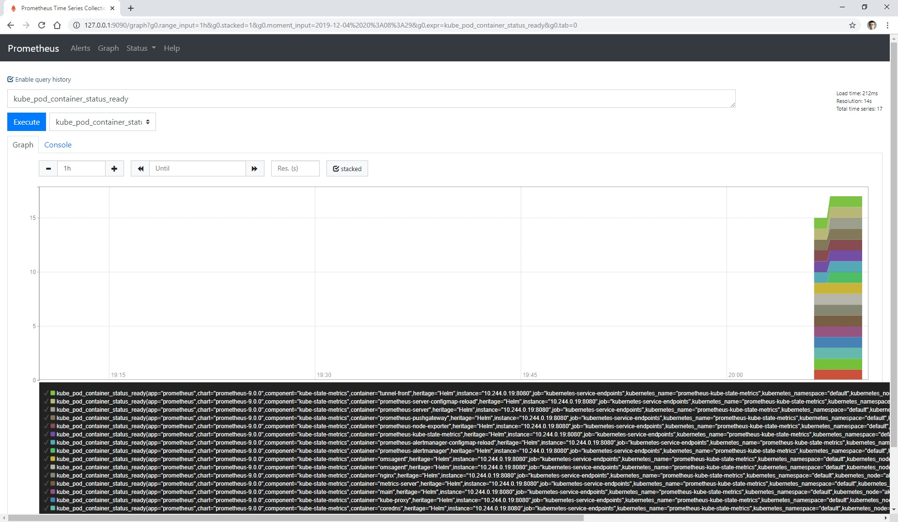
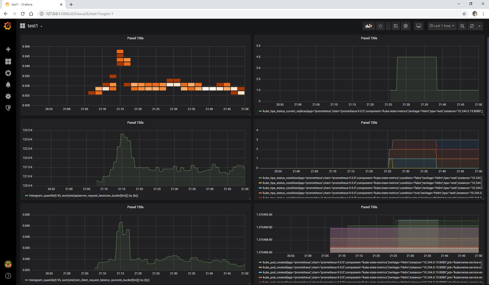
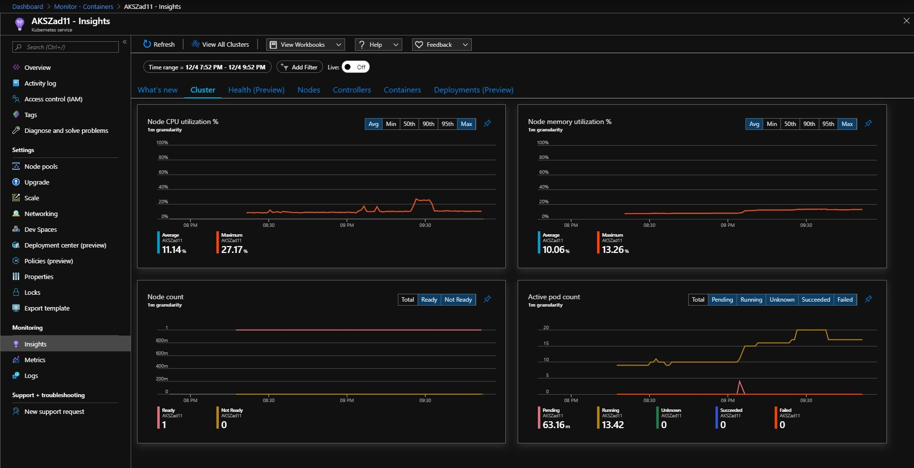
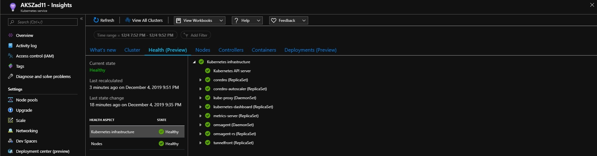
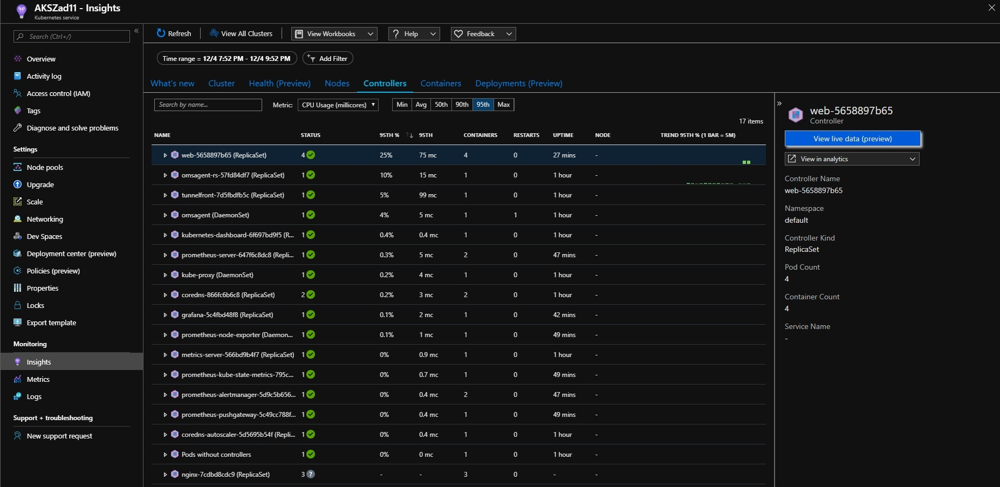
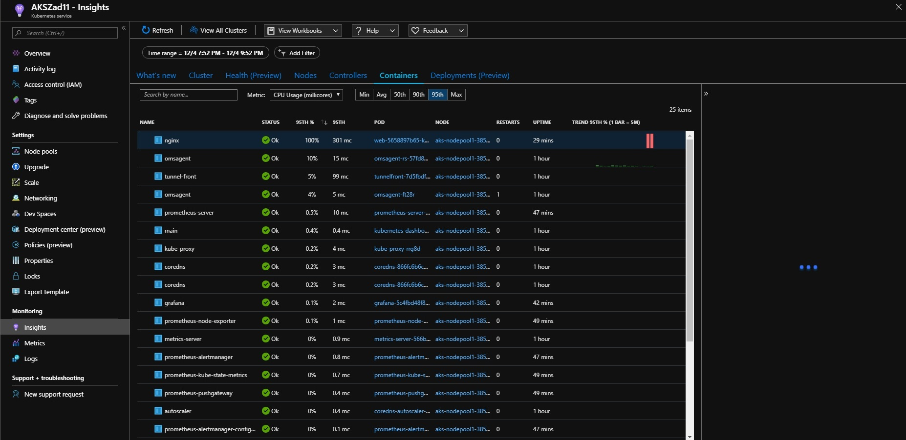
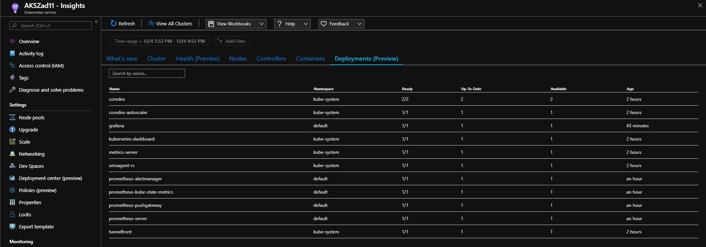

# Praca Domowa nr 11

* [Przygotowanie środowiska](#przygotowanie-środowiska)

## Przygotowanie środowiska

<details>
  <summary><b><i>Przygotowanie środowiska</i></b></summary>

#### Utworzenie Service Principal
```bash
bartosz@Azure:~/code$ az ad sp create-for-rbac --skip-assignment -o json > auth.json
```

#### Przypisanie zmiennych
```bash
bartosz@Azure:~/code$ location="westeurope"
bartosz@Azure:~/code$ resourceGroup="szkchm-zadanie11"
bartosz@Azure:~/code$ aksName="AKSZad11"
bartosz@Azure:~/code$ servicePrincipalClientId=$(jq -r ".appId" auth.json)
bartosz@Azure:~/code$ servicePrincipalClientSecret=$(jq -r ".password" auth.json)
```

#### Utworzenie Resource Group
```bash
bartosz@Azure:~/code$ az group create --location $location --name $resourceGroup
```

#### Utworzenie klastra AKS z monitoringiem
```bash
bartosz@Azure:~/code$ az aks create --enable-addons monitoring --generate-ssh-keys -g $resourceGroup -n $aksName --node-count 1 --location $location --service-principal $servicePrincipalClientId --client-secret $servicePrincipalClientSecret
```

#### Pobranie credentials dla aks
```bash
bartosz@Azure:~/code$ az aks get-credentials --resource-group $resourceGroup --name $aksName
```
</details>

<details>
  <summary><b><i>Sprawdzenie środowiska</i></b></summary>

#### Sprawdzenie monitoringu

```bash
bartosz@Azure:~/code$ kubectl get pod -A
NAMESPACE     NAME                                    READY   STATUS    RESTARTS   AGE
kube-system   coredns-866fc6b6c8-scsh5                1/1     Running   0          9m30s
kube-system   coredns-866fc6b6c8-vmzsr                1/1     Running   0          4m17s
kube-system   coredns-autoscaler-5d5695b54f-f5nqm     1/1     Running   0          9m26s
kube-system   kube-proxy-rrg8d                        1/1     Running   0          5m42s
kube-system   kubernetes-dashboard-6f697bd9f5-z2shl   1/1     Running   1          9m29s
kube-system   metrics-server-566bd9b4f7-ll7ct         1/1     Running   1          9m30s
kube-system   omsagent-ft28r                          1/1     Running   1          5m42s
kube-system   omsagent-rs-57fd84df7-n8jl5             1/1     Running   0          9m29s
kube-system   tunnelfront-7d5fbdfb5c-nwfgc            1/1     Running   0          9m25s

bartosz@Azure:~/code$ az aks show -g $resourceGroup -n $aksName | jq -r ".addonProfiles"
{
  "omsagent": {
    "config": {
      "logAnalyticsWorkspaceResourceID": "/subscriptions/616bb79e-0000-0000-0000-000000000000/resourcegroups/defaultresourcegroup-weu/providers/microsoft.operationalinsights/workspaces/defaultworkspace-616bb79e-0000-0000-0000-000000000000-weu"
    },
    "enabled": true
  }
}

bartosz@Azure:~/code$ kubectl get ds omsagent --namespace=kube-system
NAME       DESIRED   CURRENT   READY   UP-TO-DATE   AVAILABLE   NODE SELECTOR                 AGE
omsagent   1         1         1       1            1           beta.kubernetes.io/os=linux   11m

bartosz@Azure:~/code$ kubectl get deployment omsagent-rs -n=kube-system
NAME          READY   UP-TO-DATE   AVAILABLE   AGE
omsagent-rs   1/1     1            1           12m
```

  <details>
    <summary><b><i>Sprawdzenie Deploymentu omsagent-rs</i></b></summary>

  ```bash
  bartosz@Azure:~/code$ kubectl describe deployment omsagent-rs -n=kube-system
  Name:                   omsagent-rs
  Namespace:              kube-system
  CreationTimestamp:      Wed, 04 Dec 2019 19:10:57 +0000
  Labels:                 addonmanager.kubernetes.io/mode=Reconcile
                          component=oms-agent
                          kubernetes.io/cluster-service=true
                          tier=node
  Annotations:            deployment.kubernetes.io/revision: 1
                          kubectl.kubernetes.io/last-applied-configuration:
                            {"apiVersion":"extensions/v1beta1","kind":"Deployment","metadata":{"annotations":{},"labels":{"addonmanager.kubernetes.io/mode":"Reconcile..."}
  Selector:               rsName=omsagent-rs
  Replicas:               1 desired | 1 updated | 1 total | 1 available | 0 unavailable
  StrategyType:           RollingUpdate
  MinReadySeconds:        0
  RollingUpdateStrategy:  1 max unavailable, 1 max surge
  Pod Template:
    Labels:           rsName=omsagent-rs
    Annotations:      WSID: NTljYzk5ZjQtMDExMi00NGFkLWJmMmMtOTM1YzU4MGU1NGI3
                      agentVersion: 1.10.0.1
                      dockerProviderVersion: 7.0.0-6
                      schema-versions: v1
    Service Account:  omsagent
    Containers:
    omsagent:
      Image:       mcr.microsoft.com/azuremonitor/containerinsights/ciprod:ciprod11012019
      Ports:       25225/TCP, 25224/UDP, 25227/TCP
      Host Ports:  0/TCP, 0/UDP, 0/TCP
      Limits:
        cpu:     150m
        memory:  500Mi
      Requests:
        cpu:     110m
        memory:  250Mi
      Liveness:  exec [/bin/bash -c /opt/livenessprobe.sh] delay=60s timeout=1s period=60s #success=1 #failure=3
      Environment:
        NODE_IP:                   (v1:status.hostIP)
        AKS_CLUSTER_NAME:         AKSZad11
        AKS_RESOURCE_ID:          /subscriptions/616bb79e-0000-0000-0000-000000000000/resourceGroups/szkchm-zadanie11/providers/Microsoft.ContainerService/managedClusters/AKSZad11
        AKS_NODE_RESOURCE_GROUP:  MC_szkchm-zadanie11_AKSZad11_westeurope
        AKS_REGION:               westeurope
        CONTROLLER_TYPE:          ReplicaSet
      Mounts:
        /etc/config from omsagent-rs-config (rw)
        /etc/config/settings from settings-vol-config (ro)
        /etc/kubernetes/host from azure-json-path (rw)
        /etc/omsagent-secret from omsagent-secret (ro)
        /var/lib/docker/containers from containerlog-path (rw)
        /var/log from host-log (rw)
        /var/run/host from docker-sock (rw)
    Volumes:
    docker-sock:
      Type:          HostPath (bare host directory volume)
      Path:          /var/run
      HostPathType:
    container-hostname:
      Type:          HostPath (bare host directory volume)
      Path:          /etc/hostname
      HostPathType:
    host-log:
      Type:          HostPath (bare host directory volume)
      Path:          /var/log
      HostPathType:
    containerlog-path:
      Type:          HostPath (bare host directory volume)
      Path:          /var/lib/docker/containers
      HostPathType:
    azure-json-path:
      Type:          HostPath (bare host directory volume)
      Path:          /etc/kubernetes
      HostPathType:
    omsagent-secret:
      Type:        Secret (a volume populated by a Secret)
      SecretName:  omsagent-secret
      Optional:    false
    omsagent-rs-config:
      Type:      ConfigMap (a volume populated by a ConfigMap)
      Name:      omsagent-rs-config
      Optional:  false
    settings-vol-config:
      Type:               ConfigMap (a volume populated by a ConfigMap)
      Name:               container-azm-ms-agentconfig
      Optional:           true
    Priority Class Name:  system-node-critical
  Conditions:
    Type           Status  Reason
    ----           ------  ------
    Available      True    MinimumReplicasAvailable
  OldReplicaSets:  omsagent-rs-57fd84df7 (1/1 replicas created)
  NewReplicaSet:   <none>
  Events:
    Type    Reason             Age   From                   Message
    ----    ------             ----  ----                   -------
    Normal  ScalingReplicaSet  13m   deployment-controller  Scaled up replica set omsagent-rs-57fd84df7 to 1
  ```
  </details>

  <details>
    <summary><b><i>Sprawdzenie ReplicaSet omsagent</i></b></summary>

  ```bash
  bartosz@Azure:~/code$ kubectl describe rs omsagent-rs-57fd84df7 -n=kube-system
  Name:           omsagent-rs-57fd84df7
  Namespace:      kube-system
  Selector:       pod-template-hash=57fd84df7,rsName=omsagent-rs
  Labels:         pod-template-hash=57fd84df7
                  rsName=omsagent-rs
  Annotations:    deployment.kubernetes.io/desired-replicas: 1
                  deployment.kubernetes.io/max-replicas: 2
                  deployment.kubernetes.io/revision: 1
  Controlled By:  Deployment/omsagent-rs
  Replicas:       1 current / 1 desired
  Pods Status:    1 Running / 0 Waiting / 0 Succeeded / 0 Failed
  Pod Template:
    Labels:           pod-template-hash=57fd84df7
                      rsName=omsagent-rs
    Annotations:      WSID: NTljYzk5ZjQtMDExMi00NGFkLWJmMmMtOTM1YzU4MGU1NGI3
                      agentVersion: 1.10.0.1
                      dockerProviderVersion: 7.0.0-6
                      schema-versions: v1
    Service Account:  omsagent
    Containers:
    omsagent:
      Image:       mcr.microsoft.com/azuremonitor/containerinsights/ciprod:ciprod11012019
      Ports:       25225/TCP, 25224/UDP, 25227/TCP
      Host Ports:  0/TCP, 0/UDP, 0/TCP
      Limits:
        cpu:     150m
        memory:  500Mi
      Requests:
        cpu:     110m
        memory:  250Mi
      Liveness:  exec [/bin/bash -c /opt/livenessprobe.sh] delay=60s timeout=1s period=60s #success=1 #failure=3
      Environment:
        NODE_IP:                   (v1:status.hostIP)
        AKS_CLUSTER_NAME:         AKSZad11
        AKS_RESOURCE_ID:          /subscriptions/616bb79e-0000-0000-0000-000000000000/resourceGroups/szkchm-zadanie11/providers/Microsoft.ContainerService/managedClusters/AKSZad11
        AKS_NODE_RESOURCE_GROUP:  MC_szkchm-zadanie11_AKSZad11_westeurope
        AKS_REGION:               westeurope
        CONTROLLER_TYPE:          ReplicaSet
      Mounts:
        /etc/config from omsagent-rs-config (rw)
        /etc/config/settings from settings-vol-config (ro)
        /etc/kubernetes/host from azure-json-path (rw)
        /etc/omsagent-secret from omsagent-secret (ro)
        /var/lib/docker/containers from containerlog-path (rw)
        /var/log from host-log (rw)
        /var/run/host from docker-sock (rw)
    Volumes:
    docker-sock:
      Type:          HostPath (bare host directory volume)
      Path:          /var/run
      HostPathType:
    container-hostname:
      Type:          HostPath (bare host directory volume)
      Path:          /etc/hostname
      HostPathType:
    host-log:
      Type:          HostPath (bare host directory volume)
      Path:          /var/log
      HostPathType:
    containerlog-path:
      Type:          HostPath (bare host directory volume)
      Path:          /var/lib/docker/containers
      HostPathType:
    azure-json-path:
      Type:          HostPath (bare host directory volume)
      Path:          /etc/kubernetes
      HostPathType:
    omsagent-secret:
      Type:        Secret (a volume populated by a Secret)
      SecretName:  omsagent-secret
      Optional:    false
    omsagent-rs-config:
      Type:      ConfigMap (a volume populated by a ConfigMap)
      Name:      omsagent-rs-config
      Optional:  false
    settings-vol-config:
      Type:               ConfigMap (a volume populated by a ConfigMap)
      Name:               container-azm-ms-agentconfig
      Optional:           true
    Priority Class Name:  system-node-critical
  Events:
    Type    Reason            Age   From                   Message
    ----    ------            ----  ----                   -------
    Normal  SuccessfulCreate  14m   replicaset-controller  Created pod: omsagent-rs-57fd84df7-n8jl5

  ```
  </details>

</details>

# Zadanie

#### 1. Uruchomienie `nginx`
```bash
bartosz@Azure:~/code$ kubectl run nginx --image nginx --restart Never
pod/nginx created
```

#### 2. Utworzenie `ClusterRole` dla `Live Data`
```bash
bartosz@Azure:~/code$ curl https://raw.githubusercontent.com/bpelikan/SzkolaChmury/master/Kubernetes/Zadanie11/code/rbac.yaml > rbac.yaml
bartosz@Azure:~/code$ kubectl apply -f rbac.yaml
clusterrole.rbac.authorization.k8s.io/containerHealth-log-reader created
clusterrolebinding.rbac.authorization.k8s.io/containerHealth-read-logs-global created
```

#### 3. Dodanie `helm charts repository`
```bash
bartosz@Azure:~/code$ helm repo add stable https://kubernetes-charts.storage.googleapis.com
"stable" has been added to your repositories
```

#### 4. Instalacja `Prometheusa`
```bash
bartosz@Azure:~/code$ helm install prometheus stable/prometheus --version 9.0.0
```

<details>
    <summary><b><i>Output</i></b></summary>

```bash
NAME: prometheus
LAST DEPLOYED: Wed Dec  4 20:04:20 2019
NAMESPACE: default
STATUS: deployed
REVISION: 1
TEST SUITE: None
NOTES:
The Prometheus server can be accessed via port 80 on the following DNS name from within your cluster:
prometheus-server.default.svc.cluster.local

Get the Prometheus server URL by running these commands in the same shell:
  export POD_NAME=$(kubectl get pods --namespace default -l "app=prometheus,component=server" -o jsonpath="{.items[0].metadata.name}")
  kubectl --namespace default port-forward $POD_NAME 9090

The Prometheus alertmanager can be accessed via port 80 on the following DNS name from within your cluster:
prometheus-alertmanager.default.svc.cluster.local

Get the Alertmanager URL by running these commands in the same shell:
  export POD_NAME=$(kubectl get pods --namespace default -l "app=prometheus,component=alertmanager" -o jsonpath="{.items[0].metadata.name}")
  kubectl --namespace default port-forward $POD_NAME 9093

The Prometheus PushGateway can be accessed via port 9091 on the following DNS name from within your cluster:
prometheus-pushgateway.default.svc.cluster.local

Get the PushGateway URL by running these commands in the same shell:
  export POD_NAME=$(kubectl get pods --namespace default -l "app=prometheus,component=pushgateway" -o jsonpath="{.items[0].metadata.name}")
  kubectl --namespace default port-forward $POD_NAME 9091

For more information on running Prometheus, visit:
https://prometheus.io/
```
</details>

#### 5. Połączenie się z serwerem `Prometheus`
```PowerShell
PS C:\WINDOWS\system32> $POD_NAME=$(kubectl get pods --namespace default -l "app=prometheus,component=server" -o jsonpath="{.items[0].metadata.name}")
PS C:\WINDOWS\system32> kubectl --namespace default port-forward $POD_NAME 9090
Forwarding from 127.0.0.1:9090 -> 9090
Forwarding from [::1]:9090 -> 9090
```

<details>
    <summary><b><i>Podgląd</i></b></summary>


</details>

#### 6. Instalacja `Grafany`
```bash
bartosz@Azure:~/code$ helm install grafana stable/grafana
```

<details>
    <summary><b><i>Output</i></b></summary>

```bash
NAME: grafana
LAST DEPLOYED: Wed Dec  4 20:10:55 2019
NAMESPACE: default
STATUS: deployed
REVISION: 1
NOTES:
1. Get your 'admin' user password by running:

   kubectl get secret --namespace default grafana -o jsonpath="{.data.admin-password}" | base64 --decode ; echo

2. The Grafana server can be accessed via port 80 on the following DNS name from within your cluster:

   grafana.default.svc.cluster.local

   Get the Grafana URL to visit by running these commands in the same shell:

     export POD_NAME=$(kubectl get pods --namespace default -l "app=grafana,release=grafana" -o jsonpath="{.items[0].metadata.name}")
     kubectl --namespace default port-forward $POD_NAME 3000

3. Login with the password from step 1 and the username: admin
#################################################################################
######   WARNING: Persistence is disabled!!! You will lose your data when   #####
######            the Grafana pod is terminated.                            #####
#################################################################################
```
</details>


#### 7. Pobranie hasła do `Grafany`
```bash
bartosz@Azure:~/code$ kubectl get secret --namespace default grafana -o jsonpath="{.data.admin-password}" | base64 --decode ; echo
FIiH0OHlVnjd7KuDKipehz7mzemvSmMmQ1QO3kSA
```

#### 8. Połączenie się z `Grafaną`
```PowerShell
PS C:\WINDOWS\system32> $POD_NAME=$(kubectl get pods --namespace default -l "app=grafana,release=grafana" -o jsonpath="{.items[0].metadata.name}")
PS C:\WINDOWS\system32> kubectl --namespace default port-forward $POD_NAME 3000
Forwarding from 127.0.0.1:3000 -> 3000
Forwarding from [::1]:3000 -> 3000
```

> Utworzenie HPA i wykonanie testu obciążeniowego z [zadania 9](../Zadanie9).

## Wynik

<details>
    <summary><b><i>Grafana</i></b></summary>


</details>

<details>
    <summary><b><i>Azure Monitor</i></b></summary>







</details>

## Wyczyszczenie środowiska

<details>
  <summary><b><i>Wyczyszczenie środowiska</i></b></summary>

#### Usunięcie Resource group
```bash
bartosz@Azure:~/code$ az group delete --name $resourceGroup --no-wait
```

#### Usunięcie Service Principal
```bash
bartosz@Azure:~/code$ az ad sp delete --id $servicePrincipalClientId
```

#### Usunięcie pliku
```bash
bartosz@Azure:~/code$ cd ..
bartosz@Azure:~/code$ rm -rf ./code
```
</details>

# Pliki

* [rbac.yaml](./code/rbac.yaml)