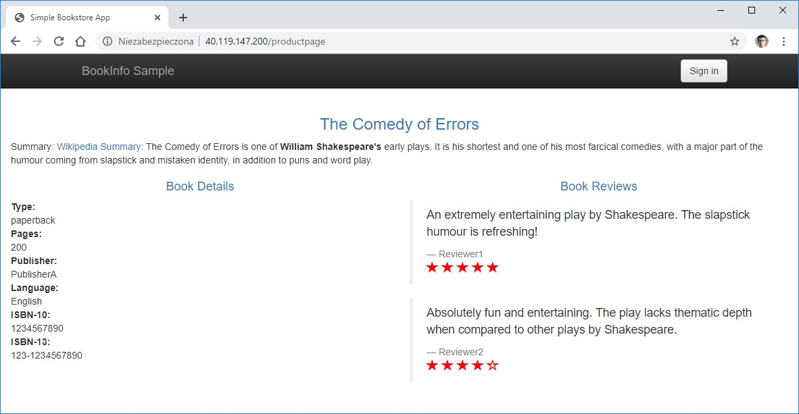

# Praca Domowa nr 12

## 1. Przygotowanie środowiska

<details>
  <summary><b><i>Przygotowanie AKS</i></b></summary>

#### 1.1 Utworzenie folderu na pliki
```bash
bartosz@Azure:~$ mkdir code
bartosz@Azure:~$ cd code
# bartosz@Azure:~$ code .
```

#### 1.2 Utworzenie Service Principal
```bash
bartosz@Azure:~/code$ az ad sp create-for-rbac --skip-assignment -o json > auth.json
```

#### 1.3 Przypisanie zmiennych
```bash
bartosz@Azure:~/code$ location="westeurope"
bartosz@Azure:~/code$ resourceGroup="szkchm-zadanie12"
bartosz@Azure:~/code$ aksName="AKSZad12"
bartosz@Azure:~/code$ servicePrincipalClientId=$(jq -r ".appId" auth.json)
bartosz@Azure:~/code$ servicePrincipalClientSecret=$(jq -r ".password" auth.json)
```

#### 1.4 Utworzenie Resource Group
```bash
bartosz@Azure:~/code$ az group create --location $location --name $resourceGroup
```

#### 1.5 Utworzenie klastra
```bash
bartosz@Azure:~/code$ az aks create --generate-ssh-keys -g $resourceGroup -n $aksName --node-count 1 --location $location --service-principal $servicePrincipalClientId --client-secret $servicePrincipalClientSecret 
```

#### 1.6 Pobranie credentials dla aks
```bash
bartosz@Azure:~/code$ az aks get-credentials --resource-group $resourceGroup --name $aksName
```
</details>


## 2. Instalacja Istio

<details>
  <summary><b><i>Instalacja Istio</i></b></summary>

#### 2.1 Pobranie paczki z Istio
```bash
bartosz@Azure:~/code$ wget https://github.com/istio/istio/releases/download/1.4.0/istio-1.4.0-linux.tar.gz
```

<details>
  <summary><b><i>Sprawdzenie czy paczka została pobrana</i></b></summary>

```bash
bartosz@Azure:~/code$ ls
auth.json  istio-1.4.0-linux.tar.gz
```
</details>

#### 2.2 Wypakowanie paczki
```bash
bartosz@Azure:~/code$ tar -xvf istio-1.4.0-linux.tar.gz
bartosz@Azure:~/code$ cd istio-1.4.0
```

#### 2.3 Dodanie Istio do ścieżki
```bash
bartosz@Azure:~/code/istio-1.4.0$ export PATH=$PWD/bin:$PATH
```

<details>
  <summary><b><i>Sprawdzenie czy Istio działa</i></b></summary>

```bash
bartosz@Azure:~/code/istio-1.4.0$ istioctl
Istio configuration command line utility for service operators to
debug and diagnose their Istio mesh.

Usage:
  istioctl [command]

Available Commands:
  authn           Interact with Istio authentication policies
  authz           (authz is experimental.  Use `istioctl experimental authz`)
  convert-ingress Convert Ingress configuration into Istio VirtualService configuration
  dashboard       Access to Istio web UIs
  deregister      De-registers a service instance
  experimental    Experimental commands that may be modified or deprecated
  help            Help about any command
  kube-inject     Inject Envoy sidecar into Kubernetes pod resources
  manifest        Commands related to Istio manifests
  profile         Commands related to Istio configuration profiles
  proxy-config    Retrieve information about proxy configuration from Envoy [kube only]
  proxy-status    Retrieves the synchronization status of each Envoy in the mesh [kube only]
  register        Registers a service instance (e.g. VM) joining the mesh
  validate        Validate Istio policy and rules
  verify-install  Verifies Istio Installation Status or performs pre-check for the cluster before Istio installation
  version         Prints out build version information

Flags:
      --context string            The name of the kubeconfig context to use
  -h, --help                      help for istioctl
  -i, --istioNamespace string     Istio system namespace (default "istio-system")
  -c, --kubeconfig string         Kubernetes configuration file
      --log_output_level string   Comma-separated minimum per-scope logging level of messages to output, in the form of <scope>:<level>,<scope>:<level>,... where scope can be one of [ads, all, analysis, attributes, authn, cacheLog, citadelClientLog, configMapController, conversions, default, googleCAClientLog, grpcAdapter, kube, kube-converter, mcp, meshconfig, model, name, patch, processing, rbac, resource, runtime, sdsServiceLog, secretFetcherLog, source, stsClientLog, tpath, translator, util, validation, vaultClientLog] and level can be one of [debug, info, warn, error, fatal, none] (default "default:info,validation:error,processing:error,source:error,analysis:warn")
  -n, --namespace string          Config namespace

Use "istioctl [command] --help" for more information about a command.
```
</details>


#### 2.4 Istalacja Istio
```bash
bartosz@Azure:~/code/istio-1.4.0$ kubectl apply -f ./install/kubernetes/istio-demo.yaml
```

<details>
  <summary><b><i>Sprawdzenie instalacji Istio na klastrze</i></b></summary>

```bash
bartosz@Azure:~/code/istio-1.4.0$ kubectl -n istio-system get pods
NAME                                      READY   STATUS      RESTARTS   AGE
grafana-6bb6bcf99f-pxd5q                  1/1     Running     0          3m59s
istio-citadel-66ddfd755-w98k6             1/1     Running     0          3m58s
istio-egressgateway-74bd664ff7-v4r6s      1/1     Running     0          3m59s
istio-galley-5f49858479-6vt96             1/1     Running     0          3m59s
istio-grafana-post-install-1.4.0-zm7h2    0/1     Completed   0          4m1s
istio-ingressgateway-f5cc4fb98-nlgcb      1/1     Running     0          3m59s
istio-pilot-65fd859486-62jnl              2/2     Running     3          3m59s
istio-policy-6cb85c5fc-trvn7              2/2     Running     5          3m59s
istio-security-post-install-1.4.0-jrst8   0/1     Completed   0          4m1s
istio-sidecar-injector-7984b6f548-qxf78   1/1     Running     0          3m58s
istio-telemetry-bd87b484c-ckh29           2/2     Running     5          3m59s
istio-tracing-56c7f85df7-5ph6d            1/1     Running     0          3m58s
kiali-7b5c8f79d8-bhzzk                    1/1     Running     0          3m59s
prometheus-74d8b55f54-kcv9j               1/1     Running     0          3m59s
```

```bash
bartosz@Azure:~/code/istio-1.4.0$ kubectl -n istio-system get svc
NAME                     TYPE           CLUSTER-IP     EXTERNAL-IP      PORT(S)                                                                                                                                      AGE
grafana                  ClusterIP      10.0.218.214   <none>           3000/TCP                                                                                                                                     4m25s
istio-citadel            ClusterIP      10.0.195.33    <none>           8060/TCP,15014/TCP                                                                                                                           4m25s
istio-egressgateway      ClusterIP      10.0.10.99     <none>           80/TCP,443/TCP,15443/TCP                                                                                                                     4m25s
istio-galley             ClusterIP      10.0.7.145     <none>           443/TCP,15014/TCP,9901/TCP                                                                                                                   4m25s
istio-ingressgateway     LoadBalancer   10.0.31.159    40.119.147.200   15020:32691/TCP,80:31380/TCP,443:31390/TCP,31400:31400/TCP,15029:31537/TCP,15030:30324/TCP,15031:32365/TCP,15032:30853/TCP,15443:31673/TCP   4m25s
istio-pilot              ClusterIP      10.0.66.77     <none>           15010/TCP,15011/TCP,8080/TCP,15014/TCP                                                                                                       4m25s
istio-policy             ClusterIP      10.0.246.15    <none>           9091/TCP,15004/TCP,15014/TCP                                                                                                                 4m25s
istio-sidecar-injector   ClusterIP      10.0.200.128   <none>           443/TCP,15014/TCP                                                                                                                            4m25s
istio-telemetry          ClusterIP      10.0.16.109    <none>           9091/TCP,15004/TCP,15014/TCP,42422/TCP                                                                                                       4m25s
jaeger-agent             ClusterIP      None           <none>           5775/UDP,6831/UDP,6832/UDP                                                                                                                   4m23s
jaeger-collector         ClusterIP      10.0.230.132   <none>           14267/TCP,14268/TCP,14250/TCP                                                                                                                4m23s
jaeger-query             ClusterIP      10.0.237.99    <none>           16686/TCP                                                                                                                                    4m23s
kiali                    ClusterIP      10.0.168.204   <none>           20001/TCP                                                                                                                                    4m25s
prometheus               ClusterIP      10.0.190.165   <none>           9090/TCP                                                                                                                                     4m25s
tracing                  ClusterIP      10.0.108.214   <none>           9411/TCP                                                                                                                                     4m23s
zipkin                   ClusterIP      10.0.105.80    <none>           9411/TCP                                                                                                                                     4m23s

```
</details>

</details>

## 3. [Instalacja przykładowej aplikacji](https://istio.io/docs/examples/bookinfo/)

<details>
  <summary><b><i>Instalacja przykładowej aplikacji</i></b></summary>

#### 3.1 Instalacja przykładowej aplikacji bez Istio
```bash
bartosz@Azure:~/code/istio-1.4.0$ kubectl apply -f ./samples/bookinfo/platform/kube/bookinfo.yaml
```

<details>
  <summary><b><i>Sprawdzenie</i></b></summary>

```bash
bartosz@Azure:~/code/istio-1.4.0$ kubectl get pod
NAME                             READY   STATUS    RESTARTS   AGE
details-v1-c5b5f496d-q9g65       1/1     Running   0          80s
productpage-v1-c7765c886-cclxr   1/1     Running   0          80s
ratings-v1-f745cf57b-dg285       1/1     Running   0          80s
reviews-v1-75b979578c-cbjn9      1/1     Running   0          80s
reviews-v2-597bf96c8f-kdg4f      1/1     Running   0          81s
reviews-v3-54c6c64795-tbg7w      1/1     Running   0          81s
```
</details>

#### 3.2 Zmiana katalogu
```bash
bartosz@Azure:~/code/istio-1.4.0$ cd ./samples/bookinfo/platform/kube/
```

#### 3.3 Wstrzyknięcie Istio do pliku z aplikacją
```bash
bartosz@Azure:~/code/istio-1.4.0/samples/bookinfo/platform/kube$ istioctl kube-inject -f bookinfo.yaml > bookinfoistio.yaml
```

#### 3.4 Zainstalowanie aplikacji pracującej z Istio
```bash
bartosz@Azure:~/code/istio-1.4.0/samples/bookinfo/platform/kube$ kubectl apply -f bookinfoistio.yaml
```

<details>
  <summary><b><i>Sprawdzenie</i></b></summary>

```bash
bartosz@Azure:~/code/istio-1.4.0/samples/bookinfo/platform/kube$ kubectl get pod
NAME                              READY   STATUS    RESTARTS   AGE
details-v1-85f674c54c-7vpnp       2/2     Running   0          60s
productpage-v1-6d988bb94c-djj4c   2/2     Running   0          60s
ratings-v1-59cf9cb675-c5mpp       2/2     Running   0          60s
reviews-v1-6699f6bb9-xcx8n        2/2     Running   0          60s
reviews-v2-7f444c9dcb-sbzf6       2/2     Running   0          60s
reviews-v3-766bb976dc-hx6br       2/2     Running   0          60s
```
</details>

#### 3.5 Utworzenie Gateway
```bash
bartosz@Azure:~/code/istio-1.4.0/samples/bookinfo/platform/kube$ cd ../../
bartosz@Azure:~/code/istio-1.4.0/samples/bookinfo$ kubectl apply -f ./networking/bookinfo-gateway.yaml
```

<details>
  <summary><b><i>Sprawdzenie</i></b></summary>

```bash
bartosz@Azure:~/code/istio-1.4.0/samples/bookinfo$ kubectl get gateway
NAME               AGE
bookinfo-gateway   36s
```

```bash
bartosz@Azure:~/code/istio-1.4.0/samples/bookinfo$ kubectl describe gateway bookinfo-gateway
Name:         bookinfo-gateway
Namespace:    default
Labels:       <none>
Annotations:  kubectl.kubernetes.io/last-applied-configuration:
                {"apiVersion":"networking.istio.io/v1alpha3","kind":"Gateway","metadata":{"annotations":{},"name":"bookinfo-gateway","namespace":"default"...
API Version:  networking.istio.io/v1alpha3
Kind:         Gateway
Metadata:
  Creation Timestamp:  2019-12-17T20:13:46Z
  Generation:          1
  Resource Version:    7348
  Self Link:           /apis/networking.istio.io/v1alpha3/namespaces/default/gateways/bookinfo-gateway
  UID:                 baf15504-2109-11ea-b7e0-7e0749e7a1bf
Spec:
  Selector:
    Istio:  ingressgateway
  Servers:
    Hosts:
      *
    Port:
      Name:      http
      Number:    80
      Protocol:  HTTP
Events:          <none>
```



</details>

</details>
## 4. Zadanie

#### 4.1 Dodanie Destination Rule
```bash
bartosz@Azure:~/code/istio-1.4.0/samples/bookinfo$ kubectl apply -f ./networking/destination-rule-all.yaml
```

Wynik:
> Otwierając bookinfo i odżwieżając kilka razy stronę pojawiają się wyniki ze wszystkich 3 rodzajów serwisów **reviews**

#### 4.2 Utworzenie wirtualnego serwisu przekierującego ruch tylko na serwis v1
```bash
bartosz@Azure:~/code/istio-1.4.0/samples/bookinfo$ kubectl apply -f ./networking/virtual-service-all-v1.yaml
```

Wynik:
> Wywoływany jest tylko serwis **Reviews-v1**, który nie komunikuje się z serwisem **Ratings**, a więc nie pojawiają się gwiazdki z ocenami

<details>
  <summary><b><i>Usunięcie Virtual Service</i></b></summary>

```bash
bartosz@Azure:~/code/istio-1.4.0/samples/bookinfo$ kubectl delete -f ./networking/virtual-service-all-v1.yaml
```
</details>


#### 4.3 Przekierowanie ruchu 
Reguła 1:
* 50% -> v1
* 50% -> v3

```bash
bartosz@Azure:~/code/istio-1.4.0/samples/bookinfo$ kubectl apply -f ./networking/virtual-service-reviews-50-v3.yaml
```

<details>
  <summary><b><i>Usunięcie</i></b></summary>

```bash
bartosz@Azure:~/code/istio-1.4.0/samples/bookinfo$ kubectl delete -f ./networking/virtual-service-reviews-50-v3.yaml
```
</details>

Reguła 2:
* 25% -> v1
* 25% -> v2
* 50% -> v3

```bash
bartosz@Azure:~/code/istio-1.4.0/samples/bookinfo$ curl https://raw.githubusercontent.com/bpelikan/SzkolaChmury/master/Kubernetes/Zadanie12/code/virtual-service-reviews-25-25-50.yaml > ./networking/virtual-service-reviews-25-25-50.yaml
bartosz@Azure:~/code/istio-1.4.0/samples/bookinfo$ kubectl apply -f ./networking/virtual-service-reviews-25-25-50.yaml
```

<details>
  <summary><b><i>Usunięcie</i></b></summary>

```bash
bartosz@Azure:~/code/istio-1.4.0/samples/bookinfo$ kubectl delete -f ./networking/virtual-service-reviews-25-25-50.yaml
```
</details>