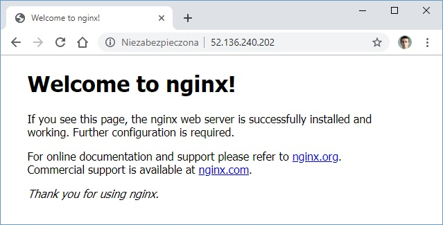
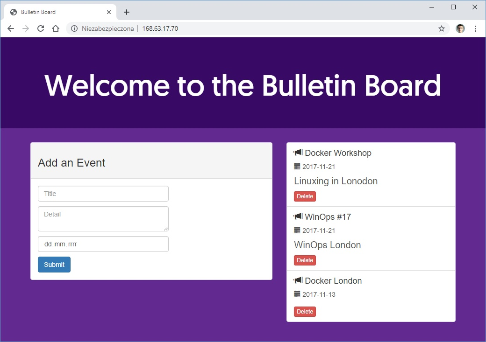
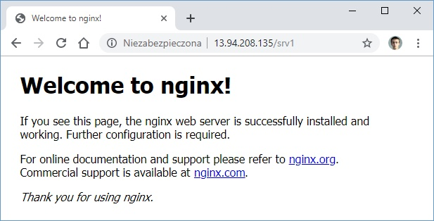
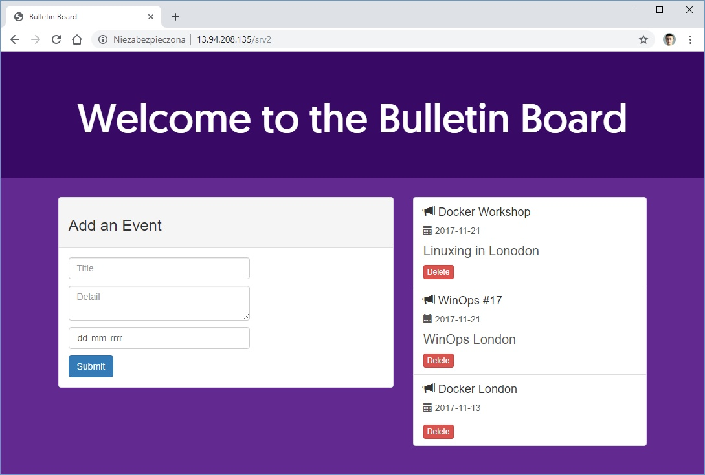

# Zadanie 6

* [Przygotowanie środowiska](#przygotowanie-środowiska)
* [Zadanie 1](#zadanie-1)
* [Zadanie 2](#zadanie-2)
* [Czyszczenie środowiska po zadaniach 1,2](#czyszczenie-środowiska-po-zadaniach-12)

## Przygotowanie środowiska

### Utworzenie Service Principal
```bash
bartosz@Azure:~/code$ az ad sp create-for-rbac --skip-assignment -o json > auth.json
```

### Przypisanie zmiennych
```bash
bartosz@Azure:~/code$ location="westeurope"
bartosz@Azure:~/code$ resourceGroup="szkchm-zadanie6"
bartosz@Azure:~/code$ aksName="AKSZad6"
bartosz@Azure:~/code$ servicePrincipalClientId=$(jq -r ".appId" auth.json)
bartosz@Azure:~/code$ servicePrincipalClientSecret=$(jq -r ".password" auth.json)
```

### Utworzenie Resource Group
```bash
bartosz@Azure:~/code$ az group create --location $location --name $resourceGroup
```

### Utworzenie klastra
```bash
bartosz@Azure:~/code$ az aks create --generate-ssh-keys -g $resourceGroup -n $aksName --node-count 1 --location $location --service-principal $servicePrincipalClientId --client-secret $servicePrincipalClientSecret 
```

<details>
  <summary><b><i>Output</i></b></summary>

```bash
{
  "aadProfile": null,
  "addonProfiles": null,
  "agentPoolProfiles": [
    {
      "availabilityZones": null,
      "count": 1,
      "enableAutoScaling": null,
      "maxCount": null,
      "maxPods": 110,
      "minCount": null,
      "name": "nodepool1",
      "orchestratorVersion": "1.13.11",
      "osDiskSizeGb": 100,
      "osType": "Linux",
      "provisioningState": "Succeeded",
      "type": "AvailabilitySet",
      "vmSize": "Standard_DS2_v2",
      "vnetSubnetId": null
    }
  ],
  "apiServerAuthorizedIpRanges": null,
  "dnsPrefix": "AKSZad6-szkchm-zadanie6-616bb7",
  "enablePodSecurityPolicy": null,
  "enableRbac": true,
  "fqdn": "akszad6-szkchm-zadanie6-616bb7-e4c0a3ce.hcp.westeurope.azmk8s.io",
  "id": "/subscriptions/616bb79e-0000-0000-0000-000000000000/resourcegroups/szkchm-zadanie6/providers/Microsoft.ContainerService/managedClusters/AKSZad6",
  "identity": null,
  "kubernetesVersion": "1.13.11",
  "linuxProfile": {
    "adminUsername": "azureuser",
    "ssh": {
      "publicKeys": [
        {
          "keyData": "ssh-rsa {...}\n"
        }
      ]
    }
  },
  "location": "westeurope",
  "maxAgentPools": 1,
  "name": "AKSZad6",
  "networkProfile": {
    "dnsServiceIp": "10.0.0.10",
    "dockerBridgeCidr": "172.17.0.1/16",
    "loadBalancerSku": "Basic",
    "networkPlugin": "kubenet",
    "networkPolicy": null,
    "podCidr": "10.244.0.0/16",
    "serviceCidr": "10.0.0.0/16"
  },
  "nodeResourceGroup": "MC_szkchm-zadanie6_AKSZad6_westeurope",
  "provisioningState": "Succeeded",
  "resourceGroup": "szkchm-zadanie6",
  "servicePrincipalProfile": {
    "clientId": "397eb365-0000-0000-0000-000000000000",
    "secret": null
  },
  "tags": null,
  "type": "Microsoft.ContainerService/ManagedClusters",
  "windowsProfile": null
}
```

</details>


### Pobranie credentials dla aks

```bash
bartosz@Azure:~/code$ az aks get-credentials --resource-group $resourceGroup --name $aksName
```

<details>
  <summary><b><i>Sprawdzenie kontekstu</i></b></summary>

```bash
bartosz@Azure:~/code$ kubectl config get-contexts
CURRENT   NAME                 CLUSTER          AUTHINFO                              NAMESPACE
*         AKSZad6              AKSZad6          clusterUser_szkchm-zadanie6_AKSZad6
          docker-desktop       docker-desktop   docker-desktop
          docker-for-desktop   docker-desktop   docker-desktop
          minikube             minikube         minikube
```

</details>

## Zadanie 1

### 1.1 Utworzenie deploymentu zawierającego pody oraz service typu LoadBalancer

```bash
bartosz@Azure:~/code$ curl https://raw.githubusercontent.com/bpelikan/SzkolaChmury/zadanie6/Kubernetes/Zadanie6/code/depl.yaml > depl.yaml
bartosz@Azure:~/code$ kubectl apply -f depl.yaml
deployment.apps/my-nginx created
service/my-nginx-service-lb created
```

### 1.2 Utworzenie drugiego deploymentu zawierającego inną aplikację 

```bash
bartosz@Azure:~/code$ curl https://raw.githubusercontent.com/bpelikan/SzkolaChmury/zadanie6/Kubernetes/Zadanie6/code/depl2.yaml > depl2.yaml
bartosz@Azure:~/code$ kubectl apply -f depl2.yaml
deployment.apps/bb-demo created
service/bb-entrypoint created
```

<details>
  <summary><b><i>Sprawdzenie stanu klastra</i></b></summary>

```PowerShell
PS C:\Users\bpelikan> kubectl get pod -o wide
NAME                        READY   STATUS    RESTARTS   AGE    IP           NODE                       NOMINATED NODE   READINESS GATES
bb-demo-5cf4d6bcbc-wtvnp    1/1     Running   0          36s    10.244.0.9   aks-nodepool1-23757279-0   <none>           <none>
my-nginx-5f78dd79f4-688xx   1/1     Running   0          3m5s   10.244.0.8   aks-nodepool1-23757279-0   <none>           <none>

PS C:\Users\bpelikan> kubectl get svc -o wide
NAME                  TYPE           CLUSTER-IP     EXTERNAL-IP      PORT(S)        AGE     SELECTOR
bb-entrypoint         LoadBalancer   10.0.73.59     168.63.17.70     80:32529/TCP   67s     bb=web
kubernetes            ClusterIP      10.0.0.1       <none>           443/TCP        29m     <none>
my-nginx-service-lb   LoadBalancer   10.0.251.214   52.136.240.202   80:30172/TCP   3m36s   app=my-nginx

PS C:\Users\bpelikan> kubectl get deployment -o wide
NAME       READY   UP-TO-DATE   AVAILABLE   AGE    CONTAINERS   IMAGES                       SELECTOR
bb-demo    1/1     1            1           38s    bb-site      bpelikan/bulletinboard:1.0   bb=web
my-nginx   1/1     1            1           3m7s   my-nginx     nginx                        app=my-nginx

PS C:\Users\bpelikan> kubectl get endpoints -o wide
NAME                  ENDPOINTS           AGE
bb-entrypoint         10.244.0.9:8080     2m28s
kubernetes            104.45.75.103:443   30m
my-nginx-service-lb   10.244.0.8:80       4m57s
```

</details>

<details>
  <summary><b><i>Sprawdzenie działania aplikacji na podach oraz LoadBalancera</i></b></summary>




</details>

## Zadanie 2
Uruchomienie Ingress controllera opartego na nginx

### 2.1 Stworzenie `ServiceAccount` i `ClusterRole` dla Tillera
```bash
bartosz@Azure:~/code$ kubectl create serviceaccount -n kube-system tiller
  serviceaccount/tiller created

bartosz@Azure:~/code$ kubectl create clusterrolebinding tiller-cluster-rule --clusterrole=cluster-admin --serviceaccount=kube-system:tiller
  clusterrolebinding.rbac.authorization.k8s.io/tiller-cluster-rule created
```

### 2.2 Inicjalizacja Tillera w klastrze
```bash
bartosz@Azure:~/code$ helm init --service-account tiller
```

<details>
  <summary><b><i>Output</i></b></summary>

```PowerShell
$HELM_HOME has been configured at C:\Users\bpelikan\.helm.

Tiller (the Helm server-side component) has been installed into your Kubernetes Cluster.

Please note: by default, Tiller is deployed with an insecure 'allow unauthenticated users' policy.
To prevent this, run `helm init` with the --tiller-tls-verify flag.
For more information on securing your installation see: https://docs.helm.sh/using_helm/#securing-your-helm-installation
```

</details>

### 2.3 Instalacja NGINX Ingress Controllera w klastrze
```bash
bartosz@Azure:~/code$ helm install stable/nginx-ingress --set controller.replicaCount=1 --set controller.nodeSelector."beta\.kubernetes\.io/os"=linux --set defaultBackend.nodeSelector."beta\.kubernetes\.io/os"=linux
```

<details>
  <summary><b><i>Output</i></b></summary>

```PowerShell
NAME:   yodeling-lambkin
LAST DEPLOYED: Thu Oct 31 00:01:48 2019
NAMESPACE: default
STATUS: DEPLOYED

RESOURCES:
==> v1/Deployment
NAME                                            READY  UP-TO-DATE  AVAILABLE  AGE
yodeling-lambkin-nginx-ingress-controller       0/1    1           0          1s
yodeling-lambkin-nginx-ingress-default-backend  0/1    1           0          1s

==> v1/Pod(related)
NAME                                                             READY  STATUS             RESTARTS  AGE
yodeling-lambkin-nginx-ingress-controller-688f99b88d-kb9f9       0/1    ContainerCreating  0         1s
yodeling-lambkin-nginx-ingress-default-backend-5d79669f7d-9zqfk  0/1    ContainerCreating  0         1s

==> v1/Service
NAME                                            TYPE          CLUSTER-IP    EXTERNAL-IP  PORT(S)                     AGE
yodeling-lambkin-nginx-ingress-controller       LoadBalancer  10.0.173.178  <pending>    80:32379/TCP,443:32116/TCP  1s
yodeling-lambkin-nginx-ingress-default-backend  ClusterIP     10.0.235.28   <none>       80/TCP                      1s

==> v1/ServiceAccount
NAME                                    SECRETS  AGE
yodeling-lambkin-nginx-ingress          1        1s
yodeling-lambkin-nginx-ingress-backend  1        1s

==> v1beta1/ClusterRole
NAME                            AGE
yodeling-lambkin-nginx-ingress  1s

==> v1beta1/ClusterRoleBinding
NAME                            AGE
yodeling-lambkin-nginx-ingress  1s

==> v1beta1/Role
NAME                            AGE
yodeling-lambkin-nginx-ingress  1s

==> v1beta1/RoleBinding
NAME                            AGE
yodeling-lambkin-nginx-ingress  1s


NOTES:
The nginx-ingress controller has been installed.
It may take a few minutes for the LoadBalancer IP to be available.
You can watch the status by running 'kubectl --namespace default get services -o wide -w yodeling-lambkin-nginx-ingress-controller'

An example Ingress that makes use of the controller:

  apiVersion: extensions/v1beta1
  kind: Ingress
  metadata:
    annotations:
      kubernetes.io/ingress.class: nginx
    name: example
    namespace: foo
  spec:
    rules:
      - host: www.example.com
        http:
          paths:
            - backend:
                serviceName: exampleService
                servicePort: 80
              path: /
    # This section is only required if TLS is to be enabled for the Ingress
    tls:
        - hosts:
            - www.example.com
          secretName: example-tls

If TLS is enabled for the Ingress, a Secret containing the certificate and key must also be provided:

  apiVersion: v1
  kind: Secret
  metadata:
    name: example-tls
    namespace: foo
  data:
    tls.crt: <base64 encoded cert>
    tls.key: <base64 encoded key>
  type: kubernetes.io/tls

```

</details>

<details>
  <summary><b><i>Sprawdzenie stanu klastra</i></b></summary>

```PowerShell
PS C:\Users\bpelikan> kubectl get pod -o wide
NAME                                                              READY   STATUS    RESTARTS   AGE   IP            NODE                       NOMINATED NODE   READINESS GATES
bb-demo-5cf4d6bcbc-wtvnp                                          1/1     Running   0          25m   10.244.0.9    aks-nodepool1-23757279-0   <none>           <none>
my-nginx-5f78dd79f4-688xx                                         1/1     Running   0          27m   10.244.0.8    aks-nodepool1-23757279-0   <none>           <none>
yodeling-lambkin-nginx-ingress-controller-688f99b88d-kb9f9        1/1     Running   0          89s   10.244.0.12   aks-nodepool1-23757279-0   <none>           <none>
yodeling-lambkin-nginx-ingress-default-backend-5d79669f7d-9zqfk   1/1     Running   0          89s   10.244.0.11   aks-nodepool1-23757279-0   <none>           <none>

PS C:\Users\bpelikan> kubectl get svc -o wide
NAME                                             TYPE           CLUSTER-IP     EXTERNAL-IP      PORT(S)                      AGE   SELECTOR
bb-entrypoint                                    LoadBalancer   10.0.73.59     168.63.17.70     80:32529/TCP                 25m   bb=web
kubernetes                                       ClusterIP      10.0.0.1       <none>           443/TCP                      53m   <none>
my-nginx-service-lb                              LoadBalancer   10.0.251.214   52.136.240.202   80:30172/TCP                 27m   app=my-nginx
yodeling-lambkin-nginx-ingress-controller        LoadBalancer   10.0.173.178   13.94.208.135    80:32379/TCP,443:32116/TCP   91s   app=nginx-ingress,component=controller,release=yodeling-lambkin
yodeling-lambkin-nginx-ingress-default-backend   ClusterIP      10.0.235.28    <none>           80/TCP                       91s   app=nginx-ingress,component=default-backend,release=yodeling-lambkin

PS C:\Users\bpelikan> kubectl get deployment -o wide
NAME                                             READY   UP-TO-DATE   AVAILABLE   AGE   CONTAINERS                      IMAGES                                                                  SELECTOR
bb-demo                                          1/1     1            1           25m   bb-site                         bpelikan/bulletinboard:1.0                                              bb=web
my-nginx                                         1/1     1            1           27m   my-nginx                        nginx                                                                   app=my-nginx
yodeling-lambkin-nginx-ingress-controller        1/1     1            1           92s   nginx-ingress-controller        quay.io/kubernetes-ingress-controller/nginx-ingress-controller:0.26.1   app=nginx-ingress,release=yodeling-lambkin
yodeling-lambkin-nginx-ingress-default-backend   1/1     1            1           92s   nginx-ingress-default-backend   k8s.gcr.io/defaultbackend-amd64:1.5                                     app=nginx-ingress,release=yodeling-lambkin

PS C:\Users\bpelikan> kubectl get endpoints -o wide
NAME                                             ENDPOINTS                        AGE
bb-entrypoint                                    10.244.0.9:8080                  25m
kubernetes                                       104.45.75.103:443                53m
my-nginx-service-lb                              10.244.0.8:80                    27m
yodeling-lambkin-nginx-ingress-controller        10.244.0.12:80,10.244.0.12:443   92s
yodeling-lambkin-nginx-ingress-default-backend   10.244.0.11:8080                 92s
```

</details>

### 2.4 Utworzenie routingu

```bash
bartosz@Azure:~/code$ curl https://raw.githubusercontent.com/bpelikan/SzkolaChmury/zadanie6/Kubernetes/Zadanie6/code/route.yaml > route.yaml
bartosz@Azure:~/code$ kubectl apply -f route.yaml
ingress.extensions/my-ingress created
```

<details>
  <summary><b><i>Sprawdzenie działania routingu w Ingress Controllerze</i></b></summary>




</details>

W przypadku aplikacji `Bulletin Board` konieczne było zmodyfikowanie routingu tak, aby umożliwić pobieranie plików css/js oraz wywoływanie zapytań api z pliku js.

---

## Czyszczenie środowiska po zadaniach 1,2

### Usunięcie AKS
```bash
bartosz@Azure:~/code$ az aks delete --resource-group $resourceGroup --name $aksName
```

### Usunięcie Resource group
```bash
bartosz@Azure:~/code$ az group delete --name $resourceGroup --no-wait
```

### Usunięcie Service Principal
```bash
bartosz@Azure:~/code$ az ad sp delete --id $servicePrincipalClientId
```

### Usunięcie pliku
```bash
bartosz@Azure:~/code$ rm auth.json
```


# Pliki

#### Zadania 1 oraz 2

* [depl.yaml](./code/depl.yaml)
* [depl2.yaml](./code/depl2.yaml)
* [route.yaml](./code/route.yaml)

---

<details>
  <summary><b><i>Sprawdzenie</i></b></summary>

```PowerShell

```

</details>

```PowerShell

```