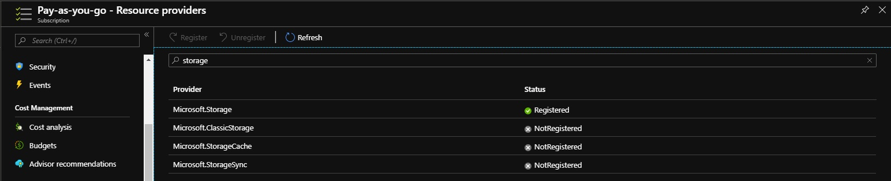

# Praca Domowa nr 7


<details>
  <summary><b><i>Przygotowanie środowiska</i></b></summary>

#### Utworzenie Service Principal
```bash
bartosz@Azure:~/code$ az ad sp create-for-rbac --skip-assignment -o json > auth.json
```

#### Przypisanie zmiennych
```bash
bartosz@Azure:~/code$ location="westeurope"
bartosz@Azure:~/code$ resourceGroup="szkchm-zadanie7"
bartosz@Azure:~/code$ aksName="AKSZad7"
bartosz@Azure:~/code$ servicePrincipalClientId=$(jq -r ".appId" auth.json)
bartosz@Azure:~/code$ servicePrincipalClientSecret=$(jq -r ".password" auth.json)
```

#### Utworzenie Resource Group
```bash
bartosz@Azure:~/code$ az group create --location $location --name $resourceGroup
```

#### Utworzenie klastra z RBAC
```bash
bartosz@Azure:~/code$ az aks create --enable-rbac --generate-ssh-keys -g $resourceGroup -n $aksName --node-count 1 --location $location --service-principal $servicePrincipalClientId --client-secret $servicePrincipalClientSecret 
```

#### Pobranie credentials dla aks
```bash
bartosz@Azure:~/code$ az aks get-credentials --resource-group $resourceGroup --name $aksName
```

</details>

---

#### 1. Zarejestrowanie providera dla Storage

```bash
bartosz@Azure:~/code$ az provider register --namespace 'Microsoft.Storage'
```

<details>
  <summary><b><i>Sprawdzenie</i></b></summary>

```bash
bartosz@Azure:~/code$ az provider show --namespace Microsoft.Storage -o table
Namespace          RegistrationPolicy    RegistrationState
-----------------  --------------------  -------------------
Microsoft.Storage  RegistrationRequired  Registered
```



</details>


#### 2. Utworzenie Storage Class
```bash
bartosz@Azure:~/code$ curl https://raw.githubusercontent.com/bpelikan/SzkolaChmury/master/Kubernetes/Zadanie7/code/azure-file-sc.yaml > azure-file-sc.yaml
bartosz@Azure:~/code$ kubectl apply -f azure-file-sc.yaml

```

<details>
  <summary><b><i>Sprawdzenie</i></b></summary>

```bash
bartosz@Azure:~/code$ kubectl get sc
NAME                PROVISIONER                AGE
azurefile           kubernetes.io/azure-file   6s
default (default)   kubernetes.io/azure-disk   37m
managed-premium     kubernetes.io/azure-disk   37m
```

</details>

#### 3. Utworzenie cluster role oraz binding
```bash
bartosz@Azure:~/code$ curl https://raw.githubusercontent.com/bpelikan/SzkolaChmury/master/Kubernetes/Zadanie7/code/azure-pvc-roles.yaml > azure-pvc-roles.yaml
bartosz@Azure:~/code$ kubectl apply -f azure-pvc-roles.yaml
clusterrole.rbac.authorization.k8s.io/system:azure-cloud-provider created
clusterrolebinding.rbac.authorization.k8s.io/system:azure-cloud-provider created
```

<!-- #### Utworzenie PVC
```bash
curl https://raw.githubusercontent.com/bpelikan/SzkolaChmury/master/Kubernetes/Zadanie7/code/azure-file-pvc.yaml > azure-file-pvc.yaml
kubectl apply -f azure-file-pvc.yaml
kubectl get pvc azurefile
``` -->

#### 4. Utworzenie pliku kustomization oraz dodanie do niego Secret Generatora
```bash
bartosz@Azure:~/code$ cat <<EOF >./kustomization.yaml
secretGenerator:
- name: mysql-pass
  literals:
  - password={YOUR_PASSWORD}
EOF
```

#### 5. Pobranie pliku deploymentu dla mysql
```bash
bartosz@Azure:~/code$ curl https://raw.githubusercontent.com/bpelikan/SzkolaChmury/master/Kubernetes/Zadanie7/code/mysql-deployment.yaml > mysql-deployment.yaml
```

#### 6. Pobranie pliku deploymentu dla WordPressa
```bash
bartosz@Azure:~/code$ curl https://raw.githubusercontent.com/bpelikan/SzkolaChmury/master/Kubernetes/Zadanie7/code/wordpress-deployment.yaml > wordpress-deployment.yaml
```

#### 7. Dodanie deploymentów do kustomization
```bash
bartosz@Azure:~/code$ cat <<EOF >>./kustomization.yaml 
resources:
  - mysql-deployment.yaml
  - wordpress-deployment.yaml
EOF
```

#### 8. Uruchomienie kustomization
```bash
bartosz@Azure:~/code$ kubectl apply -k ./
secret/mysql-pass-bkkgtkbk46 created
service/wordpress-mysql created
service/wordpress created
deployment.apps/wordpress-mysql created
deployment.apps/wordpress created
persistentvolumeclaim/mysql-pv-claim created
persistentvolumeclaim/wp-pv-claim created
```


```bash
kubectl get secrets
kubectl get pvc
kubectl get pods
kubectl get services wordpress
kubectl get svc -o wide
#minikube service wordpress --url  http://172.27.166.34:31675
kubectl delete -k ./

kubectl create clusterrolebinding kubernetes-dashboard --clusterrole=cluster-admin --serviceaccount=kube-system:kubernetes-dashboard
az aks browse --resource-group $resourceGroup --name $aksName
``` 


---

<details>
  <summary><b><i>Wyczyszczenie środowiska</i></b></summary>

#### Usunięcie Resource group
```bash
bartosz@Azure:~/code$ az group delete --name $resourceGroup --no-wait
```

#### Usunięcie Service Principal
```bash
bartosz@Azure:~/code$ az ad sp delete --id $servicePrincipalClientId
```

#### Usunięcie pliku
```bash
bartosz@Azure:~/code$ rm auth.json
```

</details>

# Linki

[mysql-wordpress-persistent-volume](https://kubernetes.io/docs/tutorials/stateful-application/mysql-wordpress-persistent-volume/)