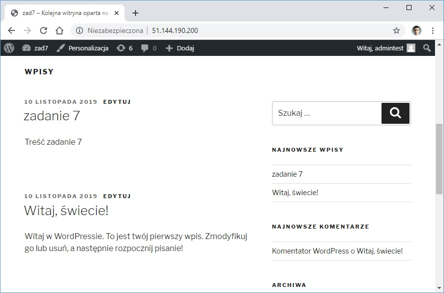

# Praca Domowa nr 7

* [Przygotowanie środowiska](#przygotowanie-środowiska)
* [Część 1 - Azure Disk](#część-1---azure-disk)
* [Część 2 - Azure File](#część-2---azure-file)
* [Wyczyszczenie środowiska](#wyczyszczenie-środowiska)

---


## Przygotowanie środowiska


<details>
  <summary><b><i>Przygotowanie AKS</i></b></summary>

#### Utworzenie Service Principal
```bash
bartosz@Azure:~/code$ az ad sp create-for-rbac --skip-assignment -o json > auth.json
```

#### Przypisanie zmiennych
```bash
bartosz@Azure:~/code$ location="westeurope"
bartosz@Azure:~/code$ resourceGroup="szkchm-zadanie7"
bartosz@Azure:~/code$ aksName="AKSZad7"
bartosz@Azure:~/code$ servicePrincipalClientId=$(jq -r ".appId" auth.json)
bartosz@Azure:~/code$ servicePrincipalClientSecret=$(jq -r ".password" auth.json)
```

#### Utworzenie Resource Group
```bash
bartosz@Azure:~/code$ az group create --location $location --name $resourceGroup
```

#### Utworzenie klastra z RBAC
```bash
bartosz@Azure:~/code$ az aks get-versions --location westeurope --output table
bartosz@Azure:~/code$ az aks create --enable-rbac --generate-ssh-keys -g $resourceGroup -n $aksName --node-count 1 --location $location --service-principal $servicePrincipalClientId --client-secret $servicePrincipalClientSecret --kubernetes-version "1.14.8"
```

#### Pobranie credentials dla aks
```bash
bartosz@Azure:~/code$ az aks get-credentials --resource-group $resourceGroup --name $aksName
```

</details>

#### Zarejestrowanie providera dla Storage

```bash
bartosz@Azure:~/code$ az provider register --namespace 'Microsoft.Storage'
```

<details>
  <summary><b><i>Sprawdzenie providera</i></b></summary>

```bash
bartosz@Azure:~/code$ az provider show --namespace Microsoft.Storage -o table
Namespace          RegistrationPolicy    RegistrationState
-----------------  --------------------  -------------------
Microsoft.Storage  RegistrationRequired  Registered
```


</details>

#### Utworzenie Storage Class dla Azure Disk
```bash
bartosz@Azure:~/code$ curl https://raw.githubusercontent.com/bpelikan/SzkolaChmury/master/Kubernetes/Zadanie7/code/azure-disk-sc.yaml > azure-disk-sc.yaml
bartosz@Azure:~/code$ kubectl apply -f azure-disk-sc.yaml
```

#### Utworzenie Storage Class dla Azure File
```bash
bartosz@Azure:~/code$ curl https://raw.githubusercontent.com/bpelikan/SzkolaChmury/master/Kubernetes/Zadanie7/code/azure-file-sc.yaml > azure-file-sc.yaml
bartosz@Azure:~/code$ kubectl apply -f azure-file-sc.yaml
```

<details>
  <summary><b><i>Sprawdzenie</i></b></summary>

```bash
bartosz@Azure:~/code$ kubectl get sc

NAME                PROVISIONER                AGE
azuredisk           kubernetes.io/azure-disk   6s
azurefile           kubernetes.io/azure-file   21m
default (default)   kubernetes.io/azure-disk   46m
managed-premium     kubernetes.io/azure-disk   46m
```

```bash
bartosz@Azure:~/code$ kubectl describe sc azuredisk
Name:            azuredisk
IsDefaultClass:  No
Annotations:     kubectl.kubernetes.io/last-applied-configuration={"apiVersion":"storage.k8s.io/v1","kind":"StorageClass","metadata":{"annotations":{},"name":"azuredisk"},"parameters":{"location":"westeurope","skuName":"Standard_LRS"},"provisioner":"kubernetes.io/azure-disk","reclaimPolicy":"Retain"}

Provisioner:           kubernetes.io/azure-disk
Parameters:            location=westeurope,skuName=Standard_LRS
AllowVolumeExpansion:  <unset>
MountOptions:          <none>
ReclaimPolicy:         Retain
VolumeBindingMode:     Immediate
Events:                <none>
```

```bash
bartosz@Azure:~/code$ kubectl describe sc/azurefile
Name:            azurefile
IsDefaultClass:  No
Annotations:     kubectl.kubernetes.io/last-applied-configuration={"apiVersion":"storage.k8s.io/v1","kind":"StorageClass","metadata":{"annotations":{},"name":"azurefile"},"mountOptions":["dir_mode=0777","file_mode=0777","uid=1000","gid=1000","mfsymlinks","nobrl","cache=none"],"parameters":{"skuName":"Standard_LRS"},"provisioner":"kubernetes.io/azure-file","reclaimPolicy":"Retain"}

Provisioner:           kubernetes.io/azure-file
Parameters:            skuName=Standard_LRS
AllowVolumeExpansion:  <unset>
MountOptions:
  dir_mode=0777
  file_mode=0777
  uid=1000
  gid=1000
  mfsymlinks
  nobrl
  cache=none
ReclaimPolicy:      Retain
VolumeBindingMode:  Immediate
Events:             <none>
```

```bash
bartosz@Azure:~/code$ kubectl describe sc/default
Name:            default
IsDefaultClass:  Yes
Annotations:     kubectl.kubernetes.io/last-applied-configuration={"apiVersion":"storage.k8s.io/v1beta1","kind":"StorageClass","metadata":{"annotations":{"storageclass.beta.kubernetes.io/is-default-class":"true"},"labels":{"kubernetes.io/cluster-service":"true"},"name":"default"},"parameters":{"cachingmode":"ReadOnly","kind":"Managed","storageaccounttype":"Standard_LRS"},"provisioner":"kubernetes.io/azure-disk"}
,storageclass.beta.kubernetes.io/is-default-class=true
Provisioner:           kubernetes.io/azure-disk
Parameters:            cachingmode=ReadOnly,kind=Managed,storageaccounttype=Standard_LRS
AllowVolumeExpansion:  <unset>
MountOptions:          <none>
ReclaimPolicy:         Delete
VolumeBindingMode:     Immediate
Events:                <none>
```

</details>

#### Utworzenie cluster role oraz binding
```bash
bartosz@Azure:~/code$ curl https://raw.githubusercontent.com/bpelikan/SzkolaChmury/master/Kubernetes/Zadanie7/code/azure-pvc-roles.yaml > azure-pvc-roles.yaml
bartosz@Azure:~/code$ kubectl apply -f azure-pvc-roles.yaml
```

## Część 1 - Azure Disk

#### 1.1 Folder dla kustomization
```bash
mkdir kustomizationDisk
cd kustomizationDisk
```

#### 1.2 Utworzenie pliku kustomization oraz dodanie do niego Secret Generatora
```bash
bartosz@Azure:~/code$ cat <<EOF >./kustomization.yaml
secretGenerator:
- name: mysql-pass
  literals:
  - password={YOUR_PASSWORD}
EOF
```

#### 1.3 Pobranie plików dla mysql
```bash
bartosz@Azure:~/code$ curl https://raw.githubusercontent.com/bpelikan/SzkolaChmury/master/Kubernetes/Zadanie7/code/AzDisk/mysql-pvc-azdisk.yaml > mysql-pvc-azdisk.yaml
bartosz@Azure:~/code$ curl https://raw.githubusercontent.com/bpelikan/SzkolaChmury/master/Kubernetes/Zadanie7/code/AzDisk/mysql-deployment.yaml > mysql-deployment.yaml
```


#### 1.4 Pobranie plików dla wordpressa
```bash
bartosz@Azure:~/code$ curl https://raw.githubusercontent.com/bpelikan/SzkolaChmury/master/Kubernetes/Zadanie7/code/AzDisk/wordpress-pvc-azdisk.yaml > wordpress-pvc-azdisk.yaml
bartosz@Azure:~/code$ curl https://raw.githubusercontent.com/bpelikan/SzkolaChmury/master/Kubernetes/Zadanie7/code/AzDisk/wordpress-deployment.yaml > wordpress-deployment.yaml
```

#### 1.5 Uzupełnienie kustomization
```bash
bartosz@Azure:~/code$ cat <<EOF >>./kustomization.yaml 
resources:
  - mysql-pvc-azdisk.yaml
  - mysql-deployment.yaml
  - wordpress-pvc-azdisk.yaml
  - wordpress-deployment.yaml
EOF
```

#### 1.6 Uruchomienie kustomization
```bash
bartosz@Azure:~/code$ kubectl apply -k ./

secret/mysql-pass-bkkgtkbk46 created
service/wordpress-mysql created
service/wordpress created
deployment.apps/wordpress-mysql created
deployment.apps/wordpress created
persistentvolumeclaim/mysql-pv-claim created
persistentvolumeclaim/wp-pv-claim created
```

<details>
  <summary><b><i>Sprawdzenie</i></b></summary>

```bash
bartosz@Azure:~/code/kustomizationDisk$ kubectl get pv
NAME                                       CAPACITY   ACCESS MODES   RECLAIM POLICY   STATUS   CLAIM                    STORAGECLASS   REASON   AGE
pvc-e98d7391-03da-11ea-8c55-7296bb4492f6   20Gi       RWO            Retain           Bound    default/mysql-pv-claim   azuredisk               103s
pvc-e9958d96-03da-11ea-8c55-7296bb4492f6   20Gi       RWO            Retain           Bound    default/wp-pv-claim      azuredisk               93s
```

```bash
bartosz@Azure:~/code/kustomizationDisk$ kubectl get pvc
NAME             STATUS   VOLUME                                     CAPACITY   ACCESS MODES   STORAGECLASS   AGE
mysql-pv-claim   Bound    pvc-e98d7391-03da-11ea-8c55-7296bb4492f6   20Gi       RWO            azuredisk      107s
wp-pv-claim      Bound    pvc-e9958d96-03da-11ea-8c55-7296bb4492f6   20Gi       RWO            azuredisk      107s
```

```bash
bartosz@Azure:~/code/kustomizationDisk$ kubectl get svc
NAME              TYPE           CLUSTER-IP   EXTERNAL-IP      PORT(S)        AGE
kubernetes        ClusterIP      10.0.0.1     <none>           443/TCP        59m
wordpress         LoadBalancer   10.0.5.87    51.144.190.200   80:31819/TCP   2m16s
wordpress-mysql   ClusterIP      None         <none>           3306/TCP       2m16s
```

</details>

#### 1.7 Dodanie wpisu i usunięcie podów

<details>
  <summary><b><i>Wpis</i></b></summary>



</details>

```bash
bartosz@Azure:~/code/kustomizationDisk$ kubectl get pod
NAME                               READY   STATUS    RESTARTS   AGE
wordpress-5bb45b5d48-zgj5p         1/1     Running   0          17s
wordpress-mysql-5b5b95db74-cmndf   1/1     Running   0          17s

bartosz@Azure:~/code/kustomizationDisk$ kubectl delete pod --all
pod "wordpress-5bb45b5d48-zgj5p" deleted
pod "wordpress-mysql-5b5b95db74-cmndf" deleted

bartosz@Azure:~/code/kustomizationDisk$ kubectl get pod
NAME                               READY   STATUS    RESTARTS   AGE
wordpress-5bb45b5d48-wx6fp         1/1     Running   0          10s
wordpress-mysql-5b5b95db74-ns9hr   1/1     Running   0          10s
```

<details>
  <summary><b><i>Sprawdzenie po usunięciu podów</i></b></summary>


</details>

#### 1.8 Utworzenie 2 replik poda z wordpressem

* utworzenie 2 replik poda z tym samy PVC 
* zalogowanie się do jednego poda
* utworzenie pliku
* zalogowanie się do drugiedo poda
* sprawdzenie czy plik istnieje

```bash
bartosz@Azure:~/code/kustomizationDisk$ kubectl get pod
NAME                               READY   STATUS    RESTARTS   AGE
wordpress-5bb45b5d48-rlvzl         1/1     Running   0          24s
wordpress-5bb45b5d48-tt4h7         1/1     Running   0          3m10s
wordpress-mysql-5b5b95db74-4nqxn   1/1     Running   0          3m10s

bartosz@Azure:~/code/kustomizationDisk$ kubectl exec -it wordpress-5bb45b5d48-rlvzl /bin/bash
root@wordpress-5bb45b5d48-rlvzl:/var/www/html# echo "test" > test.txt
root@wordpress-5bb45b5d48-rlvzl:/var/www/html# cat test.txt
test
root@wordpress-5bb45b5d48-rlvzl:/var/www/html# exit
exit

bartosz@Azure:~/code/kustomizationDisk$ kubectl exec -it wordpress-5bb45b5d48-tt4h7 /bin/bash
root@wordpress-5bb45b5d48-tt4h7:/var/www/html# cat test.txt
test
root@wordpress-5bb45b5d48-tt4h7:/var/www/html# exit
exit
```

#### 1.9 Usunięcie zasobów
```
kubectl delete -k ./
```


## Część 2 - Azure File

#### 2.1 Folder dla kustomization
```bash
mkdir kustomizationFile
cd kustomizationFile
```

#### 2.2 Utworzenie pliku kustomization oraz dodanie do niego Secret Generatora
```bash
bartosz@Azure:~/code$ cat <<EOF >./kustomization.yaml
secretGenerator:
- name: mysql-pass
  literals:
  - password={YOUR_PASSWORD}
EOF
```

#### 2.3 Pobranie plików dla mysql
```bash
bartosz@Azure:~/code$ curl https://raw.githubusercontent.com/bpelikan/SzkolaChmury/master/Kubernetes/Zadanie7/code/AzFile/mysql-pvc-azfile.yaml > mysql-pvc-azfile.yaml
bartosz@Azure:~/code$ curl https://raw.githubusercontent.com/bpelikan/SzkolaChmury/master/Kubernetes/Zadanie7/code/AzFile/mysql-deployment.yaml > mysql-deployment.yaml
```


#### 2.4 Pobranie plików dla wordpressa
```bash
bartosz@Azure:~/code$ curl https://raw.githubusercontent.com/bpelikan/SzkolaChmury/master/Kubernetes/Zadanie7/code/AzFile/wordpress-pvc-azfile.yaml > wordpress-pvc-azfile.yaml
bartosz@Azure:~/code$ curl https://raw.githubusercontent.com/bpelikan/SzkolaChmury/master/Kubernetes/Zadanie7/code/AzFile/wordpress-deployment.yaml > wordpress-deployment.yaml
```

#### 2.5 Uzupełnienie kustomization
```bash
bartosz@Azure:~/code$ cat <<EOF >>./kustomization.yaml 
resources:
  - mysql-pvc-azfile.yaml
  - mysql-deployment.yaml
  - wordpress-pvc-azfile.yaml
  - wordpress-deployment.yaml
EOF
```

#### 2.6 Uruchomienie kustomization
```bash
bartosz@Azure:~/code$ kubectl apply -k ./

secret/mysql-pass-bkkgtkbk46 created
service/wordpress-mysql created
service/wordpress created
deployment.apps/wordpress-mysql created
deployment.apps/wordpress created
persistentvolumeclaim/mysql-pv-claim created
persistentvolumeclaim/wp-pv-claim created
```

<details>
  <summary><b><i>Sprawdzenie</i></b></summary>

```bash
bartosz@Azure:~/code/kustomizationFile$ kubectl get pv
NAME                                       CAPACITY   ACCESS MODES   RECLAIM POLICY   STATUS     CLAIM                    STORAGECLASS   REASON   AGE
pvc-88a75e1f-03dd-11ea-8c55-7296bb4492f6   20Gi       RWO            Retain           Released   default/wp-pv-claim      azuredisk               74m
pvc-e98d7391-03da-11ea-8c55-7296bb4492f6   20Gi       RWO            Retain           Released   default/mysql-pv-claim   azuredisk               93m
pvc-ebac5eee-03e7-11ea-8c55-7296bb4492f6   20Gi       RWX            Retain           Bound      default/mysql-pv-claim   azurefile               12s
pvc-ebb267c4-03e7-11ea-8c55-7296bb4492f6   20Gi       RWX            Retain           Bound      default/wp-pv-claim      azurefile               9s
```

```bash
bartosz@Azure:~/code/kustomizationFile$ kubectl get pvc
NAME             STATUS   VOLUME                                     CAPACITY   ACCESS MODES   STORAGECLASS   AGE
mysql-pv-claim   Bound    pvc-ebac5eee-03e7-11ea-8c55-7296bb4492f6   20Gi       RWX            azurefile      67s
wp-pv-claim      Bound    pvc-ebb267c4-03e7-11ea-8c55-7296bb4492f6   20Gi       RWX            azurefile      67s
```

```bash
bartosz@Azure:~/code/kustomizationFile$ kubectl get svc
NAME              TYPE           CLUSTER-IP    EXTERNAL-IP      PORT(S)        AGE
kubernetes        ClusterIP      10.0.0.1      <none>           443/TCP        172m
wordpress         LoadBalancer   10.0.23.180   51.105.222.162   80:32013/TCP   3m42s
wordpress-mysql   ClusterIP      None          <none>           3306/TCP       3m42s
```
</details>

#### 2.7 Błąd połączenia
W przypadku takiego błędu:
```bash
bartosz@Azure:~/code/kustomizationFile$ kubectl get pod
NAME                              READY   STATUS    RESTARTS   AGE
wordpress-5bb45b5d48-v47lq        1/1     Running   0          2m20s
wordpress-mysql-8bb795b5b-qnsh2   1/1     Running   0          2m20s

bartosz@Azure:~/code/kustomizationFile$ kubectl logs wordpress-5bb45b5d48-v47lq
WordPress not found in /var/www/html - copying now...
Complete! WordPress has been successfully copied to /var/www/html
AH00558: apache2: Could not reliably determine the server's fully qualified domain name, using 10.244.0.43. Set the 'ServerName' directive globally to suppress this message
AH00558: apache2: Could not reliably determine the server's fully qualified domain name, using 10.244.0.43. Set the 'ServerName' directive globally to suppress this message
[Sun Nov 10 18:49:24.118410 2019] [mpm_prefork:notice] [pid 1] AH00163: Apache/2.4.10 (Debian) PHP/5.6.32 configured -- resuming normal operations
[Sun Nov 10 18:49:24.118485 2019] [core:notice] [pid 1] AH00094: Command line: 'apache2 -D FOREGROUND'
```

Sprawę rozwiązuje:
```
bartosz@Azure:~/code/kustomizationFile$ kubectl exec -it wordpress-5bb45b5d48-v47lq /bin/bash
root@wordpress-5bb45b5d48-v47lq:/var/www/html# echo "ServerName localhost" > /etc/apache2/conf-available/fqdn.conf
root@wordpress-5bb45b5d48-v47lq:/var/www/html# exit
exit
```

Jednak czasami otrzymuję inny błąd:
```bash
bartosz@Azure:~/code/kustomizationFile$ kubectl get pod
NAME                               READY   STATUS    RESTARTS   AGE
wordpress-5f7b756b8c-tqjqd         1/1     Running   3          6m31s
wordpress-mysql-5b5b95db74-bh6sb   1/1     Running   0          6m31s

bartosz@Azure:~/code/kustomizationFile$ kubectl logs wordpress-5f7b756b8c-tqjqd
WordPress not found in /var/www/html - copying now...
Complete! WordPress has been successfully copied to /var/www/html

Warning: mysqli::mysqli(): (HY000/2002): Connection refused in - on line 22

MySQL Connection Error: (2002) Connection refused

Warning: mysqli::mysqli(): (HY000/2002): Connection refused in - on line 22

MySQL Connection Error: (2002) Connection refused
```


#### 2.8 Usunięcie zasobów
```
kubectl delete -k ./
```

# Wyczyszczenie środowiska

<details>
  <summary><b><i>Wyczyszczenie środowiska</i></b></summary>

#### Usunięcie Resource group
```bash
bartosz@Azure:~/code$ az group delete --name $resourceGroup --no-wait
```

#### Usunięcie Service Principal
```bash
bartosz@Azure:~/code$ az ad sp delete --id $servicePrincipalClientId
```

#### Usunięcie pliku
```bash
bartosz@Azure:~/code$ rm ../auth.json
```

</details>

# Linki

* [mysql-wordpress-persistent-volume](https://kubernetes.io/docs/tutorials/stateful-application/mysql-wordpress-persistent-volume/)
* [azure-files-dynamic-pv](https://docs.microsoft.com/en-us/azure/aks/azure-files-dynamic-pv)
* [operator-best-practices-storage](https://docs.microsoft.com/en-us/azure/aks/operator-best-practices-storage)
* [storage-classes](https://kubernetes.io/docs/concepts/storage/storage-classes/)