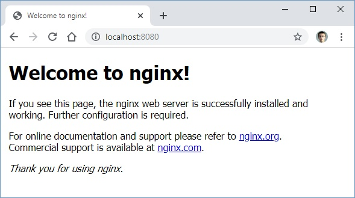

# Praca Domowa nr 8

* [Zadanie 1](#zadanie-1)
* [Zadanie 2](#zadanie-2)
* [Zadanie 3](#zadanie-3)
* [Zadanie 4](#zadanie-4)
* [Pliki](#pliki)

---

<details>
  <summary><b><i>Przygotowanie kontekstu oraz namespace</i></b></summary>

#### Utworzenie namespace
```PowerShell
PS C:\Users\bpelikan> kubectl create namespace homework8
namespace/homework8 created
```

#### Zmiana contextu na utworzony namepsace
```PowerShell
PS C:\Users\bpelikan> kubectl config set-context --current --namespace=homework8
Context "minikube" modified.

PS C:\Users\bpelikan> kubectl config get-contexts
CURRENT   NAME                 CLUSTER          AUTHINFO                              NAMESPACE
          docker-desktop       docker-desktop   docker-desktop
          docker-for-desktop   docker-desktop   docker-desktop
*         minikube             minikube         minikube                              homework8
```

</details>

# Zadanie 1

### 1.1 Wykonanie deploymentu
```PowerShell
PS C:\Users\bpelikan> kubectl apply -f depl.yaml
deployment.apps/nginx-deployment created
```

<details>
  <summary><b><i>Sprawdzenie deploymentu</i></b></summary>

#### 1.1.1 Deployment
```PowerShell
PS C:\Users\bpelikan> kubectl get deployments
NAME               READY   UP-TO-DATE   AVAILABLE   AGE
nginx-deployment   3/3     3            3           94s
```

#### 1.1.2 Status deploymentu
```PowerShell
PS C:\Users\bpelikan> kubectl rollout status deployment nginx-deployment
deployment "nginx-deployment" successfully rolled out
```

#### 1.1.3 ReplicaSet
```PowerShell
PS C:\Users\bpelikan> kubectl get rs
NAME                          DESIRED   CURRENT   READY   AGE
nginx-deployment-54f57cf6bf   3         3         3       4m37s
```

#### 1.1.4 Przejrzenie labeli utworzonych dla podów
```PowerShell
PS C:\Users\bpelikan> kubectl get pods --show-labels
NAME                                READY   STATUS    RESTARTS   AGE     LABELS
nginx-deployment-54f57cf6bf-8zt4j   1/1     Running   0          6m32s   app=nginx,pod-template-hash=54f57cf6bf
nginx-deployment-54f57cf6bf-lxpkr   1/1     Running   0          6m32s   app=nginx,pod-template-hash=54f57cf6bf
nginx-deployment-54f57cf6bf-sfcvg   1/1     Running   0          6m32s   app=nginx,pod-template-hash=54f57cf6bf
```

</details>

# Zadanie 2

### 2.1 Wystawienie portu kontenera na zewnątrz
Wystawienie portu 80 kontenera na zewnątrz za pomocą portu 8080
```PowerShell
PS C:\Users\bpelikan> kubectl port-forward nginx-deployment-54f57cf6bf-8zt4j 8080:80
Forwarding from 127.0.0.1:8080 -> 80
Forwarding from [::1]:8080 -> 80
```

### 2.2 Sprawdzenie nagłówków
```bash
PS C:\Users\bpelikan> bash
ubpelikan@DESKTOP:/mnt/c/Users/bpelikan$ curl -I -X GET http://localhost:8080
HTTP/1.1 200 OK
Server: nginx/1.7.9
Date: Sat, 16 Nov 2019 22:48:51 GMT
Content-Type: text/html
Content-Length: 612
Last-Modified: Tue, 23 Dec 2014 16:25:09 GMT
Connection: keep-alive
ETag: "54999765-264"
Accept-Ranges: bytes
```

<details>
  <summary><b><i>Sprawdzenie w przeglądarce</i></b></summary>



</details>

# Zadanie 3

### 3.1 Zaktualizowanie wersji nginx
```PowerShell
PS C:\Users\bpelikan> kubectl --record deployment.apps/nginx-deployment set image deployment.v1.apps/nginx-deployment nginx=nginx:1.9.1
deployment.apps/nginx-deployment image updated
deployment.apps/nginx-deployment image updated
```

<details>
  <summary><b><i>Sprawdzenie</i></b></summary>

#### 3.1.1 Status deploymentu
```PowerShell
PS C:\Users\bpelikan> kubectl rollout status deployment.v1.apps/nginx-deployment
deployment "nginx-deployment" successfully rolled out
```

#### 3.1.2 ReplicaSet
```PowerShell
PS C:\Users\bpelikan> kubectl get rs
NAME                          DESIRED   CURRENT   READY   AGE
nginx-deployment-54f57cf6bf   0         0         0       22m
nginx-deployment-56f8998dbc   3         3         3       96s
```

#### 3.1.3 Pody
```PowerShell
PS C:\Users\bpelikan> kubectl get pod
NAME                                READY   STATUS    RESTARTS   AGE
nginx-deployment-56f8998dbc-9nkts   1/1     Running   0          3m23s
nginx-deployment-56f8998dbc-j927w   1/1     Running   0          3m25s
nginx-deployment-56f8998dbc-tdt9f   1/1     Running   0          3m27s
```

</details>

### 3.2 Wystawienie portu kontenera na zewnątrz
```PowerShell
PS C:\Users\bpelikan> kubectl port-forward nginx-deployment-56f8998dbc-9nkts 8080:80
Forwarding from 127.0.0.1:8080 -> 80
Forwarding from [::1]:8080 -> 80
```

### 3.3 Sprawdzenie nagłówków
```bash
ubpelikan@DESKTOP:/mnt/c/Users/bpelikan$ curl -I -X GET http://localhost:8080
HTTP/1.1 200 OK
Server: nginx/1.9.1
Date: Sat, 16 Nov 2019 22:59:31 GMT
Content-Type: text/html
Content-Length: 612
Last-Modified: Tue, 26 May 2015 15:02:09 GMT
Connection: keep-alive
ETag: "55648af1-264"
Accept-Ranges: bytes
```

### 3.4 Edycja pliku deploymentu

* Zwiększenie replik do 5
* Zmiana wersji nginx na 1.17.3
* Dodanie strategii wdrażania **RollingUpdate**
* Dodanie annotacji o zmianach w pliku

### 3.5 Update deploymentu
```PowerShell
PS C:\Users\bpelikan> kubectl apply -f depl2.yaml
deployment.apps/nginx-deployment configured
```

<details>
  <summary><b><i>Sprawdzenie</i></b></summary>

#### 3.5.1 Sprawdzenie
```PowerShell
PS C:\Users\bpelikan> kubectl get pod
NAME                               READY   STATUS    RESTARTS   AGE
nginx-deployment-c5ddbdb9d-b48x9   1/1     Running   0          13s
nginx-deployment-c5ddbdb9d-dfpb5   1/1     Running   0          34s
nginx-deployment-c5ddbdb9d-k2w86   1/1     Running   0          13s
nginx-deployment-c5ddbdb9d-nr4gw   1/1     Running   0          34s
nginx-deployment-c5ddbdb9d-w2h72   1/1     Running   0          15s
```

```PowerShell
PS C:\Users\bpelikan> kubectl get rs
NAME                          DESIRED   CURRENT   READY   AGE
nginx-deployment-54f57cf6bf   0         0         0       33m
nginx-deployment-56f8998dbc   0         0         0       12m
nginx-deployment-c5ddbdb9d    5         5         5       89s
```

```PowerShell
PS C:\Users\bpelikan> kubectl describe deployment nginx-deployment
Name:                   nginx-deployment
Namespace:              homework8
CreationTimestamp:      Sat, 16 Nov 2019 23:33:43 +0100
Labels:                 app=nginx
Annotations:            deployment.kubernetes.io/revision: 3
                        kubectl.kubernetes.io/last-applied-configuration:
                          {"apiVersion":"apps/v1","kind":"Deployment","metadata":{"annotations":{"kubernetes.io/change-cause":"Image change"},"labels":{"app":"nginx...
                        kubernetes.io/change-cause: Image change
Selector:               app=nginx
Replicas:               5 desired | 5 updated | 5 total | 5 available | 0 unavailable
StrategyType:           RollingUpdate
MinReadySeconds:        0
RollingUpdateStrategy:  1 max unavailable, 1 max surge
Pod Template:
  Labels:  app=nginx
  Containers:
   nginx:
    Image:        nginx:1.17.3
    Port:         80/TCP
    Host Port:    0/TCP
    Environment:  <none>
    Mounts:       <none>
  Volumes:        <none>
Conditions:
  Type           Status  Reason
  ----           ------  ------
  Available      True    MinimumReplicasAvailable
  Progressing    True    NewReplicaSetAvailable
OldReplicaSets:  <none>
NewReplicaSet:   nginx-deployment-c5ddbdb9d (5/5 replicas created)
Events:
  Type    Reason             Age                  From                   Message
  ----    ------             ----                 ----                   -------
  Normal  ScalingReplicaSet  33m                  deployment-controller  Scaled up replica set nginx-deployment-54f57cf6bf to 3
  Normal  ScalingReplicaSet  12m                  deployment-controller  Scaled up replica set nginx-deployment-56f8998dbc to 1
  Normal  ScalingReplicaSet  12m                  deployment-controller  Scaled up replica set nginx-deployment-56f8998dbc to 2
  Normal  ScalingReplicaSet  12m                  deployment-controller  Scaled down replica set nginx-deployment-54f57cf6bf to 2
  Normal  ScalingReplicaSet  12m                  deployment-controller  Scaled down replica set nginx-deployment-54f57cf6bf to 1
  Normal  ScalingReplicaSet  12m                  deployment-controller  Scaled up replica set nginx-deployment-56f8998dbc to 3
  Normal  ScalingReplicaSet  12m                  deployment-controller  Scaled down replica set nginx-deployment-54f57cf6bf to 0
  Normal  ScalingReplicaSet  2m8s                 deployment-controller  Scaled up replica set nginx-deployment-c5ddbdb9d to 2
  Normal  ScalingReplicaSet  2m8s                 deployment-controller  Scaled up replica set nginx-deployment-56f8998dbc to 5
  Normal  ScalingReplicaSet  2m8s                 deployment-controller  Scaled down replica set nginx-deployment-56f8998dbc to 4
  Normal  ScalingReplicaSet  2m8s                 deployment-controller  Scaled up replica set nginx-deployment-c5ddbdb9d to 1
  Normal  ScalingReplicaSet  110s                 deployment-controller  Scaled down replica set nginx-deployment-56f8998dbc to 3
  Normal  ScalingReplicaSet  109s                 deployment-controller  Scaled up replica set nginx-deployment-c5ddbdb9d to 3
  Normal  ScalingReplicaSet  107s                 deployment-controller  Scaled down replica set nginx-deployment-56f8998dbc to 2
  Normal  ScalingReplicaSet  107s                 deployment-controller  Scaled up replica set nginx-deployment-c5ddbdb9d to 4
  Normal  ScalingReplicaSet  107s                 deployment-controller  Scaled down replica set nginx-deployment-56f8998dbc to 1
  Normal  ScalingReplicaSet  104s (x2 over 107s)  deployment-controller  (combined from similar events): Scaled down replica set nginx-deployment-56f8998dbc to 0
```

</details>


# Zadanie 4

### 4.1 Historia deploymentów
```PowerShell
PS C:\Users\bpelikan> kubectl rollout history deployment nginx-deployment
deployment.apps/nginx-deployment
REVISION  CHANGE-CAUSE
1         <none>
2         kubectl.exe deployment.apps/nginx-deployment set image deployment.v1.apps/nginx-deployment nginx=nginx:1.9.1 --record=true
3         Image change
```

<details>
  <summary><b><i>Szczegóły</i></b></summary>

#### 4.1.1 Szczegóły rolloutów

```PowerShell
PS C:\Users\bpelikan> kubectl rollout history deployment nginx-deployment --revision=1
deployment.apps/nginx-deployment with revision #1
Pod Template:
  Labels:       app=nginx
        pod-template-hash=54f57cf6bf
  Containers:
   nginx:
    Image:      nginx:1.7.9
    Port:       80/TCP
    Host Port:  0/TCP
    Environment:        <none>
    Mounts:     <none>
  Volumes:      <none>
```

```PowerShell
PS C:\Users\bpelikan> kubectl rollout history deployment nginx-deployment --revision=2
deployment.apps/nginx-deployment with revision #2
Pod Template:
  Labels:       app=nginx
        pod-template-hash=56f8998dbc
  Annotations:  kubernetes.io/change-cause:
          kubectl.exe deployment.apps/nginx-deployment set image deployment.v1.apps/nginx-deployment nginx=nginx:1.9.1 --record=true
  Containers:
   nginx:
    Image:      nginx:1.9.1
    Port:       80/TCP
    Host Port:  0/TCP
    Environment:        <none>
    Mounts:     <none>
  Volumes:      <none>
```

```PowerShell
PS C:\Users\bpelikan> kubectl rollout history deployment nginx-deployment --revision=3
deployment.apps/nginx-deployment with revision #3
Pod Template:
  Labels:       app=nginx
        pod-template-hash=c5ddbdb9d
  Annotations:  kubernetes.io/change-cause: Image change
  Containers:
   nginx:
    Image:      nginx:1.17.3
    Port:       80/TCP
    Host Port:  0/TCP
    Environment:        <none>
    Mounts:     <none>
  Volumes:      <none>
```

</details>

### 4.2 Wycofanie ostatniego rolloutu
```PowerShell
PS C:\Users\bpelikan> kubectl rollout undo deployments nginx-deployment
deployment.apps/nginx-deployment rolled back
```

### 4.3 Historia
```PowerShell
PS C:\Users\bpelikan> kubectl rollout history deployment nginx-deployment
deployment.apps/nginx-deployment
REVISION  CHANGE-CAUSE
1         <none>
3         Image change
4         kubectl.exe deployment.apps/nginx-deployment set image deployment.v1.apps/nginx-deployment nginx=nginx:1.9.1 --record=true
```

### 4.4 Rollback do rewizji 3
```PowerShell
PS C:\Users\bpelikan> kubectl rollout undo deployments nginx-deployment --to-revision=3
deployment.apps/nginx-deployment rolled back
```

### 4.5 Historia
```PowerShell
PS C:\Users\bpelikan> kubectl rollout history deployment nginx-deployment
deployment.apps/nginx-deployment
REVISION  CHANGE-CAUSE
1         <none>
4         kubectl.exe deployment.apps/nginx-deployment set image deployment.v1.apps/nginx-deployment nginx=nginx:1.9.1 --record=true
5         Image change
```

### 4.6 Usunięcie deploymentu
```PowerShell
PS C:\Users\bpelikan> kubectl delete deployment nginx-deployment
deployment.apps "nginx-deployment" deleted
```

# Pliki

* [depl.yaml](./code/depl.yaml)
* [depl2.yaml](./code/depl2.yaml)